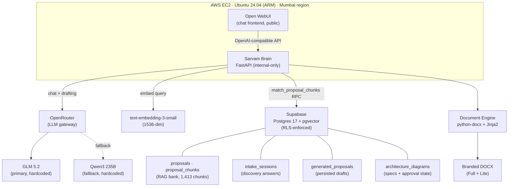
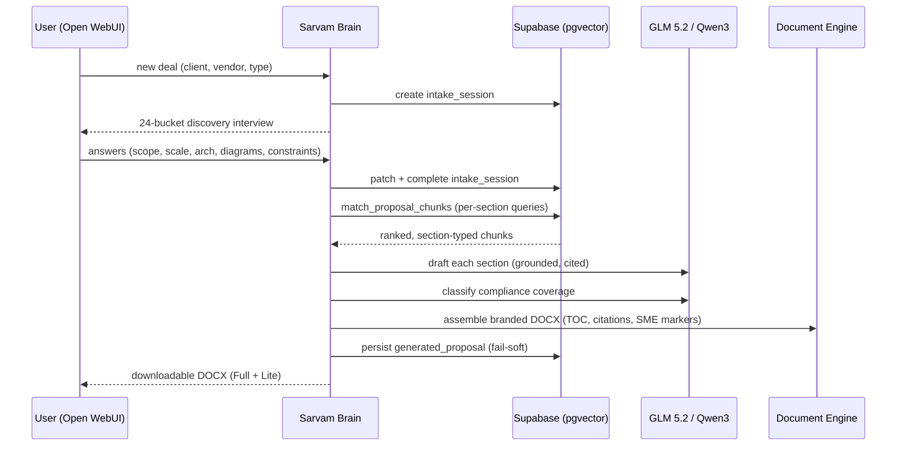
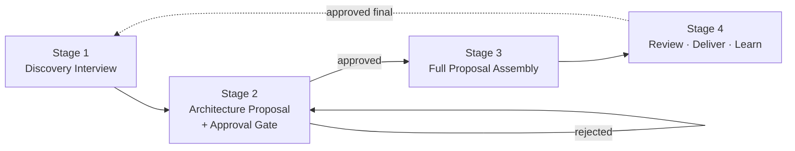
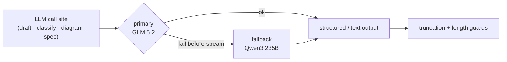
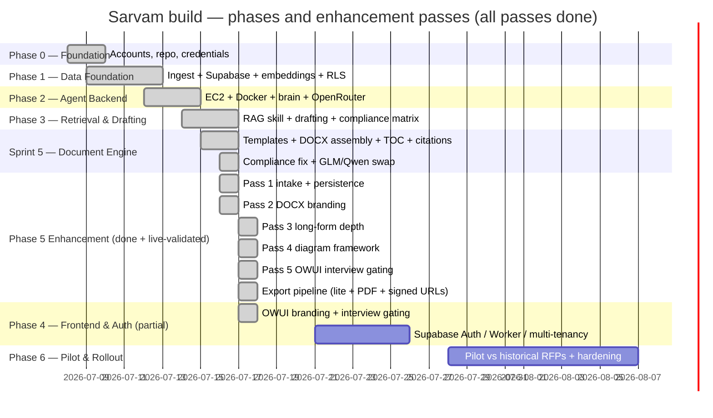

# Sarvam — IV Proposal Architect

**Sarvam** (सर्वम्, Sanskrit for *"all, everything, the whole"*) is Inspirit Vision's in-house Proposal Architect — a conversational, retrieval-grounded AI that turns a new RFP into a structured, client-ready proposal in hours instead of days, by drafting from IV's 100+ historical proposal bank rather than from a blank page.


-231154)


-FF9900)

> **Internal use only.** Proprietary to Inspirit Vision. This repository is public for collaboration; no client content, credentials, or infrastructure secrets are committed. See [Security posture](#security-posture).

---

## Progress Dashboard

> Quick-glance project status. Last updated: 2026-07-17 (IST).

**Overall completion: ~80%**
`████████████████░░░░`

### Phase completion (6 phases / 12 sprints)

| Phase | Status | Progress |
|---|---|---|
| 0 — Foundation & accounts | Done | `████████████████████` 100% |
| 1 — Data foundation (ingest + Supabase + embeddings) | Done | `████████████████████` 100% |
| 2 — Agent backend (EC2 + Docker + OpenRouter) | Done | `████████████████████` 100% |
| 3 — Retrieval + drafting | Done | `████████████████████` 100% |
| 4 — Conversational frontend + auth | Partial | `█████████░░░░░░░░░░░` 45% |
| 5 — Architecture approval gate + compression/export | In progress | `███████████████████░░` 95% |
| 6 — Pilot + hardening + rollout | Not started | `░░░░░░░░░░░░░░░░░░░░` 0% |

### Known gaps before pilot

- **`MAX_DRAFT_TOKENS` raised (1500 → 3500)** — merged `6da140c`; rebuild the brain to deploy. Anti-spiral guardrails (frequency_penalty, max_retries, truncation guard) preserved. (NoneType bug FIXED — merged `6290d23`.)
- **Client-logo sourcing** (web/image search + approval-gated embedding) — deferred from Pass 5.
- **Durable diagram spec-template store** (per vendor + diagram type) — deferred from Pass 4.
- **`approved_by` on diagrams is NULL** — blocked on Phase 4 auth (no user identity yet).
- **OWUI in-app logo** — code merged (`3501254`) but the `open-webui` container has not been rebuilt on the host; rebuild with `docker compose up -d --build open-webui`.
- **Supabase Auth / Worker / multi-tenancy** (Phase 4) — not wired (RLS + disabled sign-ups is the interim gate).
- **Phase 6 pilot** — not started.

---

## Executive Summary

Inspirit Vision currently spends multiple person-days drafting each client proposal from scratch — assembling company profile, similar experience, scope understanding, solution architecture, implementation methodology, RACI, timeline, and compliance from memory and old files. With a bank of 100+ historical proposals across SailPoint, Ping Identity, IBM Security Verify, Red Hat Keycloak (RHBK), and ForgeRock engagements, there is enough reusable intellectual property to power a system that drafts, diagrams, and delivers proposals in a fraction of the time.

Sarvam is that system. He is **not a chatbot and not a search engine** — he is a well-read junior consultant who has read every proposal IV has ever sent, remembers all of them, interviews you about the new deal, proposes an architecture you must approve, and then drafts the full document section by section, grounded in what IV has actually delivered before.

### The economics behind it

| Signal | Value | Source |
|---|---|---|
| Time to first full draft, manual process | 2 to 5 person-days | IV internal baseline |
| Proposal content that is static/reusable across deals | ~60% | IV corpus analysis, 10 sample proposals |
| Diagrams that are reused or templated across proposals | ~38% | IV corpus analysis, perceptual hashing of 260 embedded images |
| Source proposals in the working corpus | 11 ingested, 1,413 chunks | Sarvam Supabase, live |
| Target time to first draft | under 2 hours | Project success criterion (V1) |
| Target output size (Lite, email-friendly) | under 5 MB | Project success criterion (V1) |

### Targets

| Metric | Pilot exit | Steady state |
|---|---|---|
| Time to first full draft | under 2 hours | under 90 minutes |
| Structural completeness (expected sections present) | 100% | 100% |
| Fabricated client references / pricing | Zero | Zero |
| Drafts requiring major rework | under 30% | under 15% |

### What Sarvam will not do

- **He will not invent client references or metrics.** If he does not know something, he says so, and inserts an `[SME REVIEW]` marker.
- **He will not fill in pricing.** Commercials are always a human call. He sets up the table; the team fills in the numbers.
- **V1 contract:** he will not start drafting until the architecture is approved. This is a hard gate — no shortcuts. (The diagram framework is built and live; the hard pre-draft gate is not yet enforced — see [Known gaps](#known-gaps--not-pilot-ready-yet).)
- **He will not be sycophantic.** No "Great question!", no exclamation marks, no celebration emojis. He talks like a senior consultant.

---

## Known Gaps — Not Pilot-Ready Yet

Honest about what is not done, so no one mistakes the current state for production-ready:

- **Auth and multi-tenancy:** Supabase Auth and the Worker JWT gate are not wired. The brain is protected by network isolation (internal-only) and Open WebUI's disabled sign-ups, not by per-user identity. User identity is not yet propagated end-to-end, so generated drafts are not yet attributed to individual users (`approved_by` on diagrams is NULL). Production auth hardening is a pending milestone, not abandoned.
- **Hard pre-draft approval gate:** the diagram framework (Pass 4) is built and live — diagrams can be created, approved, rendered, and embedded — but drafting is **not hard-blocked** on an approved architecture. A proposal generates with or without an approved diagram. The V1 "no drafting until architecture is approved" contract is not yet enforced.
- **Per-call token cap (raised):** `MAX_DRAFT_TOKENS` raised 1500 → 3500 (merged `6da140c`); rebuild the brain to deploy. The cap bounds how long any single subsection can get; the 3-subsection structure + this cap set full-depth length. Measured: `full` produced 31 pages while the NoneType bug was active — re-measure after deploying both fixes. Anti-spiral guardrails (frequency_penalty, max_retries, truncation guard) preserved. (NoneType bug FIXED — merged `6290d23`.)
- **Client-logo sourcing:** approval-gated embedding of a client logo sourced online is deferred from Pass 5; the placeholder box is used instead.
- **Durable diagram spec-template store:** reusable DiagramSpec templates keyed by vendor and diagram type are deferred from Pass 4 (the engine regenerates from scratch for now).
- **External research and fact-checking:** Exa/Firecrawl external research and the secondary-LLM fact-checker are deferred to post-pilot.
- **Hybrid search:** retrieval is pure vector similarity; BM25 + reciprocal rank fusion is deferred.
- **Pilot validation:** no end-to-end runs against historical RFPs with the scoring rubric yet.
- **OWUI branding deploy:** the in-app logo code is merged but the `open-webui` container has not been rebuilt on the host.

---

## System Architecture



**The critical edge in that diagram is the internal-only binding.** The brain is never exposed publicly — every external path runs through the Open WebUI frontend, and the brain holds the only keys to Supabase and OpenRouter.

### End-to-end proposal sequence



---

## Component Choices and Why

| Component | Choice | Why this and not the alternative |
|---|---|---|
| Agent runtime | **FastAPI brain** (Python) | Replaced the originally-planned Hermes agent after evaluating framework lock-in. A thin FastAPI service is fully auditable, has no telemetry, and every prompt change is a tracked commit. Skills are plain Python modules, not a proprietary format |
| LLM gateway | **OpenRouter** | Provider-agnostic. One key, one contract, swap models by changing a constant. No per-provider SDK lock-in |
| Primary LLM | **GLM 5.2** (`z-ai/glm-5.2`) | Strong long-context drafting at low cost. Hardcoded so the user-facing model list is a single entry: "Sarvam Architect" |
| Fallback LLM | **Qwen3 235B** (`qwen/qwen3-235b-a22b-2507`) | Auto-triggered at every LLM call site if the primary fails before streaming. DeepSeek was removed entirely (it spiraled on ambiguous compliance requirements) |
| Embeddings | **text-embedding-3-small** (1536-dim) | Cheap, well-understood, good enough for vendor/section-typed retrieval. Negligible one-time cost to embed the whole bank |
| Retrieval | **Supabase pgvector** + `match_proposal_chunks` RPC | Vector similarity with section-type awareness and metadata filters, in the same database as everything else. No separate vector store to operate |
| Document output | **python-docx + Jinja2** | Native DOCX with real headings, tables, a refreshable TOC field, and embedded images. Templates are version-controlled Jinja2, not a binary .dotx |
| Diagram rendering | **DiagramSpec JSON → local Graphviz** | GLM emits a constrained JSON spec; a local Graphviz renderer produces deterministic PNG/SVG. No image-generation model (unreliable at precise schematic labels), no external rendering API (would leak client architecture) |
| Chat frontend | **Open WebUI** | Open-source, OpenAI-compatible, supports a persona system prompt and a single locked model. Cheaper and more controllable than building a custom chat UI |
| Hosting | **AWS EC2 (ARM, Mumbai)** | Single-purpose box, static IP, close to the team. Fixed low monthly cost; covered by AWS credits during the MVP window |
| Data store | **Supabase (Postgres + pgvector + RLS)** | Auth, relational data, vector search, and storage in one free-tier service. RLS at the database layer is the security backbone |

---

## The Proposal Bank and RAG

Sarvam grounds every draft in what IV has actually delivered, never in model memory.

- **Bank:** 100+ historical proposals (DOCX/PDF). **Working corpus:** 11 proposals ingested and embedded as 1,413 chunks across 15 section types.
- **Section taxonomy:** `exec_summary`, `scope`, `solution`, `architecture`, `assumptions`, `timeline`, `pricing`, `why_vendor`, `similar_experience`, `cover`, `table`, `diagram`, `ocr`, `page`, `other`. Retrieval is section-type aware — an executive-summary query matches executive-summary chunks, not commercial ones.
- **Metadata per proposal:** `client_name`, `industry`, `country`, `iam_vendor`, `proposal_type` (implementation / MSS), `user_count`, `app_count`, `deal_size_bucket`, `outcome`, `year` — captured during ingestion and reused as the discovery interview schema.
- **Diagram reuse (measured):** of 260 embedded images across 8 sample proposals, ~38% are reused or templated, concentrated **per vendor and per diagram type** (e.g. SailPoint deployment-architecture and HRMS joiner-workflow diagrams recur across SailPoint proposals; Ping reference architectures recur across Ping proposals). This is why reusable DiagramSpec templates are stored in Supabase rather than regenerating every diagram from scratch.

### Grounding contract

- Every drafted claim is tied to a retrieved chunk with a citation number.
- A **weak-evidence threshold** flags low-similarity sections with an `[SME REVIEW: weak evidence]` prefix rather than forcing uncertain content.
- Compliance requirements are classified per-requirement (Met / Partially Met / Not Met) against the retrieved evidence, with paraphrase matching to avoid false negatives.

---

## Conversational Workflow

Sarvam follows a four-stage conversation, with a hard human gate before any drafting begins (the diagram framework is built and live; the hard pre-draft gate is not yet enforced — see [Known gaps](#known-gaps--not-pilot-ready-yet)).



### Stage 1 — Discovery Interview
A 24-bucket structured interview collects everything needed for an accurate draft: client and engagement details, scale and volumetrics, scope, **architecture inputs (deployment model, required diagram types and count, hardware sizing, HA/DR, security architecture)**, migration, integrations (HRMS, AD/Exchange, IdP/SSO, applications), compliance and regulatory specifics, timeline, MSS-specific SLA/commercials (conditional), submission constraints, audience and win-themes, current-state systems, NFRs, delivery model, post-go-live, and reuse controls. Every answer persists to the `intake_sessions` table.

### Stage 2 — Architecture Proposal and Human-in-Loop Gate
Sarvam retrieves the closest-matching past architecture, generates a `DiagramSpec`, renders it for preview, and presents it. The user **approves or rejects with comments**; on rejection he regenerates incorporating the feedback. Approved diagrams are persisted and embedded in the DOCX. **V1 contract:** drafting will be hard-gated on an approved architecture; the diagram framework is built and live, but the hard pre-draft gate and the reusable template library are not yet enforced/built (see [Known gaps](#known-gaps--not-pilot-ready-yet)).

### Stage 3 — Full Proposal Assembly
Static sections (Company Profile, Why-Vendor, Methodology) are pulled near-verbatim from the RAG bank. Dynamic sections (Executive Summary, Sizing, RACI, Timeline, Solution Architecture) are generated fresh, grounded in retrieved chunks. A compliance matrix is classified per requirement. The document is assembled into a branded DOCX with a refreshable TOC, citation appendix, and SME-review markers.

### Stage 4 — Review, Deliver, Learn
Section-level edit requests preserve approved sections untouched. On final approval, the proposal is saved back into the RAG bank as new reference material, so the next deal starts smarter. Delivery in "Full" (print-ready) and "Lite" (email-friendly, under 5 MB) variants.

---

## Document Production Engine

The engine is what turns a chat thread into a deliverable document.

### Built now

- **Templates:** Jinja2 section templates for `implementation` and `mss` proposal types (8 sections each). Conditional sections branch on proposal type (MSS gets SLA tiers and mandatory/on-demand services; implementation gets HLD/LLD and deployment architecture).
- **Section-by-section drafting:** each section runs its own retrieval query and LLM draft, with per-call token caps and frequency penalty to prevent repetition spirals on ambiguous content.
- **Compliance matrix:** per-requirement classification against retrieved evidence, with paraphrase matching and a truncation guard.
- **Citations and traceability:** every section carries a citation appendix mapping reference numbers to source proposals; a retrieval trace is persisted with each generated proposal.
- **SME-review markers:** inserted where evidence is weak or a gap is detected, so human review is fast and targeted.
- **Branded DOCX (Pass 2, done):** IV logo on the title page, navy (`#231154`) and orange (`#E85A24`) accents, running header/footer with page numbers, section dividers, and a client-logo placeholder (with a hook for embedding a supplied client logo).

### Built now (continued — enhancement passes)

- **Long-form depth (Pass 3, done):** `brief` / `standard` / `full` tiers control the number of subsections drafted (Overview / Detailed Design / Considerations & Dependencies) and the retrieval fan-out — the path to long output. `full` adds RACI, timeline, sizing, integration inventory, and risk appendices as real DOCX tables.
- **Diagram framework (Pass 4, done + live-validated):** GLM emits a constrained `DiagramSpec` JSON → local Graphviz renders PNG → user approves → only approved diagrams are embedded. Approval state machine (draft → needs_review → approved/rejected).
- **Export pipeline (Round 3, done + live-validated):** lite (<5 MB) DOCX compression via Pillow, PDF export via LibreOffice headless, and delivery to storage signed URLs (`generated-drafts` bucket, 1-hour TTL). Opt-in via `lite` / `include_pdf` / `return_signed_urls` on `/v1/generate-proposal`.

### Deferred

- **Client-logo sourcing:** approval-gated embedding of a client logo sourced online when one is not provided.
- **Durable diagram spec-template store:** reusable specs keyed by vendor and diagram type (the engine regenerates from scratch for now).

---

## Model Routing



- **Primary:** GLM 5.2. **Fallback:** Qwen3 235B. Both are hardcoded constants — there is no model chooser in the UI; Open WebUI exposes a single model, "Sarvam Architect".
- Fallback applies at all five LLM call sites (chat drafting, section drafting, compliance classification, open-router raw drafting, and diagram-spec generation).
- **Why no DeepSeek:** it spiraled on ambiguous compliance requirements, generating hundreds of thousands of characters and multi-minute hangs. Removed in favor of GLM/Qwen with per-call token caps, frequency penalty, and truncation guards.
- **Why no image-generation model for diagrams:** image-gen models mangle precise text labels and break schematic consistency, and editing labels onto a raster diagram is unreliable. Graphviz renders the DiagramSpec deterministically — no model failure point — and the only model involved (GLM spec generation) already has the Qwen fallback.
- Embeddings use `text-embedding-3-small` (unchanged); OpenRouter's image API remains available as an optional path for non-diagram visuals later, but is not used for architecture diagrams.

---

## API Reference

The brain exposes an OpenAI-compatible interface plus proposal-production endpoints.

| Method | Endpoint | Purpose |
|---|---|---|
| GET | `/health` | Liveness + active primary/fallback model |
| GET | `/v1/models` | Lists the single `sarvam-architect` model |
| POST | `/v1/chat/completions` | Grounded RAG chat (streaming) |
| POST | `/v1/compliance-matrix` | Classify RFP requirements against retrieved evidence |
| GET | `/v1/intake-template` | Return the 24-bucket discovery interview (filters by proposal type) |
| POST | `/v1/intake-sessions` | Create a discovery session |
| PATCH | `/v1/intake-sessions/{id}` | Merge partial answers |
| POST | `/v1/intake-sessions/{id}/complete` | Validate required answers, mark complete |
| POST | `/v1/generate-proposal` | Generate a branded DOCX; accepts `intake_session_id`, `generated_proposal_id` (embeds approved diagrams), `proposal_depth` (`brief`/`standard`/`full`), and export flags `lite` / `include_pdf` / `return_signed_urls` |
| POST | `/v1/proposals/{id}/diagrams` | Create a diagram spec (LLM-generated `DiagramSpec`, persisted as draft) |
| GET | `/v1/proposals/{id}/diagrams` | List diagrams for a proposal |
| PATCH | `/v1/diagrams/{id}` | Advance diagram status (draft → needs_review → approved/rejected; approved renders via Graphviz + uploads) |
| GET | `/v1/diagrams/{id}` | Fetch a single diagram (status, spec, rendered path) |

Persistence is fail-soft: if a Supabase write fails, the generated DOCX is still returned — generation never blocks on storage.

---

## Security Posture

| Layer | Control |
|---|---|
| Network | EC2 security group restricts inbound to SSH (from known IPs) and the frontend port. The brain is bound to localhost — never exposed publicly |
| Database | Row-Level Security enforced at the Postgres layer on every table. All writes use a server-side key; client-facing access is policy-gated. RLS is never disabled |
| Secrets | API keys live only in the server's local environment file (restricted permissions). `.gitignore` blocks `.env`, `*.pem`, `*.key`, and key-pattern files repo-wide |
| Client data | Source proposals under NDA live under `data/raw/` (gitignored, never committed). Only anonymised metadata is version-controlled |
| Frontend | Open WebUI open sign-ups disabled; only the Sarvam Architect model is exposed (all other LLM connections removed) |
| LLM data | OpenRouter is the only external LLM path. No client content is sent to image-generation or rendering APIs |
| Availability | A daily keep-alive pings the database to prevent free-tier idle pause, and auto-restores the project if it is ever found paused |
| Key hygiene | API keys rotated quarterly. The WordPress Lightsail instance is out of scope and never touched by this project |

Deeper reasoning: [`docs/PROJECT.md`](docs/PROJECT.md) (contingency matrix, risk register).

---

## Costs

Qualitative model — no per-credit estimates. Exact figures are tracked in private ops notes.

| Item | Tier | Notes |
|---|---|---|
| Compute (EC2) | Free during MVP (credits), low fixed monthly after | Single ARM instance, static IP |
| Database (Supabase) | Free tier | Pauses after 7 days idle (mitigated by the daily keep-alive) |
| LLM (OpenRouter) | Pay-per-use | GLM 5.2 primary is inexpensive for drafting volume; Qwen3 fallback only on primary failure |
| Embeddings | Negligible | One-time embed of the bank costs cents |
| Frontend, GitHub | Free tiers | Open WebUI is self-hosted; GitHub public repo |

Post-MVP graduation (when volume justifies): Supabase Pro removes the DB cap and idle-pause; OpenRouter production budget scales with proposal volume. The whole stack avoids per-seat SaaS licenses.

---

## Roadmap and Status

The original plan in [`docs/PROJECT.md`](docs/PROJECT.md) is a 6-phase, 12-sprint blueprint. Actual delivery compressed and reshuffled that plan; the table below tracks the real state.



| Milestone | State |
|---|---|
| Foundation, repo, credentials | Done |
| Supabase schema, RLS, pgvector, embeddings (11 proposals, 1,413 chunks) | Done |
| EC2 + Docker + brain + OpenRouter (GLM 5.2 + Qwen3) | Done |
| Grounded RAG chat + compliance matrix | Done |
| Document-production engine (templates, DOCX, TOC, citations, SME markers) | Done |
| Compliance repetition fix + model swap (DeepSeek removed) | Done |
| Pass 1 — intake sessions + persistence foundation | Done |
| Pass 2 — DOCX branding (IV logo, navy/orange, header/footer, client-logo placeholder) | Done |
| Pass 3 — long-form depth (depth tiers, multi-subsection, RACI/timeline/sizing/risk appendices) | Done |
| Pass 4 — diagram framework (DiagramSpec → Graphviz → approval → embed approved only) | Done + live-validated |
| Pass 5 — Open WebUI interview gating (no session → discovery interview) | Done |
| Export pipeline — lite <5 MB DOCX + PDF (LibreOffice) + signed URLs to storage | Done + live-validated |
| OWUI in-app logo branding (favicon env + /app/build/static override) | Done (merged); open-webui container rebuild pending on host |
| Persistence fix (generated_proposals status draft→drafting) | Done + live-validated |
| NoneType section-drafting bug (null LLM subsection → empty section) | Fixed — merged `6290d23` (PR #2); rebuild brain to deploy |
| Raise `MAX_DRAFT_TOKENS` (1500 → 3500) | Done — merged `6da140c`; rebuild brain to deploy |
| Client-logo sourcing (web/image search + approval-gated embedding) | Deferred |
| Durable diagram spec-template store (per vendor + diagram type) | Deferred |
| Supabase Auth / Worker / multi-tenancy (Sprint 8) | Not wired (~45% of Phase 4) |
| External research + fact-checker | Deferred (post-pilot) |
| Hybrid search (BM25 + vector + reciprocal rank fusion) | Deferred |
| Pilot against 5–10 historical RFPs + hardening + team rollout | Not started |

> **Status line:** Phases 0–3 complete. Phase 4 ~45% (Open WebUI + interview gating + branding done; Auth/Worker/multi-tenancy not wired). Phase 5 ~97% (all 5 passes + export pipeline done + live-validated; NoneType bug FIXED `6290d23`; MAX_DRAFT_TOKENS raised `6da140c` — rebuild brain to deploy; remaining: client-logo sourcing, durable spec-template store). Phase 6 (pilot, hardening, rollout) not started. Overall ~81%.

---

## Original Plan vs. Actual Build

[`docs/PROJECT.md`](docs/PROJECT.md) was written at ground zero and names components the build later replaced. This table reconciles the blueprint with reality so the two documents do not contradict each other.

| Layer | Original plan (PROJECT.md) | Actual build | Why it changed |
|---|---|---|---|
| Agent runtime | Hermes Agent (Docker) | FastAPI brain | Avoided framework lock-in; a thin auditable service with version-controlled Python modules |
| Hosting | Oracle Cloud Free Tier | AWS EC2 (ARM, Mumbai) | AWS credits available; Mumbai region closer to the team |
| Frontend | Open WebUI on Cloudflare Pages + Worker auth proxy | Open WebUI directly on EC2 | Simpler single-box deployment for MVP; Cloudflare Worker deferred until multi-tenancy is wired |
| Diagrams | MermaidJS inline in chat | DiagramSpec JSON → local Graphviz | Deterministic, editable, approval-friendly; no external rendering dependency |
| LLM tier | DeepSeek primary, GLM 5.2 fallback, Claude escalation | GLM 5.2 primary + Qwen3 235B fallback, hardcoded | DeepSeek removed after compliance-spiral incidents; GLM/Qwen covers drafting and classification reliably |
| Auth | Supabase Auth + Worker JWT gate (Sprint 8) | RLS at DB layer; brain internal-only | Network isolation is the interim gate; full Auth/Worker is a known gap, not abandoned |

The blueprint's intent (conversation-first, retrieval-grounded, human-in-loop, self-improving) is unchanged. Only the components and sequence evolved.

---

## Repository Guide

```
iv-sarvam/
├── README.md                         # this file
├── backend/brain/                    # the Sarvam brain (FastAPI)
│   ├── app.py                        # endpoints, model routing, fallback
│   ├── document_engine.py            # section drafting + DOCX assembly
│   ├── proposal_templates.py         # Jinja2 section templates (implementation / mss)
│   ├── intake_template.py            # 24-bucket discovery interview schema
│   ├── supabase_client.py            # thin PostgREST helpers (fail-soft)
│   ├── branding.py                   # DOCX branding (logo, theme, header/footer)
│   ├── assets/                       # optimized IV logo PNGs
│   ├── tests/                        # keyless smoke tests (intake + document engine)
│   ├── Dockerfile
│   └── requirements.txt
├── deploy/                           # EC2 deployment
│   ├── docker-compose.yml            # open-webui + sarvam-brain
│   ├── Dockerfile.webui
│   ├── patch-webui.py                # OWUI persona + lockdown patches
│   └── assets/                       # OWUI logo assets
├── supabase/migrations/              # SQL migrations (schema + RLS + RPCs)
│   ├── 001_init.sql
│   └── sarvam_005_intake_and_diagrams.sql
├── scripts/                          # ingestion + embedding pipeline
├── docs/                             # project, persona, sprint docs
├── data/                             # raw (gitignored) + tagging templates
└── assets/                           # shared branding assets
```

---

## Getting Started

The brain and frontend run as Docker services on the EC2 host. Local development of the brain:

```bash
git clone https://github.com/imranshaikh-commits/iv-sarvam.git
cd iv-sarvam

# create the environment file from the private ops template (names only — no secrets here):
#   OPENROUTER_API_KEY=...
#   SUPABASE_URL=...
#   SUPABASE_KEY=...

# run the brain locally
cd backend/brain
pip install -r requirements.txt
uvicorn app:app --host 127.0.0.1 --port 8000

# keyless tests (no API keys needed)
python tests/test_intake_template.py
python tests/test_document_engine.py
```

Deployment to the EC2 host (run on the host):

```bash
cd ~/iv-sarvam && git fetch && git pull origin <branch> && cd deploy && docker compose up -d --build sarvam-brain
curl -s http://127.0.0.1:8000/health
```

Open WebUI is the user-facing surface; the brain is never exposed directly.

---

## Persona and Team

**Sarvam's character** (full spec in [`docs/SARVAM_PERSONA.md`](docs/SARVAM_PERSONA.md), one-pager in [`docs/MEET_SARVAM.md`](docs/MEET_SARVAM.md)): consultative not compliant; precise on scope, conservative on claims; vendor-agnostic by conviction; bilingually and culturally aware; structured but never robotic; curious about the deal, not just the RFP; self-aware about his limits. Signature opening: *"Sarvam here — IV's Proposal Architect. New deal, or picking up something from earlier?"*

| Role | Person | Responsibility |
|---|---|---|
| Project Lead | Imran | Direction, prompt engineering, persona tuning, sprint reviews |
| Technical Reviewer | Ashish | Architecture quality gate, IAM technical accuracy, pricing review |

---

## Licence

Proprietary — Inspirit Vision internal use only. Not for redistribution. Client proposal content is under NDA and never committed to this repository.

---

*Maintained by the IV team. Start with [`docs/PROJECT.md`](docs/PROJECT.md) for the full plan, [`docs/MEET_SARVAM.md`](docs/MEET_SARVAM.md) for the persona, or this README for the current build state.*
