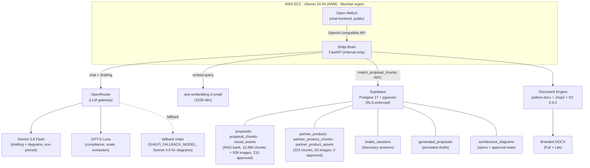
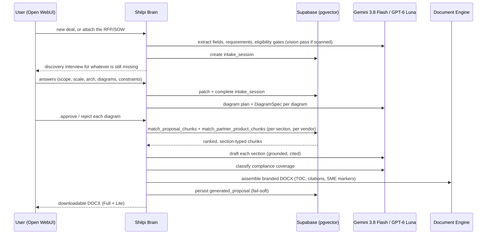
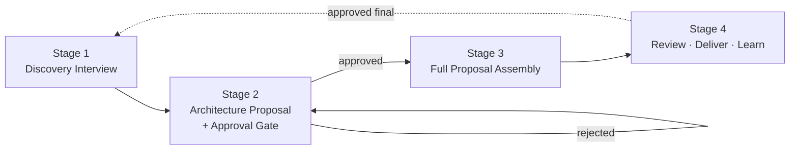
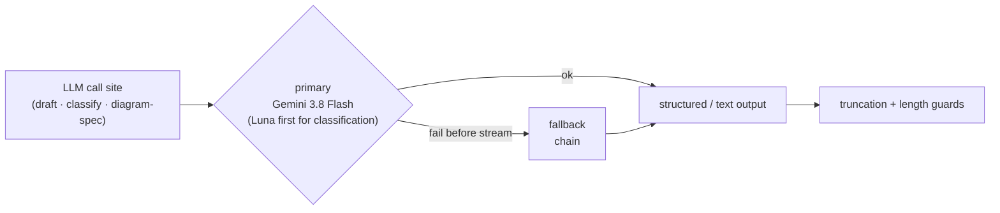
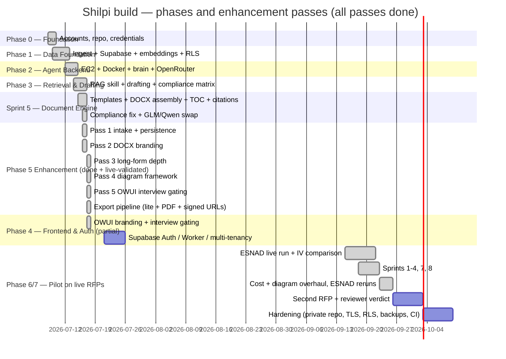

# Shilpi — IV Proposal Architect

**Shilpi** (शिल्पी, Sanskrit for *"artisan, craftsperson"*) is Inspirit Vision's in-house Proposal Architect — a conversational, retrieval-grounded AI that turns a new RFP into a structured, client-ready proposal in hours instead of days, by drafting from IV's curated bank of 110 past proposals and a separate library of partner product documentation rather than from a blank page.


-231154)
-E85A24)
-0E7490)


-FF9900)
-555555)

> **Internal use only.** Proprietary to Inspirit Vision. This repository is public for collaboration; no client content, credentials, or infrastructure secrets are committed. **It should be made private before a second person clones it** (see [Known gaps](#known-gaps)). See [Security posture](#security-posture).

---

## Progress Dashboard

> Quick-glance project status. Last updated: 2026-09-25 (IST), against commit `f770bfd` and the live Supabase project.

**Overall build completion: 84%**
`█████████████████░░░`

Arithmetic mean of the eight phase rows below (100, 100, 100, 100, 75, 98, 85, 10). Recompute it when a row changes; never adjust it by feel. It measures **build progress against the plan**, not readiness. The two questions that gate real use are next, and neither of them is a percentage.

| | Status |
|---|---|
| **Can IV use this on a live deal?** | **Yes, as a first-draft tool.** Three full ESNAD runs between 2026-09-23 and 09-25 went end to end: scanned RFP, intake, diagram plan, drafting, DOCX. The latest content review against IV's real ESNAD proposal found no factual errors, apart from one over-broad data-cleansing assumption for the reviewer to edit. Diagrams name the right products and client systems and sit inline under the section that explains them. A run now costs about **$0.45–0.55**, down from $6.15 on Sonnet 5. **Make the repository private before a second person clones it.** This is still outstanding. |
| **Would a senior IAM architect sign the output?** | **Unknown. Nobody other than the builder has read a draft.** The structural gap to IV's ESNAD submission is closed: heading depth to H5, per-vendor workstreams, RACI and BOQ per vendor, house sections, and partner product depth drawn from 323 chunks of vendor documentation. Two gaps are still open: imagery (IV used 66 images, and partner product images are extracted but none are approved or placed) and a human verdict. All tuning since 09-21 has been against one RFP. A second, different RFP is the next test. |

### Phase completion

| Phase | Status | Progress |
|---|---|---|
| 0 — Foundation & accounts | Done | `████████████████████` 100% |
| 1 — Data foundation (ingest + Supabase + embeddings) | Done | `████████████████████` 100% |
| 2 — Agent backend (EC2 + Docker + OpenRouter) | Done | `████████████████████` 100% |
| 3 — Retrieval + drafting | Done | `████████████████████` 100% |
| 4 — Conversational frontend + auth | Partial | `███████████████░░░░░` 75% — full pipeline validated end to end in chat (router, RFP upload or 22-area discovery, diagram plan, per-diagram approval, drafting, DOCX/PDF). Auth and multi-tenancy are not wired |
| 5 — Architecture approval gate + compression/export | Done (gate enforced in chat) | `████████████████████` 98% — the durable spec-template store is deferred |
| 6 — Validation | In progress | `█████████████████░░░` 85% — 6.0 recreation, 6.1 corpus, 6.3 eval harness and 6.4 cost measurement are done. 6.2 scored pilot is partial: one real RFP scored in depth and no human reviewer yet |
| 7 — Pilot + hardening + rollout | Started | `██░░░░░░░░░░░░░░░░░░` 10% — live pilot runs on a real RFP are under way. Hardening is 0 of 5: private repo, TLS, auth, backups, CI |

### Workstream progress since the ESNAD comparison (2026-09-21)

| Workstream | Status | Progress |
|---|---|---|
| Sprint 1 — correctness (vendor split, sizing coherence, extraction merge) | Done | `████████████████████` 100% |
| Sprint 2 — workstream depth (H5 headings, per-vendor RACI/BOQ) | Done | `████████████████████` 100% |
| Sprint 3 — missing house sections (Resources, RAID, Exclusions, Post-Production Support) | Done | `████████████████████` 100% |
| Sprint 4 — partner product corpus infrastructure | Done | `████████████████████` 100% |
| Sprint 5 — product depth in drafting | Mostly done | `██████████████░░░░░░` 70% — per-vendor product evidence (6 chunks per vendor) is drafted from and cited. Not yet re-measured against IV's ~90 sub-points per product |
| Sprint 6 — visual density | Partial | `████████░░░░░░░░░░░░` 40% — 83 partner product images extracted. 0 approved, no placement logic, HTML sources not extracted |
| Sprint 7 — partner product content | Done | `████████████████████` 100% — 26 products, 323 chunks, 9 vendors (live count) |
| Sprint 8 — intake enrichment (per-domain population, partner tier) | Done | `████████████████████` 100% |
| Model and cost optimisation | Done | `████████████████████` 100% — about 90% cheaper per run. See [Costs](#costs) |
| Diagram overhaul (facts, placement, vendor colour, solution stack, D2 0.9.0) | Done | `████████████████████` 100% |
| Second-RFP validation | Not started | `░░░░░░░░░░░░░░░░░░░░` 0% — needs a different RFP (ideally SailPoint) with IV's real proposal to compare against |
| Human reviewer verdict | Not started | `░░░░░░░░░░░░░░░░░░░░` 0% |

### What's next

1. **Finish the current ESNAD run review.** Confirm zero Luna schema failures, record the cost, and check the stack diagram cosmetics.
2. **Run a second, different RFP**, ideally a SailPoint deal where IV's real proposal exists for comparison. Every fix since 09-21 was driven by ESNAD, so a second deal is the only way to find out what was overfitted.
3. **Clear the runway:** make the repo private, decide the `visual_assets` RLS policy, and put TLS in front of port 8080.
4. **Get a verdict:** Ashish reads a draft against "would you sign this", and the commercial owner reads the commercial section. Also do the first **MSS** run.
5. **Imagery:** review and approve partner product images, then build placement for them (the equivalent of `asset_selection.py`).

Eval fixtures live in `docs/evals/` and are **not committed**. They contain client-confidential proposal content and this repository is public. See [`docs/evals/README.md`](docs/evals/README.md).

### Known gaps

Checked against the code and the live database on 2026-09-25. Items fixed since the previous README are listed at the end of this section.

**Security and access**
- **The repository is public.** Client review artefacts were published from it once already (see [Incidents](#incidents)). Make it private before anyone else clones it.
- **`visual_assets` has Row Level Security disabled.** This was re-verified on 2026-09-25 and it is the only public table with RLS off. The Supabase anon key can read or write all 939 rows. Fixing it needs an access-policy decision first: `ENABLE ROW LEVEL SECURITY` with no policies blocks all access rather than securing it. Imran must decide the policy before anyone implements it.
- **Port 8080 is plain HTTP**, with the whole proposal bank behind it. It has been open since the first session.
- **RLS is present but not load-bearing.** `org_members` is empty, so every `is_org_member()` policy is vacuously false. The brain works only because it uses the service-role key. `approved_by` on diagrams stays NULL until user identity exists.
- **No backups.** Intake sessions, approved diagrams and generated proposals cannot be re-derived. There is no scheduled `pg_dump`.

**Validation**
- **No verdict from a reviewer other than the builder.** Every quality judgement here rests on one reader.
- **One RFP since the hardening sprints.** All work from 09-21 to 09-25 was driven by ESNAD, a Ping + Saviynt SaaS deal, and nothing has been checked on a different deal.
- **An MSS proposal has never been run.** 14 MSS proposals are in the corpus and the template exists.
- **Sprint 5 is not re-measured.** Product depth is drafted from partner evidence but has not been counted against IV's ~90 sub-points per product.
- **`outcome` is `unknown` for all 110 proposals.** Weighting retrieval toward proposals that won would compound more than any other change here, and it needs a person who knows the answers.

**Output quality**
- **Imagery.** IV's ESNAD submission carries 66 images. Shilpi places diagrams plus approved corporate assets, and the reusable corporate pool is small. 83 partner product images sit unapproved, with no placement logic and no vision descriptions for the 31 unknowns.
- **`[SME REVIEW]` markers still need a human.** They are by design, but a draft is not client-ready until someone resolves them.
- **Industry can be missed by RFP extraction** when the RFP never states it. The field label now tells the extractor to infer it from the client name, but that change is unverified in a live run.
- **Company Profile is thin**, because the `company_profile` corpus chunks are mostly fragments. Sprint 8 added partner tier and certification intake fields, but the prose depth still depends on the corpus.
- **Sizing evidence is lopsided.** Production sizing tables are plentiful and DR sizing tables are nearly absent (`sizing_dr` scores 0.12).
- **Diagram visual parity.** D2 output is accurate and legible but visibly machine-laid-out next to IV's hand-drawn decks. Closing that needs editable export (`.drawio`/`.pptx`) or a designer template set. The durable per-vendor spec-template store is also deferred.

**Engineering**
- **Model defaults in code do not match production.** Production pins Gemini 3.8 Flash through `SHILPI_PRIMARY_MODEL` in the host env file. The code default is still `z-ai/glm-5.2`, with fallback `qwen/qwen3-235b-a22b-2507`. If the env line is lost, the brain reverts to GLM and logs it, but it does not fail. `document_engine.py` keeps its own copy of these constants.
- **No CI.** 641 tests across 13 files run only by hand.
- **Cost is not recorded per proposal.** Cost is measured from the OpenRouter activity CSV after the fact, and nothing is stored with the generated proposal.
- **Reranking is built, off, and unmeasured.** The retrieval harness talks to the database directly, so the brain's post-retrieval steps have never been scored.
- **Canonical status is split.** `docs/03_CURRENT_STATE.md`, `docs/PHASES.md`, `docs/09_NEAR_TERM_SPRINTS.md` and this dashboard overlap, with no stated precedence between them.

**Fixed since the previous README (2026-09-21):** partner product corpus populated (it had zero rows); migration drift closed (`sarvam_015`–`017` committed); the intake parser now captures everything (96/96); output is sized to the engagement; dropped sections are named in the document; the Appendix F top-level heading and the duplicate diagram gallery are fixed; diagrams now use node shapes and the solution stack; cost per run is measured.

### Recently shipped — cost, diagrams and the ESNAD reruns (2026-09-22 → 25)

**Content, 09-22.** Sprint 7 ingested public partner documentation for all nine OEM partners, later extended with PingOne Advanced Identity Cloud and Saviynt EIC. The corpus now holds 26 products and 323 chunks. `sarvam_016` added a per-product diversity cap after one document was found to hold 56% of all chunks. Sprint 8 added per-domain population fields (workforce, CIAM, privileged, applications) and partner tier and certification intake. Sprint 6's cheap pass extracted 83 partner product images: 8,772 raw PDF image objects deduplicated by content hash, with no vision-model cost.

**Three ESNAD reruns, each reviewed line by line against IV V3.0.** Before each paid run, three rounds of pre-emptive fixes ran from agent reviews and a local rehearsal. They covered SLA extraction, a QA false positive on header lines, draft timeouts, the 220-word cap on nested capability overviews, a 60-requirement compliance limit, echoed titles, mid-sentence cut-offs, citation runs, review-aside stripping, run-together-word detection, SaaS environment and deployment facts, and per-vendor scope attribution.

**Model and cost: about $6.15 → $0.45–0.55 per run, measured from OpenRouter activity logs.**
- Drafting moved from Sonnet 5 to **Gemini 3.8 Flash** after a side-by-side run. The same run on Gemini cost $2.02 before the caching work below.
- Compliance classification, scale judgement and requirement extraction run on **GPT-6 Luna** first ($0.10/$0.50 per M tokens), falling back to the drafting models. Luna needs OpenAI strict JSON schemas, so the LLM-facing Pydantic models forbid extra fields and mark every field required.
- **Prompt caching:** the drafting system prompt, including the section context, is a cacheable part, and 63–75% of input tokens now hit the cache.
- **Response caching:** OpenRouter caches identical requests for 24 h. Chat turns and diagram calls opt out.
- **Low reasoning effort** on drafting and structured calls. Section evidence is cut from 24 to 16 chunks.
- A length cut-off retries once with a budget of at least 6,000 tokens and logs token usage. Only the incomplete tail line is trimmed.
- `instructor==1.12.0` and `openai==1.109.1` are pinned, because instructor 1.17 raises `ModeError` in OpenRouter mode.

**Diagrams: accurate, legible, placed.**
- Specs are generated from engagement facts: environments, deployment model, population by domain, roles and client systems. The generic template is no longer used, so diagrams name the right products and the client's real systems.
- Readability caps are 14 nodes and 18 edges. Vendor colours are Ping blue and Saviynt green, and a colour-key caption sits under each diagram. Structural types render left to right, and an aspect-band retry flips the layout axis.
- A deterministic **Solution Stack** diagram is built as a D2 grid. Arrows run only between neighbouring columns, with dashed links to the source-systems band.
- Placement rules put each diagram under the subsection that explains it: stack under *Why …*, privileged under the PAM overview, governance under Access Certification, lifecycle under HRMS/Joiner, and integration under Connectors.
- **D2 0.9.0** with ELK layout runs in the container, with a real-D2 compile test in the suite. The diagram model chain is Gemini 3.8 Flash, then Claude Sonnet 4.6.

---

## Executive Summary

Inspirit Vision currently spends multiple person-days drafting each client proposal from scratch — assembling company profile, similar experience, scope understanding, solution architecture, implementation methodology, RACI, timeline, and compliance from memory and old files. With a curated bank of 110 past proposals across 15 vendors and 48 clients, plus 323 chunks of partner product documentation across nine OEM partners — SailPoint, Ping Identity, ForgeRock, Oracle, IBM, BeyondTrust, CyberArk, Okta, Saviynt, Red Hat Keycloak among them — there is enough reusable intellectual property to power a system that drafts, diagrams, and delivers proposals in a fraction of the time.

Shilpi is that system. He is **not a chatbot and not a search engine** — he is a well-read junior consultant who has read every proposal IV has ever sent, remembers all of them, interviews you about the new deal, proposes an architecture you must approve, and then drafts the full document section by section, grounded in what IV has actually delivered before.

### The economics behind it

| Signal | Value | Source |
|---|---|---|
| Time to first full draft, manual process | 2 to 5 person-days | IV internal baseline |
| Proposal content that is static/reusable across deals | ~60% | IV corpus analysis, 10 sample proposals |
| Images that are reusable across proposals | 345 of 946 (36%) | `visual_assets`, content-hash dedup across 74 proposals. The rest are client-specific architecture drawings or unclassifiable |
| Source proposals in the working corpus | 110 ingested, 10,984 chunks (2026-09-25) | Shilpi Supabase, live |
| Partner product documentation | 26 products, 323 chunks, 9 vendors | Shilpi Supabase, live |
| LLM cost per full proposal run | $0.45–0.55 (was $6.15 on Sonnet 5) | OpenRouter activity logs, ESNAD runs 2026-09-24/25 |
| Target time to first draft | under 2 hours | Project success criterion (V1) |
| Target output size (Lite, email-friendly) | under 5 MB | Project success criterion (V1) |

### Targets

| Metric | Pilot exit | Steady state |
|---|---|---|
| Time to first full draft | under 2 hours | under 90 minutes |
| Structural completeness (expected sections present) | 100% | 100% |
| Fabricated client references / pricing | Zero | Zero |
| Drafts requiring major rework | under 30% | under 15% |

### What Shilpi will not do

- **He will not invent client references or metrics.** If he does not know something, he says so, and inserts an `[SME REVIEW]` marker.
- **He will not fill in pricing.** Commercials are always a human call. He sets up the table; the team fills in the numbers.
- **V1 contract:** he will not start drafting until the architecture is approved. This is a hard gate — no shortcuts — and it is **enforced in the chat flow**: a drafting request before approval is refused.
- **He will not be sycophantic.** No "Great question!", no exclamation marks, no celebration emojis. He talks like a senior consultant.

---

## Before You Use It

Three things a new user must be told, or they will read correct behaviour as breakage:

1. It produces a **first draft**, not a finished document. Expect `[SME REVIEW]` markers on figures nobody supplied.
2. **Commercials are deliberately empty.** Prices and percentages belong to the commercial owner; Shilpi refusing to invent them is the intended behaviour.
3. **Answer in any format, or attach the RFP.** Prose, bullets, JSON, shorthand, all 96 fields pasted at once, or a scanned RFP/SOW (read page by page with a vision pass). Shilpi then asks only for what it could not read plus the decisions that are IV's to make.

Everything not yet done is in [Known gaps](#known-gaps). Deliberately not pursued: **hybrid search** (a 2026 controlled comparison found hybrid BM25+dense finishing below plain dense retrieval at this corpus scale) and **external research / fact-checking** (post-pilot).

---

## System Architecture


```mermaid
flowchart TB
    subgraph EC2["AWS EC2 · Ubuntu 24.04 (ARM) · Mumbai region"]
        OWUI["Open WebUI<br/>(chat frontend, public)"]
        BRAIN["Shilpi Brain<br/>FastAPI (internal-only)"]
        OWUI -->|OpenAI-compatible API| BRAIN
    end

    ROUTER["OpenRouter<br/>(LLM gateway)"]
    GLM["Gemini 3.8 Flash<br/>(drafting + diagrams, env-pinned)"]
    QWEN["fallback chain<br/>(SHILPI_FALLBACK_MODEL; Sonnet 4.6 for diagrams)"]
    LUNA["GPT-6 Luna<br/>(compliance, scale, extraction)"]
    EMB["text-embedding-3-small<br/>(1536-dim)"]

    SB["Supabase<br/>Postgres 17 + pgvector<br/>(RLS-enforced)"]
    PROP["proposals · proposal_chunks · visual_assets<br/>(RAG bank, 10,984 chunks + 939 images, 210 approved)"]
    PART["partner_products · partner_product_chunks · partner_product_assets<br/>(323 chunks, 83 images, 0 approved)"]
    INTAKE["intake_sessions<br/>(discovery answers)"]
    GEN["generated_proposals<br/>(persisted drafts)"]
    DIAG["architecture_diagrams<br/>(specs + approval state)"]

    DOCS["Document Engine<br/>python-docx + Jinja2 + D2 0.9.0"]
    DOCX["Branded DOCX<br/>(Full + Lite)"]

    BRAIN -->|chat + drafting| ROUTER
    ROUTER --> GLM
    ROUTER --> LUNA
    ROUTER -.fallback.-> QWEN
    BRAIN -->|embed query| EMB
    BRAIN -->|match_proposal_chunks RPC| SB
    SB --- PROP
    SB --- PART
    SB --- INTAKE
    SB --- GEN
    SB --- DIAG
    BRAIN --> DOCS
    DOCS --> DOCX
```

**The critical edge in that diagram is the internal-only binding.** The brain is never exposed publicly — every external path runs through the Open WebUI frontend, and the brain holds the only keys to Supabase and OpenRouter.

### End-to-end proposal sequence


```mermaid
sequenceDiagram
    participant U as User (Open WebUI)
    participant B as Shilpi Brain
    participant S as Supabase (pgvector)
    participant L as Gemini 3.8 Flash / GPT-6 Luna
    participant D as Document Engine

    U->>B: new deal, or attach the RFP/SOW
    B->>L: extract fields, requirements, eligibility gates (vision pass if scanned)
    B->>S: create intake_session
    B-->>U: discovery interview for whatever is still missing
    U->>B: answers (scope, scale, arch, diagrams, constraints)
    B->>S: patch + complete intake_session
    B->>L: diagram plan + DiagramSpec per diagram
    U->>B: approve / reject each diagram
    B->>S: match_proposal_chunks + match_partner_product_chunks (per section, per vendor)
    S-->>B: ranked, section-typed chunks
    B->>L: draft each section (grounded, cited)
    B->>L: classify compliance coverage
    B->>D: assemble branded DOCX (TOC, citations, SME markers)
    B->>S: persist generated_proposal (fail-soft)
    B-->>U: downloadable DOCX (Full + Lite)
```

---

## Component Choices and Why

| Component | Choice | Why this and not the alternative |
|---|---|---|
| Agent runtime | **FastAPI brain** (Python) | Replaced the originally-planned Hermes agent after evaluating framework lock-in. A thin FastAPI service is fully auditable, has no telemetry, and every prompt change is a tracked commit. Skills are plain Python modules, not a proprietary format |
| LLM gateway | **OpenRouter** | Provider-agnostic. One key, one contract, swap models by changing a constant. No per-provider SDK lock-in |
| Primary LLM | **Gemini 3.8 Flash** (`google/gemini-3.8-flash`), pinned via `SHILPI_PRIMARY_MODEL` | Replaced Sonnet 5 on 2026-09-24 after a side-by-side ESNAD run: comparable content, about a third of the cost before caching and roughly a twelfth after. Sonnet had itself replaced GLM on measured degeneration (4 degenerate paragraphs vs 0) |
| Classification LLM | **GPT-6 Luna** (`openai/gpt-6-luna`), `SHILPI_COMPLIANCE_MODELS` | Compliance classification (one call per requirement, up to 60), engagement-scale judgement and requirement extraction are classification, not writing. Luna runs them at $0.10/$0.50 per M tokens with OpenAI strict JSON schemas, falling back to the drafting chain |
| Fallback LLM | `SHILPI_FALLBACK_MODEL` (code default `qwen/qwen3-235b-a22b-2507`) | Auto-triggered at every call site if the primary fails before streaming. Any override is logged at startup and reported by `GET /health`, so it is never silent. Code defaults still name GLM 5.2 as primary, see Known gaps |
| Embeddings | **text-embedding-3-small** (1536-dim) | Cheap, well-understood, good enough for vendor/section-typed retrieval. Negligible one-time cost to embed the whole bank |
| Retrieval | **Supabase pgvector** + `match_proposal_chunks` RPC | HNSW vector search with content dedup (42.9% of chunks are byte-identical, because IV keeps document revisions), a per-proposal cap so no single document fills the evidence budget, and reserved slots for the proposal type and section topic being drafted — plus a topic-scoped second query for topics too small to appear in a general candidate pool |
| Document output | **python-docx + Jinja2** | Native DOCX with real headings, tables, a refreshable TOC field, and embedded images. Templates are version-controlled Jinja2, not a binary .dotx |
| Diagram rendering | **DiagramSpec JSON → D2 0.9.0 with ELK (SVG → librsvg PNG), Graphviz fallback** | Spec model chain `SHILPI_DIAGRAM_MODELS` = Gemini 3.8 Flash, then Claude Sonnet 4.6; the Solution Stack diagram is built deterministically with no model. The model emits a constrained JSON spec; D2 renders it with real nested zone containers (DMZ / secure zone / data zone) which Graphviz lays out poorly. SVG is native (no headless browser); Graphviz stays installed as an automatic fallback so a missing `d2` binary degrades instead of breaking. No image-generation model (unreliable at precise labels), no external rendering API (would leak client architecture) |
| Chat frontend | **Open WebUI** | Open-source, OpenAI-compatible, supports a persona system prompt and a single locked model. Cheaper and more controllable than building a custom chat UI |
| Hosting | **AWS EC2 (ARM, Mumbai)** | Single-purpose box, static IP, close to the team. Fixed low monthly cost; covered by AWS credits during the MVP window |
| Data store | **Supabase (Postgres + pgvector + RLS)** | Auth, relational data, vector search, and storage in one free-tier service. RLS at the database layer is the security backbone |

---

## The Proposal Bank and RAG

Shilpi grounds every draft in what IV has actually delivered, never in model memory.

- **Bank:** 421 files in the Sales-SoWs Drive folder, of which **129 are IV-authored proposal prose**. **Working corpus (live, 2026-09-25):** 110 proposals, 10,984 chunks, 48 clients, 15 vendors. Composition 59 implementation / 37 migration / 14 MSS. The earlier figure of 112 included the two Amlak benchmark proposals, since deleted to keep the answer out of the corpus.
- **Partner product corpus:** 26 products, 323 chunks across Ping Identity, Okta, Oracle, IBM Verify, SailPoint, CyberArk, Semperis, Saviynt and Microsoft Entra ID. Public vendor material only, kept in separate tables (`partner_products`, `partner_product_chunks`) so a vendor datasheet can never be cited as IV's own delivery history. Retrieved per vendor (`SHILPI_PRODUCT_EVIDENCE_PER_VENDOR`, default 6) with a per-product cap of 3 (`sarvam_016`). 83 extracted product images sit in `partner_product_assets`, none approved yet.
- **Curation by content, not filename.** A content review rejected 68 of 197 candidates the path heuristics had accepted: a client-authored STC RFP whose doc properties name Saudi Telecom Company, a competitor's proposal authored by Smpl ID, 22 consultant CVs, 2 NDAs, vendor marketing PDFs. Client-authored documents are **never** bank content — grounding IV's voice in the client's words and citing it as IV past work is the failure this prevents.
- **Two label columns, deliberately.** `section_type` is STRUCTURAL (`table`, `diagram`, `page`, `ocr`) — how the content was extracted. `section_topic` is SEMANTIC (23 topics: `scope`, `architecture`, `sizing`, `raci`, `why_vendor`, `company_profile`, `migration`, `pricing`, ...) — what it is about. A table inside a Commercial section is both; one column cannot express that.
- **Why the semantic column exists.** `section_type` was 46% `other`, with 34 `why_vendor` and 16 `company_profile` chunks in the entire corpus — yet every IV proposal has both. Metadata-filtered retrieval was impossible against labels that poor. After reclassification (`scripts/classify_sections.py`, rules not a model, 29.9% residue): `company_profile` covers 96 of 114 proposals, `similar_experience` 94, `pricing` 105.
- **Metadata per proposal:** `client_name`, `industry`, `country`, `iam_vendor`, `proposal_type` (implementation / migration / MSS), `user_count`, `app_count`, `deal_size_bucket`, `outcome`, `year`, plus `source_sha256` and `source_tier` for provenance. The reviewed manifest's values **override** anything the model infers during ingestion: a first-page read is exactly where a partner's name sits, which is how `CIAM_Mannai_IV_Technical_Proposal_V3_0.docx` reads as a Mannai proposal when the client is Ahlibank.
- **`outcome` is `unknown` for all 110.** Recording won/lost and weighting retrieval toward what actually won is the single change that would compound more than anything else on the roadmap. It needs a human who knows the answers, and nobody has been asked.
- **Visual assets:** 939 images (946 before cleanup) from 74 proposals (385 MB) in a private Supabase Storage bucket. `visual_assets` holds the metadata, the vision description already paid for during ingestion, and a **mandatory approval gate** (`approved` defaults false). Dedup on content hash collapsed 3,763 duplicates — the IV logo appears in most proposals and stores once.
- **Only two of four asset kinds may ever be placed.** `corporate` (239) and `product` (106) are reusable. `architecture` (379) is excluded **in code**, not left to a reviewer: those images depict a specific client's zones, node counts and integrations, so one in another client's proposal is a leak. `unknown` (224) has no vision description because OCR never ran, so it cannot be judged.
- **210 assets are currently approved.** 131 were withdrawn after run 8: any project schedule (a Gantt chart is a client's project plan, however generic it looks) and anything whose description or OCR text names a corpus client.
- **Selection matches on vision descriptions, not provenance.** The original design placed images by the `(section_heading, image, caption)` triple, but the extractor fell back to "the first non-image chunk" whenever an image's own heading was its numbering — so 49 corporate assets across 12 proposals were all labelled "Introduction". Provenance that says everything came from the same place says nothing.

### Grounding contract

- Every drafted claim is tied to a retrieved chunk with a citation number.
- A **weak-evidence threshold** flags low-similarity sections with an `[SME REVIEW: weak evidence]` prefix rather than forcing uncertain content.
- Compliance requirements are classified per-requirement (Met / Partially Met / Not Met) against the retrieved evidence, with paraphrase matching to avoid false negatives.

---

## Conversational Workflow

Shilpi follows a four-stage conversation, with a hard human gate before any drafting begins — **enforced end-to-end in the chat flow** as of 2026-07-27. A new thread opens with an intent router (start a new proposal / search past proposals / discuss); conversation state travels in invisible markers inside assistant replies, so the stateless OpenAI-compatible protocol needs no OWUI plugin.


```mermaid
flowchart LR
    S1["Stage 1<br/>Discovery Interview"] --> S2["Stage 2<br/>Architecture Proposal<br/>+ Approval Gate"]
    S2 -->|approved| S3["Stage 3<br/>Full Proposal Assembly"]
    S2 -->|rejected| S2
    S3 --> S4["Stage 4<br/>Review · Deliver · Learn"]
    S4 -.approved final.-> S1
```

### Stage 1 — Discovery Interview
The consultant can attach the client's RFP/SOW instead of answering from scratch: Shilpi extracts fields, a requirement register and eligibility gates from it (page-by-page vision for scanned PDFs), then asks only for what it could not read plus IV's own decisions (vendor per domain, partner tier, per-domain population). Otherwise a 22-area structured interview collects everything needed for an accurate draft: client and engagement details, scale and volumetrics, scope, **architecture inputs (deployment model, required diagram types and count, hardware sizing, HA/DR, security architecture)**, migration, integrations (HRMS, AD/Exchange, IdP/SSO, applications), compliance and regulatory specifics, timeline, MSS-specific SLA/commercials (conditional), submission constraints, audience and win-themes, current-state systems, NFRs, delivery model, post-go-live, and reuse controls. Every answer persists to the `intake_sessions` table.

### Stage 2 — Architecture Proposal and Human-in-Loop Gate
Shilpi retrieves the closest-matching past architecture, generates a `DiagramSpec`, renders it for preview, and presents it. The user **approves or rejects with comments**; on rejection he regenerates incorporating the feedback. Approved diagrams are persisted and embedded in the DOCX. **V1 contract (enforced):** drafting is hard-gated on an approved architecture — a "generate the proposal" request before approval is refused in chat. The reusable spec-template library remains deferred.

### Stage 3 — Full Proposal Assembly
Static sections (Company Profile, Why-Vendor, Methodology) are pulled near-verbatim from the RAG bank. Dynamic sections (Executive Summary, Sizing, RACI, Timeline, Solution Architecture) are generated fresh, grounded in retrieved chunks. A compliance matrix is classified per requirement. The document is assembled into a branded DOCX with a refreshable TOC, citation appendix, and SME-review markers.

### Stage 4 — Review, Deliver, Learn
Section-level edit requests preserve approved sections untouched. On final approval, the proposal is saved back into the RAG bank as new reference material, so the next deal starts smarter. Delivery in "Full" (print-ready) and "Lite" (email-friendly, under 5 MB) variants.

---

## Measuring Retrieval

Every retrieval change since 2026-08-18 has been gated on a scorecard, because
several changes that looked obviously right were measured as no-ops or
regressions.

```bash
python3 scripts/eval_retrieval.py --baseline           # record a baseline
python3 scripts/eval_retrieval.py --compare retrieval_baseline.json
```

Twenty probes drawn from **real template subsections** (production sizing, RACI,
Why-Vendor, migration cutover, payment milestones), scored on: distinct
proposals represented, max hits from any one proposal, proposal-type match,
section-topic match, tabular-evidence share, fragment share, recency and mean
similarity. No single number is the verdict — a change that raises diversity
while collapsing relevance is a regression, and the comparison says so.

This exists because a 2026 controlled study of five retrieval strategies found
that **increased complexity did not reliably improve results at this corpus
scale**: hybrid BM25+dense and multi-query expansion both finished *below* plain
dense retrieval, with multi-query posting the lowest precision of any strategy.
Only cross-encoder reranking clearly won. Our corpus is a narrow domain at a
similar scale — exactly the regime where added sophistication backfired. So the
rule is: measure first, change second, measure again.

Scorecard JSONs are gitignored: they contain client names.

---

## Document Production Engine

The engine is what turns a chat thread into a deliverable document.

### Built now

- **Templates:** Jinja2 section templates for `implementation`, `migration` and `mss`. Every type the intake offers now has a template, asserted as an invariant — the intake offered `migration` for weeks while `get_template("migration")` raised `ValueError`, so a consultant could answer all 22 discovery areas and then hit a crash. The `migration` template is 14 sections and is NOT the implementation one renamed: current-state assessment, migration strategy (including whether password hashes carry across or users must re-enrol), rollback position, and decommissioning have no greenfield counterpart. The `implementation` template mirrors IV's real house structure — **11 top-level sections and 61 content-specific subsections, every heading distinct** ("Proposed Production Hardware Sizing", "Tranche 2 - Lifecycle Management and Initial Applications", "Payment Milestones"). Twenty subsections explicitly require a markdown table, which the assembler renders as native Word tables — the sizing tables carry IV's own eleven column headers, RACI is a legend plus two matrices, and payment splits into licence, implementation, resident engineer and application-integration bucket. Section titles and headings render through Jinja, so vendor and client names substitute ("Proposed Solution - SailPoint", "Why SailPoint"). Subsections defined on a section override the depth tier's count: those headings are the section's structure, not a knob.
- **Section-by-section drafting:** each section runs its own retrieval query and LLM draft, with per-call token caps and frequency penalty to prevent repetition spirals on ambiguous content.
- **Compliance matrix:** per-requirement classification against retrieved evidence, with paraphrase matching and a truncation guard.
- **Citations and traceability:** retrieval traces are persisted with each generated proposal. Inline `[N]` markers and the citation appendix are **stripped from the deliverable** — the appendix listed retrieved chunks by client name and similarity score, so an Amlak document named three other IV clients across 78 paragraphs. Provenance belongs in logs, not in a document that leaves the building.
- **SME-review markers:** inserted where evidence is weak or a gap is detected, so human review is fast and targeted.
- **Branded DOCX:** IV logo on the title page, navy (`#231154`) and orange (`#E85A24`) accents, running header/footer with page numbers and section dividers. A client logo **attached in the chat** at discovery area 10 is decoded and placed both on the title page and in the running header on every page.
- **Deterministic QA gate (`document_qa.py`):** three independent structural signals for degeneration — phrase repetition, longest run without sentence-ending punctuation, and function-word density — measured against the human Amlak proposal as a control (0 false positives across 375 blocks). Also strips em-dashes (IV writes 0.2 per 1,000 words; an early run wrote 13.4) and internal review asides in bracketed, dash-led and bare forms.

### Built now (continued — enhancement passes)

- **Long-form depth:** `brief` / `standard` / `full` tiers control retrieval fan-out and, for sections that do not define their own subsections, the number of generic facets drafted. `full` adds RACI, timeline, sizing, integration inventory, and risk appendices as real DOCX tables.
- **Diagram framework (done + live-validated):** the model emits a constrained `DiagramSpec` JSON → D2 renders SVG (librsvg → PNG), Graphviz fallback → user approves **in chat** → only approved diagrams are embedded. Approval state machine (draft → needs_review → approved/rejected), driven from the conversation.
- **Swimlanes and page fit (done):** for flow diagrams `group` means the ACTOR, not the network zone, so a joiner flow renders as horizontal lanes (HRMS / IdentityIQ / Manager / Active Directory) the way IV draws it. Diagrams that come out too tall for the page are re-laid-out and the best-scoring candidate kept, measured from the rendered SVG rather than guessed: an Amlak-shaped architecture diagram went from 2.45 aspect (a sliver) to 0.46. Node shapes (`decision`, `datastore`, `external`) are kept through sanitising and rendered. Since 2026-09-24 specs are built from engagement facts (environments, deployment model, population by domain, roles, client systems), capped at 14 nodes / 18 edges, vendor-coloured with a legend caption, and a deterministic Solution Stack grid is added at assembly.
- **Image placement (done):** approved `corporate` and `product` assets are matched to sections on their vision descriptions and embedded at 4.5 x 3.2 inches. Each image appears once per document. Off by default (`SHILPI_ASSETS_ENABLED`), because turning it on changes what lands in a client document.
- **Export pipeline (Round 3, done + live-validated):** lite (<5 MB) DOCX compression via Pillow, PDF export via LibreOffice headless, and delivery to storage signed URLs (`generated-drafts` bucket, 1-hour TTL). Opt-in via `lite` / `include_pdf` / `return_signed_urls` on `/v1/generate-proposal`.

### Deferred

- **Client-logo sourcing:** approval-gated embedding of a client logo sourced online when one is not provided.
- **Durable diagram spec-template store:** reusable specs keyed by vendor and diagram type (the engine regenerates from scratch for now).

---

## Model Routing


```mermaid
flowchart LR
    CALL["LLM call site<br/>(draft · classify · diagram-spec)"] --> P{"primary<br/>Gemini 3.8 Flash<br/>(Luna first for classification)"}
    P -->|ok| OUT["structured / text output"]
    P -->|fail before stream| F["fallback<br/>chain"]
    F --> OUT
    OUT --> GUARD["truncation + length guards"]
```

- **Drafting and chat:** Gemini 3.8 Flash, pinned on the host via `SHILPI_PRIMARY_MODEL`. **Classification** (compliance, scale, requirement extraction): GPT-6 Luna first, via `SHILPI_COMPLIANCE_MODELS`. **Diagram specs:** `SHILPI_DIAGRAM_MODELS` = Gemini 3.8 Flash, then Claude Sonnet 4.6. The code defaults are still GLM 5.2 / Qwen3 (see Known gaps); `SHILPI_PRIMARY_MODEL` / `SHILPI_FALLBACK_MODEL` override them, and any override is logged at startup and reported by `GET /health` so it is never silent. There is no model chooser in the UI; Open WebUI exposes a single model, "Shilpi Architect".
- **Why Gemini over Sonnet (2026-09-24):** the same ESNAD inputs cost $6.15 on Sonnet 5 and $2.02 on Gemini 3.8 Flash before caching, with no content regression found in a line-by-line review. With caching and Luna it is now $0.45–0.55.
- **Why Sonnet over GLM (earlier):** measured, not assumed. Same 22 inputs, model as the only variable. GLM produced 4 degenerate paragraphs including two single-pass thesaurus walks of 645 and 677 words with no full stop; Sonnet produced 0, with a worst case of 104. Verbosity and em-dash habit barely moved, which is what identified them as template and prompt problems rather than model problems.
- Fallback applies at every LLM call site (chat drafting, section drafting, compliance classification, raw drafting, diagram-spec generation). Structured calls use Instructor in `OPENROUTER_STRUCTURED_OUTPUTS` mode with strict schemas; drafting calls send a cacheable system prompt and `reasoning: {effort: low}`. A `finish_reason: length` cut-off retries once with at least 6,000 tokens.
- **Why no DeepSeek:** it spiraled on ambiguous compliance requirements, generating hundreds of thousands of characters and multi-minute hangs. Removed in favor of per-call token caps, frequency penalty, and truncation guards on a measured chain.
- **Why no image-generation model for diagrams:** image-gen models mangle precise text labels and break schematic consistency, and editing labels onto a raster diagram is unreliable. D2 (with Graphviz fallback) renders the DiagramSpec deterministically — no model failure point — and the only model involved (spec generation) already has a fallback (Sonnet 4.6).
- **Why D2 over Graphviz:** Graphviz optimises for minimal edge crossings, not legibility, and its clusters lay out poorly — the first live deployment diagram came out as a repeat of the logical flow with no zones. D2 draws `group` as a real nested container, which is what DMZ / secure zone / data zone diagrams need. Both are auto-layout, so neither reproduces IV's hand-composed sample decks; see [Known gaps](#known-gaps).
- Embeddings use `text-embedding-3-small` (unchanged); OpenRouter's image API remains available as an optional path for non-diagram visuals later, but is not used for architecture diagrams.

---

## API Reference

The brain exposes an OpenAI-compatible interface plus proposal-production endpoints.

| Method | Endpoint | Purpose |
|---|---|---|
| GET | `/health` | Liveness + active primary/fallback model |
| GET | `/v1/keepalive` | Touches Postgres (prevents Supabase free-tier idle pause); cron-curled daily on the host |
| GET | `/v1/models` | Lists the single `shilpi-architect` model |
| POST | `/v1/chat/completions` | Conversation state machine: intent router → discovery interview → architecture approval gate → drafting; vault mode = grounded RAG chat (streaming, SSE heartbeats) |
| POST | `/v1/compliance-matrix` | Classify RFP requirements against retrieved evidence |
| GET | `/v1/intake-template` | Return the 22-area discovery interview (filters by proposal type) |
| POST | `/v1/intake-sessions` | Create a discovery session |
| PATCH | `/v1/intake-sessions/{id}` | Merge partial answers |
| POST | `/v1/intake-sessions/{id}/complete` | Validate required answers, mark complete |
| POST | `/v1/generate-proposal` | Generate a branded DOCX; accepts `intake_session_id`, `generated_proposal_id` (embeds approved diagrams), `proposal_depth` (`brief`/`standard`/`full`/`deep`), and export flags `lite` / `include_pdf` / `return_signed_urls` |
| POST | `/v1/proposals/{id}/diagrams` | Create a diagram spec (LLM-generated `DiagramSpec`, persisted as draft) |
| GET | `/v1/proposals/{id}/diagrams` | List diagrams for a proposal |
| PATCH | `/v1/diagrams/{id}` | Advance diagram status (draft → needs_review → approved/rejected; approved renders via D2/Graphviz + uploads) |
| GET | `/v1/diagrams/{id}` | Fetch a single diagram (status, spec, rendered path) |

Persistence is fail-soft: if a Supabase write fails, the generated DOCX is still returned — generation never blocks on storage.

---

## Security Posture

| Layer | Control |
|---|---|
| Network | EC2 security group restricts inbound to SSH (from known IPs) and the frontend port. The brain is bound to localhost — never exposed publicly. **Open gap: the frontend is served over plain HTTP on port 8080**, so session cookies and every proposal rendered in the browser cross the network unencrypted |
| Database | Row-Level Security enabled at the Postgres layer on every public table **except `visual_assets`** (open gap, policy decision pending, see Known gaps). All writes use a server-side key. RLS is never disabled without an explicit go-ahead |
| Secrets | API keys live only in the server's local environment file (restricted permissions). `.gitignore` blocks `.env`, `*.env`, `*.pem`, `*.key`. **The `.env` pattern never matched `sarvam.env`** — caught before it was committed, but only by chance. Ignore rules for anything touching client data are now verified with `git check-ignore`, not assumed |
| Client data | Source proposals under NDA live under `data/raw/` (gitignored, never committed). Only anonymised metadata is version-controlled. **This was violated once** — see Incidents. Gitignored: corpus manifests (client names and engagements), retrieval scorecards (client names in probe results), the asset review sheet (client imagery), ingestion run output |
| Frontend | Open WebUI open sign-ups disabled; only the Shilpi Architect model is exposed (all other LLM connections removed) |
| LLM data | OpenRouter is the only external LLM path. No client content is sent to image-generation or rendering APIs |
| Availability | A daily keep-alive pings the database to prevent free-tier idle pause, and auto-restores the project if it is ever found paused |
| Key hygiene | API keys rotated quarterly. The WordPress Lightsail instance is out of scope and never touched by this project |

Deeper reasoning: [`docs/PROJECT.md`](docs/PROJECT.md) (contingency matrix, risk register).

---

### Incidents

- **2026-08-22 — client imagery published to this repo.** The asset review
  contact sheet (341 base64 thumbnails of client proposal images, plus vision
  descriptions naming clients) was committed by a `git add -A`. The
  `.gitignore` rules had been drafted but never added, and **untracking a file
  does nothing if the ignore rule was never there**. Purged with
  `git filter-repo` and force-pushed; a fresh clone confirms no trace in any
  commit. GitHub may retain unreferenced blobs by SHA until garbage collection,
  and anyone who cloned in the window still holds a copy.
  Now verified with `git check-ignore` rather than assumed, for every artefact
  that touches client data: `sarvam.env`, `ids.txt`, `asset_review.html`,
  retrieval scorecards, corpus manifests, ingestion run output.

- **2026-08-21 — another client's project plan placed in a proposal.** See
  Known Gaps. Not a repo exposure: the document was never sent.

## Costs

Qualitative model — no per-credit estimates. Exact figures are tracked in private ops notes.

| Item | Tier | Notes |
|---|---|---|
| Compute (EC2) | Free during MVP (credits), low fixed monthly after | Single ARM instance, static IP |
| Database (Supabase) | Free tier | Pauses after 7 days idle (mitigated by the daily keep-alive) |
| LLM (OpenRouter) | Pay-per-use | **$0.45–0.55 per full ESNAD run**, measured from OpenRouter activity logs on 2026-09-24/25. It was $6.15 on Sonnet 5 and $2.02 on Gemini 3.8 Flash before caching. Levers: Gemini 3.8 Flash for drafting, GPT-6 Luna for classification, prompt caching (63–75% of input tokens cached), 24 h response caching, low reasoning effort, and 16 evidence chunks per section instead of 24. Response-cache hits appear in the CSV as zero-cost rows. Cost is not yet stored per proposal |
| Embeddings | Negligible | One-time embed of the bank costs cents |
| Frontend, GitHub | Free tiers | Open WebUI is self-hosted; GitHub public repo |

Post-MVP graduation (when volume justifies): Supabase Pro removes the DB cap and idle-pause; OpenRouter production budget scales with proposal volume. The whole stack avoids per-seat SaaS licenses.

---

## Roadmap and Status

The original plan in [`docs/PROJECT.md`](docs/PROJECT.md) is a 6-phase, 12-sprint blueprint. Actual delivery compressed and reshuffled that plan; the table below tracks the real state.


```mermaid
gantt
    dateFormat  YYYY-MM-DD
    title Shilpi build — phases and enhancement passes (all passes done)
    section Phase 0 — Foundation
    Accounts, repo, credentials                 :done, p0, 2026-07-08, 2d
    section Phase 1 — Data Foundation
    Ingest + Supabase + embeddings + RLS        :done, p1, 2026-07-09, 4d
    section Phase 2 — Agent Backend
    EC2 + Docker + brain + OpenRouter           :done, p2, 2026-07-12, 3d
    section Phase 3 — Retrieval & Drafting
    RAG skill + drafting + compliance matrix    :done, p3, 2026-07-14, 3d
    section Sprint 5 — Document Engine
    Templates + DOCX assembly + TOC + citations :done, s5a, 2026-07-15, 2d
    Compliance fix + GLM/Qwen swap              :done, s5b, 2026-07-16, 1d
    section Phase 5 Enhancement (done + live-validated)
    Pass 1 intake + persistence                 :done, e1, 2026-07-16, 1d
    Pass 2 DOCX branding                        :done, e2, 2026-07-16, 1d
    Pass 3 long-form depth                      :done, e3, 2026-07-17, 1d
    Pass 4 diagram framework                   :done, e4, 2026-07-17, 1d
    Pass 5 OWUI interview gating                :done, e5, 2026-07-17, 1d
    Export pipeline (lite + PDF + signed URLs)  :done, e6, 2026-07-17, 1d
    section Phase 4 — Frontend & Auth (partial)
    OWUI branding + interview gating            :done, f4a, 2026-07-17, 1d
    Supabase Auth / Worker / multi-tenancy      :f4b, 2026-07-21, 5d
    section Phase 6/7 — Pilot on live RFPs
    ESNAD live run + IV comparison              :done, p6a, 2026-09-15, 7d
    Sprints 1-4, 7, 8                           :done, p6b, 2026-09-18, 5d
    Cost + diagram overhaul, ESNAD reruns       :done, p6c, 2026-09-23, 3d
    Second RFP + reviewer verdict               :p6d, 2026-09-26, 7d
    Hardening (private repo, TLS, RLS, backups, CI) :p7, 2026-10-03, 7d
```

| Milestone | State |
|---|---|
| Foundation, repo, credentials | Done |
| Supabase schema, RLS, pgvector, embeddings (110 proposals, 10,984 chunks) | Done |
| EC2 + Docker + brain + OpenRouter (Gemini 3.8 Flash + GPT-6 Luna since 2026-09-24; Sonnet 5 before) | Done |
| Grounded RAG chat + compliance matrix | Done |
| Document-production engine (templates, DOCX, TOC, citations, SME markers) | Done |
| Compliance repetition fix + model swap (DeepSeek removed) | Done |
| Pass 1 — intake sessions + persistence foundation | Done |
| Pass 2 — DOCX branding (IV logo, navy/orange, header/footer, client-logo placeholder) | Done |
| Pass 3 — long-form depth (depth tiers, multi-subsection, RACI/timeline/sizing/risk appendices) | Done |
| Pass 4 — diagram framework (DiagramSpec → D2/Graphviz → approval → embed approved only) | Done + live-validated; approval gate now enforced in chat |
| Pass 5 — Open WebUI interview gating (no session → discovery interview) | Done |
| Export pipeline — lite <5 MB DOCX + PDF (LibreOffice) + signed URLs to storage | Done + live-validated |
| OWUI in-app logo branding (favicon env + /app/build/static override) | Done (merged); host rebuild of open-webui not re-verified since 2026-07 |
| Persistence fix (generated_proposals status draft→drafting) | Done + live-validated |
| NoneType section-drafting bug (null LLM subsection → empty section) | Fixed — merged `6290d23` (PR #2), deployed |
| Raise `MAX_DRAFT_TOKENS` (1500 → 3500) | Done — merged `6da140c`, deployed. Superseded by the length-retry budget (at least 6,000 tokens) in `b139617` |
| Client-logo sourcing (web/image search + approval-gated embedding) | Deferred |
| Durable diagram spec-template store (per vendor + diagram type) | Deferred |
| Supabase Auth / Worker / multi-tenancy | Not wired. Deliberate: single internal user, RLS plus disabled sign-ups is the interim gate |
| External research + fact-checker | Deferred (post-pilot) |
| Hybrid search (BM25 + RRF) | **Closed, not deferred.** A 2026 controlled comparison found it finishing *below* plain dense retrieval at this corpus scale. Cross-encoder reranking is the technique worth measuring instead |
| RFP/SOW upload path (scanned PDFs via vision extraction, requirement register, eligibility gates) | Done + live-validated on ESNAD |
| Multi-vendor engagements (per-vendor headings, retrieval, RACI/BOQ, diagrams) | Done + live-validated on ESNAD (Ping + Saviynt) |
| Sprints 1–4, 7, 8 (ESNAD comparison follow-up) | Done |
| Sprint 5 (product depth) / Sprint 6 (visual density) | 70% / 40% |
| Model + cost optimisation (Gemini 3.8 Flash, GPT-6 Luna, caching) | Done — $0.45–0.55 per run |
| Diagram overhaul (facts, placement, vendor colour, solution stack, D2 0.9.0) | Done |
| Pilot against more RFPs + hardening + team rollout | In progress: 1 live RFP (ESNAD, several runs). Next: a second, different RFP. The `RFP/` folder in the Drive bank (20 client-authored documents) is the wider test set |

> **Status line (2026-09-25):** Phases 0–3 complete. Phase 4 is 75%: the
> conversational pipeline, including RFP upload, is validated end to end; auth and
> multi-tenancy are not wired. Phase 5 done, gate enforced in chat. Phase 6 at 85%:
> a real RFP scored in depth against IV's own proposal and cost measured, but no
> human verdict and only one RFP. Phase 7 at 10%: live pilot runs under way,
> hardening not started.

---

## Original Plan vs. Actual Build

[`docs/PROJECT.md`](docs/PROJECT.md) was written at ground zero and names components the build later replaced. This table reconciles the blueprint with reality so the two documents do not contradict each other.

| Layer | Original plan (PROJECT.md) | Actual build | Why it changed |
|---|---|---|---|
| Agent runtime | Hermes Agent (Docker) | FastAPI brain | Avoided framework lock-in; a thin auditable service with version-controlled Python modules |
| Hosting | Oracle Cloud Free Tier | AWS EC2 (ARM, Mumbai) | AWS credits available; Mumbai region closer to the team |
| Frontend | Open WebUI on Cloudflare Pages + Worker auth proxy | Open WebUI directly on EC2 | Simpler single-box deployment for MVP; Cloudflare Worker deferred until multi-tenancy is wired |
| Diagrams | MermaidJS inline in chat | DiagramSpec JSON → D2 (Graphviz fallback) | Deterministic, editable, approval-friendly; no external rendering dependency. Graphviz first, switched to D2 for nested zone containers |
| LLM tier | DeepSeek primary, GLM 5.2 fallback, Claude escalation | Gemini 3.8 Flash primary, GPT-6 Luna for classification, env-overridable | DeepSeek removed after compliance-spiral incidents. Sonnet 5 then replaced GLM on measured degeneration (4 degenerate paragraphs vs 0), and Gemini 3.8 Flash replaced Sonnet on cost (about 12x cheaper per run after caching) |
| Auth | Supabase Auth + Worker JWT gate (Sprint 8) | RLS at DB layer; brain internal-only | Network isolation is the interim gate; full Auth/Worker is a known gap, not abandoned |

The blueprint's intent (conversation-first, retrieval-grounded, human-in-loop, self-improving) is unchanged. Only the components and sequence evolved.

---

## Repository Guide

```
iv-sarvam/
├── README.md                         # this file
├── backend/brain/                    # the Shilpi brain (FastAPI)
│   ├── app.py                        # endpoints, model routing, fallback,
│   │                                 #   RFP extraction orchestration, product-corpus retrieval
│   ├── document_engine.py            # section drafting + DOCX assembly + appendix supersession
│   ├── proposal_templates.py         # section templates (implementation / migration / mss)
│   │                                 #   + SECTION_TOPICS, split_vendors (vendor/capability parsing)
│   ├── document_qa.py                # deterministic QA gate (degeneration, citations, em-dashes)
│   ├── diagram_engine.py             # DiagramSpec -> D2 (swimlanes, shapes, vendor colour,
│   │                                 #   solution-stack grid) -> PNG
│   ├── chat_state.py                 # conversation state machine (router/interview/RFP review/
│   │                                 #   diagram plan/drafting modes); diagram-plan edit parser
│   ├── intake_template.py            # 22-area discovery interview schema
│   ├── rfp_intake.py                 # client RFP/SOW upload: text-layer check, vision extraction,
│   │                                 #   requirement + eligibility-gate extraction
│   ├── scope_filter.py               # drops sections discovery answers rule out; pre-flight gap report
│   ├── asset_selection.py            # picks reusable images per section, vendor-aware
│   ├── export_engine.py              # DOCX -> PDF via headless LibreOffice
│   ├── supabase_client.py            # thin PostgREST helpers (fail-soft)
│   ├── branding.py                   # DOCX branding (logo, theme, header/footer)
│   ├── assets/                       # optimized IV logo PNGs
│   ├── tests/                        # 641 tests across 13 files; run manually, not in CI
│   ├── Dockerfile                    # explicit COPY allowlist — a new module MUST be
│   │                                 #   added here or the container crash-loops on import
│   └── requirements.txt
├── deploy/                           # EC2 deployment
│   ├── docker-compose.yml            # open-webui + sarvam-brain
│   ├── Dockerfile.webui
│   ├── patch-webui.py                # OWUI persona + lockdown patches
│   └── assets/                       # OWUI logo assets
├── supabase/migrations/              # SQL migrations (schema + RLS + RPCs)
│   ├── 001_init.sql
│   ├── sarvam_005_intake_and_diagrams.sql
│   ├── sarvam_006_ingest_dedup.sql            # content-hash dedup on ingestion
│   ├── sarvam_007_retrieval_dedup_and_diversity.sql
│   ├── sarvam_008_proposal_type_aware_retrieval.sql
│   ├── sarvam_009_section_topic.sql           # semantic label column
│   ├── sarvam_010_topic_aware_retrieval.sql
│   ├── sarvam_011_topic_scoped_fallback.sql   # reaches topics too small to surface
│   ├── sarvam_012_lower_topic_reserve.sql
│   ├── sarvam_013_visual_assets.sql           # image library + approval gate
│   ├── sarvam_014_generated_proposals_migration_type.sql
│   ├── sarvam_015_partner_product_corpus.sql  # partner_products + chunks + match RPC
│   ├── sarvam_016_partner_product_diversity.sql  # per-product cap of 3
│   └── sarvam_017_partner_product_assets.sql  # partner product images + approval gate
├── scripts/                          # ingestion, curation and measurement
│   ├── corpus_manifest.py            # curate the Drive bank into tiers (CSV for human review)
│   ├── ingest_v2.py                  # manifest-driven ingestion, content-hash dedup
│   ├── classify_sections.py          # backfill section_topic (rules, no model)
│   ├── extract_visual_assets.py      # recover image bytes into visual_assets
│   ├── review_assets.py              # human approval flow for reusable images
│   ├── partner_product_manifest.csv  # public vendor sources for the product corpus
│   ├── ingest_partner_products.py    # ingest partner product docs (separate corpus)
│   ├── extract_partner_product_images.py  # partner images, heuristic classification
│   ├── eval_retrieval.py             # 20-probe retrieval scorecard
│   └── test_*.py                     # tests for the ingestion scripts
├── docs/                             # project, persona, sprint docs
├── data/                             # raw (gitignored) + tagging templates
└── assets/                           # shared branding assets
```

---

## Getting Started

The brain and frontend run as Docker services on the EC2 host. Local development of the brain:

```bash
git clone https://github.com/imranshaikh-commits/iv-sarvam.git
cd iv-sarvam

# create the environment file from the private ops template (names only — no secrets here):
#   OPENROUTER_API_KEY=...
#   SUPABASE_URL=...
#   SUPABASE_KEY=...

# run the brain locally
cd backend/brain
pip install -r requirements.txt
uvicorn app:app --host 127.0.0.1 --port 8000

# keyless tests (no API keys needed); pins matter — instructor 1.17 breaks OpenRouter mode
python -m pytest tests -q          # 641 tests; each tests/test_*.py also runs standalone

# diagrams render with D2 0.9.0 + librsvg (rsvg-convert); without them the
# engine falls back to Graphviz and the real-D2 compile test is skipped
```

Deployment to the EC2 host (run on the host):

```bash
cd ~/iv-sarvam && git pull origin main && cd deploy && docker compose up -d --build sarvam-brain  # container name: sarvam-brain
curl -s http://127.0.0.1:8000/health
```

Open WebUI is the user-facing surface; the brain is never exposed directly.

---

## Build history

The sections below are kept as a record of how the system got here. Figures in them were correct on the date shown and are not updated.

### 2026-09-21 — first live inbound RFP, first direct IV comparison

ESNAD (Saudi Mining Services Company) was the first run driven end to end by a
real inbound tender rather than a recreation exercise, and the first with a
real IV-authored proposal for the same deal to score against directly instead
of a reader's judgement.

**Nine separate bugs, found only because a real RFP was run through the whole
pipeline, not a component in isolation.** A 20-page scanned SOW with no text
layer forced every extraction path to run for real: (1) four call sites
discarded the result of a Supabase write and told the consultant "saved"
regardless — a field answered correctly at intake could silently vanish and
resurface as "missing" at a later gate with no visible connection to the
original failure; (2) the vendor-split parser only understood a parenthesised
capability list — `"Ping Identity for Access Management and CIAM, Saviynt for
IGA and PAM"` (no parentheses, exactly how a consultant actually typed it)
split on every comma and "and", producing four fake vendors and headings like
"Why CIAM"; (3) the diagram-plan editor's "add X diagram" vocabulary was a
fixed keyword dictionary — measured directly, 23 of 30 reasonable domain
phrasings failed identically, not isolated gaps, which is why it was replaced
with an LLM fallback rather than patched entry by entry; (4) the eligibility
gate's own prompt told the user to say "all met" and the handler receiving the
reply never listened for that exact phrase; (5) the compliance matrix never
saw the 56 requirements already extracted from the RFP, so it re-derived them
from `rfp_text` — which is empty for a scanned document with no text layer —
and shipped a proposal with zero requirement citations; (6) a free-text
correction reply with no field label got positionally mapped onto
`client_name`/`industry`/`country` because those are declared first in the
schema, corrupting the output filename to the vendor's name instead of the
client's. Every one of these was found by running the real thing, not by a
unit test — the tests were added afterward, each with a negative control
proving it actually catches the bug it targets.

**Direct comparison against the real IV-authored ESNAD submission — the first
time Shilpi's output has been checked against an actual answer for the same
deal, not a benchmark or a reader's opinion.** IV: 169 pages, 21,703 prose
words, 66 images, heading depth to H5 with ~90 sub-points per vendor product.
Shilpi (pre-fix): 9,843 words, 11 images, two heading levels, one generic IAM
skeleton with vendor names substituted in rather than four workstreams
IV's document is organised by product. Shilpi's one real advantage: 20 of
IV's own numbered requirements cited against zero in IV's submission — IV
does not do line-by-line requirement mapping either.

**Sprints 1–4, built directly off that comparison:**
- **Sprint 1 — correctness.** The vendor-split parser now reads a connector
  word ("for"/"covering"/"delivering") to separate a vendor name from its
  capability list, extensible to any future partner with no hardcoded
  vocabulary. Sizing tables (Production/DR/UAT/Development) now share one
  `is_saas` decision instead of four independent guesses — the prior version
  had Production correctly say N/A while Development invented "4 vCPU, 16 GB"
  for a product that is never deployed on IV or client hardware. A second,
  unrelated extraction bug was found sitting fully built and tested but never
  wired in (`rfp_vision.py`) — a later, fuller statement now correctly
  overrides an earlier, thinner one for the same field.
- **Sprint 2 — workstream depth.** A rendering cap silently flattened a
  model's own markdown headers to H3 regardless of depth; raised to H5 and
  paired with an instruction that actually asks the per-vendor Solution
  Overview subsection to structure itself by capability area, since checking
  first found *zero* subsections asked for internal structure at all — the
  cap alone would have changed nothing. RACI and the licence BOQ now generate
  one column/table per vendor instead of a hardcoded pair.
- **Sprint 3 — missing house sections.** Project Resources, an Initial
  Project RAID Log, and explicit Scope Exclusions, added where IV's own
  document places them (immediately after RACI). Post-Production Support
  split out of a folded paragraph inside Knowledge Transfer into its own
  section with real AMC/SLA tiers, matching IV's structure.
- **Sprint 4 — partner product corpus infrastructure.** A second corpus,
  structurally separate from the proposal-history vault, for vendor product
  documentation (datasheets, architecture guides) across all nine of IV's
  OEM partners — Ping Identity, Okta, Oracle, IBM Verify, SailPoint,
  CyberArk, Semperis, Saviynt, Microsoft Entra ID. Schema, retrieval, and
  drafting-prompt wiring are live; **zero rows are ingested** — gathering
  real material is Sprint 7, not started. Every part of this is a verified
  no-op today: a vendor-specific section drafts exactly as it did before
  this sprint until real content exists to retrieve.

**A related gap found while building Sprint 4, not yet fixed:**
`public.visual_assets` (939 rows of proposal imagery) has Row Level Security
disabled outright — not under-populated policies like the rest of the schema,
genuinely off, meaning the Supabase anon key can read or write every row.
Flagged, not fixed (still open on 2026-09-25) — fixing it requires deciding real access policies first,
or `ENABLE ROW LEVEL SECURITY` alone just blocks all access instead of
securing it.

**Also found: the Supabase migration files are behind the live schema.**
Sprint 4's table changes were applied directly against the live database and
were never written back as a `.sql` file under `supabase/migrations/` — a
fresh Supabase project built from the migration files alone would not get
those two tables. `sarvam_015_partner_product_corpus.sql` needs writing. *(Written 2026-09-22.)*

### 2026-09-09 — the day the second client changed the design

Run 18 is the first output judged against a client the system had never seen.

| | IV BTPN | Run 14 | Run 17 | **Run 18** |
|---|---|---|---|---|
| Prose words | 2,642 | 6,141 | 5,264 | **4,058** |
| Ratio to the human original | — | 2.3x | 2.0x | **1.54x** |
| Subsections | 19 | — | 44 | **37** |
| Discovery fields captured | — | 40/96 | 95/96 | **96/96** |
| Degenerate paragraphs | 0 | 0 | 0 | **0** |

**The intake was losing half of every answer, four different ways.** The parser
found fields by scanning for colons, so an em-dash answer matched nothing. It
looked up only the CURRENT interview area, so a block covering several areas —
the natural way to answer 96 questions — had everything else discarded. The LLM
fallback truncated the reply at 4,000 characters. And once the first two were
fixed, a pasted numbered list left its markers inside values, storing
`proposal_type` as `"migration\n6"`.

Each was found by an end-to-end run, none by a unit test, and each was fixed one
format at a time until the underlying question surfaced: **why is the user's
input hard-bounded at all?**

**The answer was that the LLM extractor only ran when the regex parser returned
NOTHING.** A reply that was 5% parseable got 5% captured, confidently, with no
fallback. Now the parser is the fast path and anything it reads poorly goes to
the model — prose, JSON, shorthand, mixed formats. The same change was made at
every intent gate, so "yep, that works" is as good as "approve", with a higher
confidence bar on approval because a wrongly-read sign-off puts an unreviewed
diagram into a client document.

**Sizing the document to the engagement.** IV wrote 53 subsections for a 42-week
greenfield build and 19 for a scoped version upgrade. Shilpi wrote the same
document for both. Sections the answers positively exclude are now dropped and
named on the page; variants collapse to one of each; sections cap at three
subsections for a small engagement.

**Engagement scale is judged by reading, not keyword matching.** The heuristic
read *"Pre-Production and Production exist but are out of IV's scope"*, saw the
word "production", and concluded production was IN scope — the same class of
mistake as the colon-only parser, one layer up. A model now judges it once per
proposal: *"Version upgrade in place (6.5.x to 7.3) scoped to Development, SIT,
UAT only, with Production explicitly out of delivery."*

**Gaps are surfaced before generation, not after.** Only 1 of the 75 fields the
templates draft from was marked required, which is why every earlier run carried
20–30 `[SME REVIEW]` markers discovered 40 minutes too late. The drafting gate
now names what will be weak and offers to take the values first.

**`migration` had to be added in five places, four of which were broken** — the
template registry, the section→discovery map, the API validator, and a database
CHECK constraint. Every one was invisible until an end-to-end run of that type.

**Reranking is built and off.** The one retrieval technique the research
supports, behind a flag, until the scorecard justifies it. It has not yet been
measured, because the harness talks to the database directly and never exercises
the brain's post-retrieval steps — a gap in the instrument worth fixing before
trusting any retrieval change.

---

### 2026-08-27 → 09-09

**The first run against a second client changed what "good" means.** Thirteen
runs had used the Amlak proposal — a 42-week greenfield SailPoint build. Bank
BTPN is a scoped ForgeRock 6.5.x → 7.3 upgrade of three lower environments, and
IV wrote a quarter of the document for it:

| | IV Amlak | IV BTPN | Shilpi BTPN (run 14) | after scope filter (run 15) |
|---|---|---|---|---|
| Prose words | 6,648 | **2,642** | 6,141 | 4,897 |
| Tables | 25 | **10** | 19 | 17 |
| Top-level sections | 11 | **8** | 15 | 12 |

Shilpi's BTPN output was almost exactly the size of IV's *Amlak* proposal. The
system produced one size of document regardless of engagement, and by the
scorecard we had been using ("more tables than the original") that looked like a
win. Three sections directly contradicted the answers given: Decommissioning for
an in-place version upgrade, Knowledge Transfer marked out of scope, and a
Commercial section whose licence, pricing and milestone fields were all skipped.

**Scope filtering** (`scope_filter.py`) now drops sections and table subsections
the discovery answers positively rule out, with a stated reason for each. It
never guesses: silence about a section is not evidence against it, core sections
are never dropped, and it keeps everything rather than leave fewer than five.

**The intake parser silently discards answers.** `parse_bucket_answers` locates
fields by scanning for colons. An answer written with an em dash — a natural way
to write, and the format used in a live BTPN session — matches nothing and is
dropped with no log line. Measured on that session: **40 of 96 fields captured**,
losing `required_diagram_types`, `deployment_model`, `ha_dr_requirements`,
`cluster_topology`, `delivery_phases`, `assumptions`, `raci` and
`payment_milestones` among others. The diagram planner then fell back to a
single default diagram, and run 14 was scored against inputs half of which never
arrived. **Not yet fixed — this is the pilot blocker.**

**`migration` had to be added in five places, four of which were broken.** The
first migration proposal ever attempted found each in turn: `get_template()`
raised, the section→discovery map kept pre-rebuild ids, `/v1/generate-proposal`
validated against a hardcoded `{"implementation", "mss"}`, and
`generated_proposals_proposal_type_check` kept the old type list. Every one was
invisible until an end-to-end run of that type. The endpoint now validates
against the template registry, and a test greps every module for hardcoded type
lists.

**Diagnosis was slower than it needed to be, twice.** Eleven Supabase handlers
logged only `str(exception)` — the status line — discarding the PostgREST body
that names the column and constraint. "The database didn't respond" cost two
rounds when the database had answered precisely. Fixed. Separately, rebuilding a
container before capturing its logs destroyed the evidence for two failures.

---

### 2026-08-22 → 27

**Run 10 exceeds the human original on table content.**

| | IV original | Run 9 | Run 10 |
|---|---|---|---|
| Tables | 25 | 19 | **27** |
| Table words | 3,252 | 2,381 | **3,760** |
| Sizing table columns | 11 | 3–6 | **11** |
| Payment milestone tables | 4 | 1 | **4** |
| Top-level sections | 11 | 18 | 14 |
| Median body paragraph | 29 words | 29 | 30 |

Getting there meant reading IV's actual document rather than approximating it.
The sizing tables are eleven named columns, not six invented ones. RACI is a
legend plus two matrices totalling 33 rows, not one flat table. Payment splits
into licence, implementation, resident engineer and application-integration
bucket. Each tranche carries its own milestone table with success criteria.

**Diagrams now sit inside the subsection that explains them** — the joiner flow
under *Proposed HRMS Integration and Joiner Workflow*, deployment under
*Proposed Deployment Architecture*. They used to be collected into a trailing
gallery, so a reader held the prose in their head and went looking forty pages
later.

**Eleven of twelve sections had been drafted with no discovery answers at all.**
`_SECTION_DISCOVERY_FIELDS` still keyed on the section ids from before the
house-structure rebuild, and used field names absent from the intake schema
(`engagement_duration` for `duration`, `envs` for `environments`). "Proposed UAT
Hardware Sizing" was drafted without the UAT sizing the consultant supplied. The
model was not hedging; it had not been told. Silently degrading every run since
Sprint B. Two tests now assert both invariants.

**The generic facet triple came back and shipped.** Run 9's Executive Summary
carried "Overview / Detailed Design / Considerations & Dependencies" — the exact
pattern Sprint B removed — because a section with no subsections falls back to
`SUBSECTION_FACETS`. Declaring the absence produced the opposite of the intent,
at the top of the document, in the one section every reader reads.

**Structural cleanup:** appendices nested under *Appendices* instead of being
siblings of it; the compliance matrix demoted to a supporting artefact; the
contents page no longer lists itself as section 1.

**Known open after run 10** — Tranche 2 produced no table; Appendix F is still
emitted as a top-level heading; the trailing diagram gallery duplicates every
diagram now placed inline; "To be confirmed" cells rose 11 → 29 as the
commercial tables widened; 39 SME markers, barely down from 42.

---

### 2026-08-14 → 21

Every number below is measured, and several of them overturned a change that
looked correct. That is the point of recording them.

**Corpus: 11 → 112 proposals.** The Sales-SoWs bank was curated by reading
document *content*, not filenames. 68 of 197 candidates were rejected: a
client-authored STC RFP whose doc properties name Saudi Telecom Company and
whose body still carries `<stc: Enter Project Number>` placeholders, a
competitor's proposal authored by Smpl ID whose corporate boilerplate would
have entered IV's voice bank, 22 consultant CVs, 2 NDAs and four vendor
marketing PDFs. Migration proposals went from **0 to 39**, MSS from 1 to 14.

**Ingestion is manifest-driven with content-hash dedup.** Selection comes from
the reviewed manifest, never a directory walk, and the manifest's human-verified
metadata overrides whatever the model infers — which is how Mannai stays
Ahlibank, Netpolean stays ABB India and PNB stays PNB MetLife.

**Retrieval rebuilt and measured.** A 20-probe scorecard
(`scripts/eval_retrieval.py`) now scores source diversity, proposal-type match,
section-topic match, tabular evidence share, fragment share and recency:

| | before | after |
|---|---|---|
| type match | 0.429 | **0.768** |
| topic match | — | **0.700** |
| max hits from one proposal | 7 of 10 | **2 of 8** |
| section labels marked `other` | 45.6% | **29.9%** |

Type match was previously *worse than random*: migration queries returned 0.25
migration content against a 35.5% base rate, so every migration section would
have been drafted from greenfield implementation proposals.

**Three stacked bugs found by refusing to trust a success response.** The type
reservation was cosmetic — a trailing `LIMIT` re-selected the global top-k and
evicted every reserved row, because reserved rows score lower by construction.
Fixing that changed nothing, because pgvector's HNSW index returns at most
`hnsw.ef_search` candidates (default **40**) however large the LIMIT, so two
prior migrations' "wider pools" never existed; in those 40 candidates, 39 were
implementation and one was migration. Fixing *that* needed `SET LOCAL`, which
needs PL/pgSQL, which then failed twice more on `STABLE` and on `RETURNS TABLE`
column shadowing.

**A metric that does not measure what you care about will approve a regression
in it.** The scorecard approved topic-aware retrieval on relevance; run 7 then
lost three sizing tables and rows from every other table. `tabular_pct` was
added in response, and the topic reservation lowered from 50% to 30%.

**Migration proposal type built.** 14 sections covering current-state
assessment, migration strategy, rollback and decommissioning — none of which
exist in a greenfield template. The intake had offered `migration` since it was
written while `get_template("migration")` raised `ValueError`, so a consultant
could answer all 22 discovery areas and then hit a crash. Now asserted as an
invariant over every intake type.

**Visual assets recovered.** 946 assets from 74 proposals, with no API calls:
the pipeline was already extracting images, OCRing them and describing the
diagrams with a vision model, then discarding the bytes. The descriptions were
reattached by the index in their chunk headings (`Diagram #5` → image 5), which
is deterministic because extraction order is.

**Lessons re-learned, recorded so they are not re-learned again.**
Slug truncation at 60 characters silently rejected four of six TASNEE MSS
revisions as duplicates. A dry run that skipped fetching descriptions reported a
classification that could not occur in the real run. The first section
classifier left 60% residue — *worse* than the 46% it replaced — and only the
dry run caught it. Two tests written for the topic work passed a negative
control with their call sites deliberately unwired.

---

## Persona and Team

**Shilpi's character** (full spec in [`docs/SHILPI_PERSONA.md`](docs/SHILPI_PERSONA.md), one-pager in [`docs/MEET_SHILPI.md`](docs/MEET_SHILPI.md)): consultative not compliant; precise on scope, conservative on claims; vendor-agnostic by conviction; bilingually and culturally aware; structured but never robotic; curious about the deal, not just the RFP; self-aware about his limits. Signature opening: *"Shilpi here — IV's Proposal Architect. New deal, or picking up something from earlier?"*

| Role | Person | Responsibility |
|---|---|---|
| Project Lead | Imran | Direction, prompt engineering, persona tuning, sprint reviews |
| Technical Reviewer | Ashish | Architecture quality gate, IAM technical accuracy, pricing review |

---

## Licence

Proprietary — Inspirit Vision internal use only. Not for redistribution. Client proposal content is under NDA and never committed to this repository.

---

*Maintained by the IV team. Start with [`docs/PROJECT.md`](docs/PROJECT.md) for the full plan, [`docs/MEET_SHILPI.md`](docs/MEET_SHILPI.md) for the persona, or this README for the current build state.*
