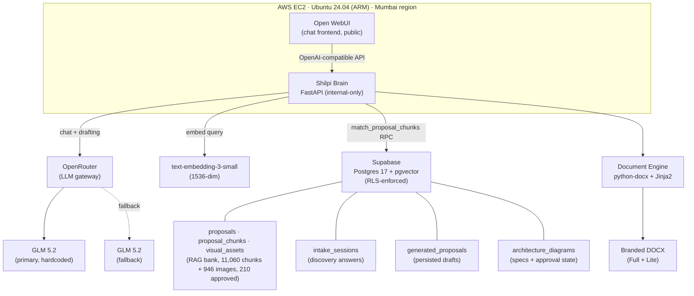
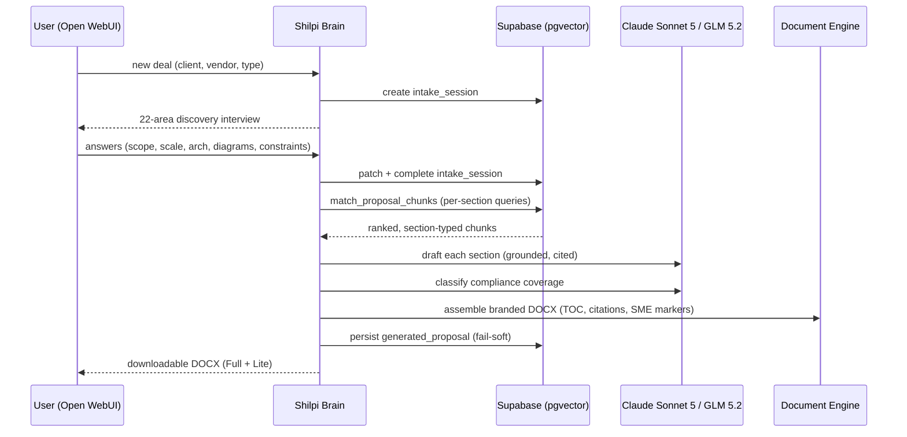
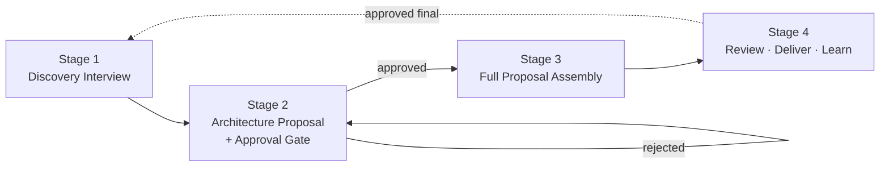
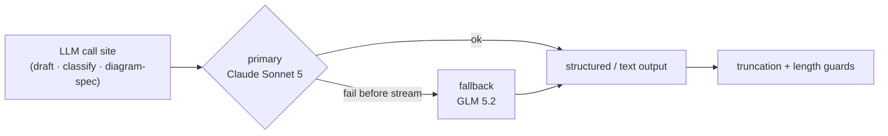
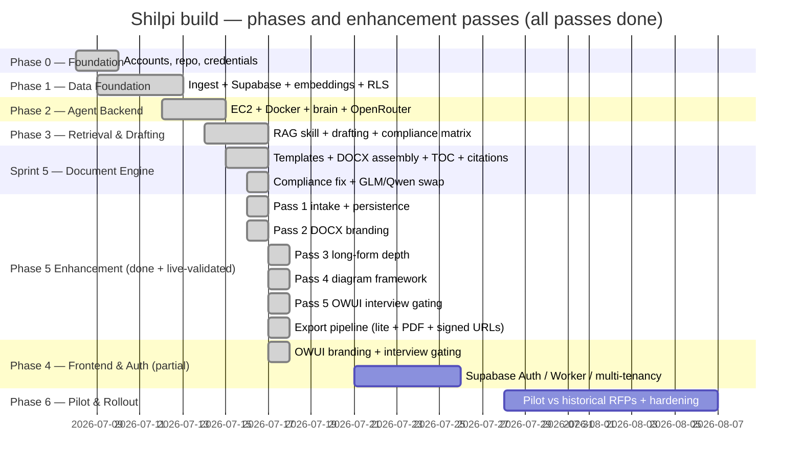

# Shilpi — IV Proposal Architect

**Shilpi** (शिल्पी, Sanskrit for *"artisan, craftsperson"*) is Inspirit Vision's in-house Proposal Architect — a conversational, retrieval-grounded AI that turns a new RFP into a structured, client-ready proposal in hours instead of days, by drafting from IV's curated bank of 112 past proposals rather than from a blank page.


-231154)


-FF9900)

> **Internal use only.** Proprietary to Inspirit Vision. This repository is public for collaboration; no client content, credentials, or infrastructure secrets are committed. See [Security posture](#security-posture).

---

## Progress Dashboard

> Quick-glance project status. Last updated: 2026-08-22 (IST).

**Two questions gate use. Neither is a percentage.**

| | Status |
|---|---|
| **Can IV use this on a live deal?** | Not yet. Blocked by: the frontend is plain HTTP, this repo is public, and the fixes from run 8 are untested in a live run. All small. |
| **Would a senior IAM architect sign the output?** | **Unknown — never tested.** Eight scored runs, one reader, the person who built it. No amount of further code answers this. |

<details>
<summary>Why there is no overall completion figure here</summary>

There used to be one. It was hand-typed, disagreed with the phase table below
(88% against 81%), and drifted every time a phase row was edited.

More importantly it measured progress against a plan written in July — before we
knew the corpus was 11% ingested, before the section template turned out to be
wrong, before image reuse existed as an idea. Optimising that number means
closing rows in a table, which is not the same as being useful to IV.

The phase table is kept because it shows *shape*: where effort went and what was
never started. It is not a completion score.
</details>

### Phase completion

| Phase | Status | Progress |
|---|---|---|
| 0 — Foundation & accounts | Done | `████████████████████` 100% |
| 1 — Data foundation (ingest + Supabase + embeddings) | Done | `████████████████████` 100% |
| 2 — Agent backend (EC2 + Docker + OpenRouter) | Done | `████████████████████` 100% |
| 3 — Retrieval + drafting | Done | `████████████████████` 100% |
| 4 — Conversational frontend + auth | Partial | `███████████████░░░░░` 75% — **full pipeline validated end to end in chat** (router → 22-area discovery → diagram plan → per-diagram approval → drafting → DOCX/PDF); auth/multi-tenancy still missing |
| 5 — Architecture approval gate + compression/export | Done (gate enforced in chat) | `████████████████████` 98% |
| 6 — Validation (recreation benchmark) | In progress | `███████████████░░░░░` 75% — eight scored runs against the Amlak proposal. Fidelity, hygiene, structure, prose volume and image placement all addressed and measured. What remains is not a build task: **no reviewer other than the builder has read a draft** |
| 7 — Pilot + hardening + rollout | Not started | `░░░░░░░░░░░░░░░░░░░░` 0% |

### What's next

Three sprints. The ordering matters more than the contents: the project is
feature-rich and evidence-poor, and everything built since run 6 has been judged
by one reader.

**Sprint I — clear the runway.** Frontend behind TLS, repository made private,
the asset library reviewed at legible size, and run 9 to confirm the run-8 fixes
landed. Small, and it ends with a document worth showing someone.

**Sprint J — get a verdict.** A senior IAM architect reads a draft against
"would you sign this"; the commercial owner reads the commercial section. In
parallel, a **migration** run and an **MSS** run — both have templates and real
grounding (39 and 14 proposals) and neither has ever been exercised end to end.
Ends with a rework number produced by someone other than the builder.

**Sprint K — built against evidence.** Contents written by Sprint J's verdict,
not guessed now. The standing candidates are cross-encoder reranking, image
placement position, and the outcome loop (`outcome` is `unknown` for all 112
proposals, and weighting retrieval toward what actually won is the change that
would compound most).

The honest risk in that ordering: if Sprint J finds the problem somewhere we have
not looked, some of the work since run 6 was speculative. That is an argument for
running J sooner, not for skipping it.

Eval fixtures live in `docs/evals/` and are **not committed** — they contain
client-confidential proposal content and this repository is public. See
[`docs/evals/README.md`](docs/evals/README.md).

### Known gaps before pilot

- **Corpus** — 112 proposals, 11,060 chunks, 50 clients, 15 vendors. Composition is now 61 implementation / 39 migration / 14 MSS, against 10/0/1 before. The Sales-SoWs bank was curated by reading document CONTENT, not filenames: 68 of 197 candidates were rejected, including a client-authored STC RFP whose doc properties name Saudi Telecom, a competitor's proposal authored by Smpl ID, 22 consultant CVs and 2 NDAs.
- **Supabase Auth / Worker / multi-tenancy** (Phase 4) — not wired (RLS + disabled sign-ups is the interim gate). `approved_by` on diagrams stays NULL until user identity exists.
- **Port 8080 is still plain HTTP** with the whole proposal bank behind it. Open since the first session; the only outstanding item with a live security consequence.
- **Diagram detail** — swimlanes and page-fit are built and working (run 6 produced a six-lane joiner flow with real branch logic). Two gaps remain: the model ignores the `shape` field so decision points render as rectangles rather than diamonds, and hardware-spec callouts beside the boxes are not built.
- **Durable diagram spec-template store** (per vendor + diagram type) — deferred from Pass 4.
- **Reranking** — a 2026 controlled comparison found cross-encoder reranking the only technique that reliably beat plain dense retrieval at this corpus scale, while hybrid BM25+dense and multi-query expansion both finished BELOW it. Reranking is therefore the next retrieval change worth measuring; hybrid search is not.
- **Nobody but the builder has read a Shilpi draft** — eight scored runs, one reader, one opinion. Every quality judgement in this document rests on that. Ashish's "would you sign this" benchmark has never been applied. This is the largest untested assumption in the project and no amount of further building removes it.
- **`outcome` is `unknown` for all 112 proposals** — recording won/lost and weighting retrieval toward what actually won is the single change that would compound more than anything else here. It needs a human who knows the answers.
- **Phase 6 pilot against historical RFPs** — not started. The `RFP/` folder in the Drive bank (20 client-authored documents, tiered `testset` during curation) is the natural test set.
- **Visual density** — the human Amlak proposal carries 37 images; run 8 produced 16, up from 6. Placement works, but images land at the END of whatever section matched rather than beside the text they illustrate, so an engagement-approach graphic sat under "Workforce and Capabilities". The realistic ceiling is 10–15: of IV's 37, roughly a third are per-deal architecture drawings that cannot be reused at all.
- **Image placement leaked another client's data, and the gate did not catch it** — run 8 placed a Microsoft Project Gantt chart under *Case Studies* showing BTPN's and STC's task names, durations and resource assignments, in a proposal addressed to Amlak. Two failures compounded. The classifier filed Gantt charts as `corporate` on the reasoning that they are "generic in shape, client-specific only in the dates"; a Gantt chart IS a client's project plan. And the approval sheet rendered 260px thumbnails on which the task names were illegible — a gate you cannot read through is not a gate. Fixed: 131 assets un-approved (any project schedule, and anything whose description or OCR names a corpus client), thumbnails raised to 720px with click-to-zoom, and the sheet now reflects current approval state instead of pre-checking everything, which would have silently restored the rejects on the next export.
- **Captions removed entirely** — captions were generated from each image's vision description and produced, verbatim: *"Gantt chart, a type of project management diagram that visualizes the schedule and dependencies for the 'Sistem-BTPN ProjectPL'. It details tasks broken into ph"*. Three faults in one string: it explained what a Gantt chart is to an IAM audience, it named another client's project, and it truncated mid-word. IV's own proposals caption almost nothing.
- **Company Profile is thin** — 493 words but generic, because the `company_profile` chunks behind it are mostly headings and fragments rather than IV's actual profile prose. A corpus problem, not a template one.
- **Sizing evidence is lopsided** — the retrieval scorecard measures tabular evidence per probe: `sizing_prod` scores 1.00, `sizing_dr` scores 0.12. The corpus is rich in production sizing tables and nearly bare of DR-specific ones, which is why run 7 lost its DR, UAT and Development sizing tables. No amount of retrieval tuning fixes a gap in the source material.
- **The benchmark must stay out of the corpus** — both Amlak proposals were ingested during bulk ingestion and have been deleted. Run 7 was drafted with its own answer available, so its Similar Experience quality is genuine but its overall score is inflated. Always run the leakage check before a scored run.

### Recently shipped (2026-08-21 → 22)

**Images reach the document.** 6 → 16 in run 8. 946 assets recovered from the
bank with no API calls (the pipeline was already extracting, OCRing and
describing images with a vision model, then discarding the bytes); reclassified
from those stored descriptions into 239 corporate and 106 product; 341 approved
through an offline contact sheet; then **131 un-approved** after run 8 showed
why.

**A client data leak, and what it taught.** Run 8 put another client's Microsoft
Project plan into a proposal. The rule that allowed it was mine, and the reason
it survived review was also mine: 260px thumbnails on which the task names could
not be read. Both fixed. The general lesson is recorded in `02_LESSONS.md`: an
approval gate must be legible at the size the reviewer sees, or it launders a
decision nobody actually made.

**Three run-8 defects traced to limits I set.**

| Symptom | Cause |
|---|---|
| `[SME REV`, `[SME RE` truncated mid-word | 420-token cap against a 220-word instruction. A hard cap must be a safety net, never the binding constraint |
| Paragraphs of 180 words (IV's median is 29) | the instruction capped the SUBSECTION and said nothing about paragraphs |
| "Gantt chart, a type of project management diagram that…" | captions built from vision descriptions, truncated at 160 chars |

**Client review artefacts were published to this public repo** — the asset
contact sheet, carrying 341 base64 thumbnails of client proposal imagery and
descriptions naming clients, was committed by a `git add -A`. The `.gitignore`
rules for it had been written but never actually added. Purged from history with
`git filter-repo` and force-pushed; the ignore rules now verified with
`git check-ignore` rather than assumed. Untracking a file does nothing if the
ignore rule was never there.

---

### Recently shipped (2026-08-14 → 21)

Every number below is measured, and several of them overturned a change that
looked correct. That is the point of recording them.

**Corpus: 11 → 112 proposals.** The Sales-SoWs bank was curated by reading
document *content*, not filenames. 68 of 197 candidates were rejected: a
client-authored STC RFP whose doc properties name Saudi Telecom Company and
whose body still carries `<stc: Enter Project Number>` placeholders, a
competitor's proposal authored by Smpl ID whose corporate boilerplate would
have entered IV's voice bank, 22 consultant CVs, 2 NDAs and four vendor
marketing PDFs. Migration proposals went from **0 to 39**, MSS from 1 to 14.

**Ingestion is manifest-driven with content-hash dedup.** Selection comes from
the reviewed manifest, never a directory walk, and the manifest's human-verified
metadata overrides whatever the model infers — which is how Mannai stays
Ahlibank, Netpolean stays ABB India and PNB stays PNB MetLife.

**Retrieval rebuilt and measured.** A 20-probe scorecard
(`scripts/eval_retrieval.py`) now scores source diversity, proposal-type match,
section-topic match, tabular evidence share, fragment share and recency:

| | before | after |
|---|---|---|
| type match | 0.429 | **0.768** |
| topic match | — | **0.700** |
| max hits from one proposal | 7 of 10 | **2 of 8** |
| section labels marked `other` | 45.6% | **29.9%** |

Type match was previously *worse than random*: migration queries returned 0.25
migration content against a 35.5% base rate, so every migration section would
have been drafted from greenfield implementation proposals.

**Three stacked bugs found by refusing to trust a success response.** The type
reservation was cosmetic — a trailing `LIMIT` re-selected the global top-k and
evicted every reserved row, because reserved rows score lower by construction.
Fixing that changed nothing, because pgvector's HNSW index returns at most
`hnsw.ef_search` candidates (default **40**) however large the LIMIT, so two
prior migrations' "wider pools" never existed; in those 40 candidates, 39 were
implementation and one was migration. Fixing *that* needed `SET LOCAL`, which
needs PL/pgSQL, which then failed twice more on `STABLE` and on `RETURNS TABLE`
column shadowing.

**A metric that does not measure what you care about will approve a regression
in it.** The scorecard approved topic-aware retrieval on relevance; run 7 then
lost three sizing tables and rows from every other table. `tabular_pct` was
added in response, and the topic reservation lowered from 50% to 30%.

**Migration proposal type built.** 14 sections covering current-state
assessment, migration strategy, rollback and decommissioning — none of which
exist in a greenfield template. The intake had offered `migration` since it was
written while `get_template("migration")` raised `ValueError`, so a consultant
could answer all 22 discovery areas and then hit a crash. Now asserted as an
invariant over every intake type.

**Visual assets recovered.** 946 assets from 74 proposals, with no API calls:
the pipeline was already extracting images, OCRing them and describing the
diagrams with a vision model, then discarding the bytes. The descriptions were
reattached by the index in their chunk headings (`Diagram #5` → image 5), which
is deterministic because extraction order is.

**Lessons re-learned, recorded so they are not re-learned again.**
Slug truncation at 60 characters silently rejected four of six TASNEE MSS
revisions as duplicates. A dry run that skipped fetching descriptions reported a
classification that could not occur in the real run. The first section
classifier left 60% residue — *worse* than the 46% it replaced — and only the
dry run caught it. Two tests written for the topic work passed a negative
control with their call sites deliberately unwired.

---

## Executive Summary

Inspirit Vision currently spends multiple person-days drafting each client proposal from scratch — assembling company profile, similar experience, scope understanding, solution architecture, implementation methodology, RACI, timeline, and compliance from memory and old files. With a curated bank of 112 past proposals across 15 vendors and 50 clients — SailPoint, Ping Identity, ForgeRock, Oracle, IBM, BeyondTrust, CyberArk, Okta, Saviynt, Red Hat Keycloak among them — there is enough reusable intellectual property to power a system that drafts, diagrams, and delivers proposals in a fraction of the time.

Shilpi is that system. He is **not a chatbot and not a search engine** — he is a well-read junior consultant who has read every proposal IV has ever sent, remembers all of them, interviews you about the new deal, proposes an architecture you must approve, and then drafts the full document section by section, grounded in what IV has actually delivered before.

### The economics behind it

| Signal | Value | Source |
|---|---|---|
| Time to first full draft, manual process | 2 to 5 person-days | IV internal baseline |
| Proposal content that is static/reusable across deals | ~60% | IV corpus analysis, 10 sample proposals |
| Images that are reusable across proposals | 345 of 946 (36%) | `visual_assets`, content-hash dedup across 74 proposals. The rest are client-specific architecture drawings or unclassifiable |
| Source proposals in the working corpus | 112 ingested, 11,060 chunks | Shilpi Supabase, live |
| Target time to first draft | under 2 hours | Project success criterion (V1) |
| Target output size (Lite, email-friendly) | under 5 MB | Project success criterion (V1) |

### Targets

| Metric | Pilot exit | Steady state |
|---|---|---|
| Time to first full draft | under 2 hours | under 90 minutes |
| Structural completeness (expected sections present) | 100% | 100% |
| Fabricated client references / pricing | Zero | Zero |
| Drafts requiring major rework | under 30% | under 15% |

### What Shilpi will not do

- **He will not invent client references or metrics.** If he does not know something, he says so, and inserts an `[SME REVIEW]` marker.
- **He will not fill in pricing.** Commercials are always a human call. He sets up the table; the team fills in the numbers.
- **V1 contract:** he will not start drafting until the architecture is approved. This is a hard gate — no shortcuts — and it is **enforced in the chat flow**: a drafting request before approval is refused.
- **He will not be sycophantic.** No "Great question!", no exclamation marks, no celebration emojis. He talks like a senior consultant.

---

## Known Gaps — Not Pilot-Ready Yet

Honest about what is not done, so no one mistakes the current state for production-ready:

- **Auth and multi-tenancy:** Supabase Auth and the Worker JWT gate are not wired. The brain is protected by network isolation (internal-only) and Open WebUI's disabled sign-ups, not by per-user identity. User identity is not yet propagated end-to-end, so generated drafts are not yet attributed to individual users (`approved_by` on diagrams is NULL). Production auth hardening is a pending milestone, not abandoned.
- **Nobody but the builder has read a Shilpi draft.** Seven scored runs, one reader, one opinion. Every quality judgement in this document rests on that. Getting a senior IAM architect to read one and mark what they would rewrite is now the highest-leverage open item — it is also the ground truth any future LLM reviewer would need to be scored against.
- **Proposal length:** `full` depth measures 42pp after the NoneType fix + 3500-token cap (both deployed); the opt-in `deep` tier (6 subsection facets) is merged but not yet re-measured. 100+pp remains a target, pending a decision on whether length is the right proxy for "boss-ready".
- **Durable diagram spec-template store:** reusable DiagramSpec templates keyed by vendor and diagram type are deferred from Pass 4 (the engine regenerates from scratch for now).
- **External research and fact-checking:** Exa/Firecrawl external research and the secondary-LLM fact-checker are deferred to post-pilot.
- **Hybrid search:** deliberately NOT pursued. A 2026 controlled comparison found hybrid BM25+dense finishing *below* plain dense retrieval at this corpus scale, and multi-query expansion posting the lowest precision of any strategy. Cross-encoder reranking was the only technique that clearly won, so that is the next retrieval change worth measuring.
- **Diagram visual parity:** D2 output is accurate and legible but visibly machine-generated next to IV's hand-composed sample decks. Auto-layout cannot close that gap. Reaching house-style parity needs either editable export (`.drawio`/`.pptx`) for a human to finish, or a designer-built SVG template library for the ~4 recurring diagram types — a design investment, not an engineering one. Deferred until pilot feedback says whether it matters.
- **Pilot validation:** no end-to-end runs against historical RFPs with the scoring rubric yet.

---

## System Architecture


```mermaid
flowchart TB
    subgraph EC2["AWS EC2 · Ubuntu 24.04 (ARM) · Mumbai region"]
        OWUI["Open WebUI<br/>(chat frontend, public)"]
        BRAIN["Shilpi Brain<br/>FastAPI (internal-only)"]
        OWUI -->|OpenAI-compatible API| BRAIN
    end

    ROUTER["OpenRouter<br/>(LLM gateway)"]
    GLM["GLM 5.2<br/>(primary, hardcoded)"]
    QWEN["GLM 5.2<br/>(fallback)"]
    EMB["text-embedding-3-small<br/>(1536-dim)"]

    SB["Supabase<br/>Postgres 17 + pgvector<br/>(RLS-enforced)"]
    PROP["proposals · proposal_chunks · visual_assets<br/>(RAG bank, 11,060 chunks + 946 images, 210 approved)"]
    INTAKE["intake_sessions<br/>(discovery answers)"]
    GEN["generated_proposals<br/>(persisted drafts)"]
    DIAG["architecture_diagrams<br/>(specs + approval state)"]

    DOCS["Document Engine<br/>python-docx + Jinja2"]
    DOCX["Branded DOCX<br/>(Full + Lite)"]

    BRAIN -->|chat + drafting| ROUTER
    ROUTER --> GLM
    ROUTER -.fallback.-> QWEN
    BRAIN -->|embed query| EMB
    BRAIN -->|match_proposal_chunks RPC| SB
    SB --- PROP
    SB --- INTAKE
    SB --- GEN
    SB --- DIAG
    BRAIN --> DOCS
    DOCS --> DOCX
```

**The critical edge in that diagram is the internal-only binding.** The brain is never exposed publicly — every external path runs through the Open WebUI frontend, and the brain holds the only keys to Supabase and OpenRouter.

### End-to-end proposal sequence


```mermaid
sequenceDiagram
    participant U as User (Open WebUI)
    participant B as Shilpi Brain
    participant S as Supabase (pgvector)
    participant L as Claude Sonnet 5 / GLM 5.2
    participant D as Document Engine

    U->>B: new deal (client, vendor, type)
    B->>S: create intake_session
    B-->>U: 22-area discovery interview
    U->>B: answers (scope, scale, arch, diagrams, constraints)
    B->>S: patch + complete intake_session
    B->>S: match_proposal_chunks (per-section queries)
    S-->>B: ranked, section-typed chunks
    B->>L: draft each section (grounded, cited)
    B->>L: classify compliance coverage
    B->>D: assemble branded DOCX (TOC, citations, SME markers)
    B->>S: persist generated_proposal (fail-soft)
    B-->>U: downloadable DOCX (Full + Lite)
```

---

## Component Choices and Why

| Component | Choice | Why this and not the alternative |
|---|---|---|
| Agent runtime | **FastAPI brain** (Python) | Replaced the originally-planned Hermes agent after evaluating framework lock-in. A thin FastAPI service is fully auditable, has no telemetry, and every prompt change is a tracked commit. Skills are plain Python modules, not a proprietary format |
| LLM gateway | **OpenRouter** | Provider-agnostic. One key, one contract, swap models by changing a constant. No per-provider SDK lock-in |
| Primary LLM | **Claude Sonnet 5** (`anthropic/claude-sonnet-5`) | Chosen by measurement, not preference: same 22 inputs, model as the only variable. GLM produced 4 degenerate paragraphs including two thesaurus walks of 645 and 677 words with no full stop; Sonnet produced 0, worst case 104. Verbosity and em-dash habit barely moved, which is how we knew those were template problems |
| Fallback LLM | **GLM 5.2** (`z-ai/glm-5.2`) | Auto-triggered at every call site if the primary fails before streaming. Overridable via `SHILPI_PRIMARY_MODEL` / `SHILPI_FALLBACK_MODEL`; any override is logged at startup and reported by `GET /health`, so it is never silent |
| Embeddings | **text-embedding-3-small** (1536-dim) | Cheap, well-understood, good enough for vendor/section-typed retrieval. Negligible one-time cost to embed the whole bank |
| Retrieval | **Supabase pgvector** + `match_proposal_chunks` RPC | HNSW vector search with content dedup (42.9% of chunks are byte-identical, because IV keeps document revisions), a per-proposal cap so no single document fills the evidence budget, and reserved slots for the proposal type and section topic being drafted — plus a topic-scoped second query for topics too small to appear in a general candidate pool |
| Document output | **python-docx + Jinja2** | Native DOCX with real headings, tables, a refreshable TOC field, and embedded images. Templates are version-controlled Jinja2, not a binary .dotx |
| Diagram rendering | **DiagramSpec JSON → D2 (SVG → librsvg PNG), Graphviz fallback** | The model emits a constrained JSON spec; D2 renders it with real nested zone containers (DMZ / secure zone / data zone) which Graphviz lays out poorly. SVG is native (no headless browser); Graphviz stays installed as an automatic fallback so a missing `d2` binary degrades instead of breaking. No image-generation model (unreliable at precise labels), no external rendering API (would leak client architecture) |
| Chat frontend | **Open WebUI** | Open-source, OpenAI-compatible, supports a persona system prompt and a single locked model. Cheaper and more controllable than building a custom chat UI |
| Hosting | **AWS EC2 (ARM, Mumbai)** | Single-purpose box, static IP, close to the team. Fixed low monthly cost; covered by AWS credits during the MVP window |
| Data store | **Supabase (Postgres + pgvector + RLS)** | Auth, relational data, vector search, and storage in one free-tier service. RLS at the database layer is the security backbone |

---

## The Proposal Bank and RAG

Shilpi grounds every draft in what IV has actually delivered, never in model memory.

- **Bank:** 421 files in the Sales-SoWs Drive folder, of which **129 are IV-authored proposal prose**. **Working corpus:** 112 proposals, 11,060 chunks, 50 clients, 15 vendors. Composition 61 implementation / 39 migration / 14 MSS.
- **Curation by content, not filename.** A content review rejected 68 of 197 candidates the path heuristics had accepted: a client-authored STC RFP whose doc properties name Saudi Telecom Company, a competitor's proposal authored by Smpl ID, 22 consultant CVs, 2 NDAs, vendor marketing PDFs. Client-authored documents are **never** bank content — grounding IV's voice in the client's words and citing it as IV past work is the failure this prevents.
- **Two label columns, deliberately.** `section_type` is STRUCTURAL (`table`, `diagram`, `page`, `ocr`) — how the content was extracted. `section_topic` is SEMANTIC (23 topics: `scope`, `architecture`, `sizing`, `raci`, `why_vendor`, `company_profile`, `migration`, `pricing`, ...) — what it is about. A table inside a Commercial section is both; one column cannot express that.
- **Why the semantic column exists.** `section_type` was 46% `other`, with 34 `why_vendor` and 16 `company_profile` chunks in the entire corpus — yet every IV proposal has both. Metadata-filtered retrieval was impossible against labels that poor. After reclassification (`scripts/classify_sections.py`, rules not a model, 29.9% residue): `company_profile` covers 96 of 114 proposals, `similar_experience` 94, `pricing` 105.
- **Metadata per proposal:** `client_name`, `industry`, `country`, `iam_vendor`, `proposal_type` (implementation / migration / MSS), `user_count`, `app_count`, `deal_size_bucket`, `outcome`, `year`, plus `source_sha256` and `source_tier` for provenance. The reviewed manifest's values **override** anything the model infers during ingestion: a first-page read is exactly where a partner's name sits, which is how `CIAM_Mannai_IV_Technical_Proposal_V3_0.docx` reads as a Mannai proposal when the client is Ahlibank.
- **`outcome` is `unknown` for all 112.** Recording won/lost and weighting retrieval toward what actually won is the single change that would compound more than anything else on the roadmap. It needs a human who knows the answers, and nobody has been asked.
- **Visual assets:** 946 images from 74 proposals (385 MB) in a private Supabase Storage bucket. `visual_assets` holds the metadata, the vision description already paid for during ingestion, and a **mandatory approval gate** (`approved` defaults false). Dedup on content hash collapsed 3,763 duplicates — the IV logo appears in most proposals and stores once.
- **Only two of four asset kinds may ever be placed.** `corporate` (239) and `product` (106) are reusable. `architecture` (379) is excluded **in code**, not left to a reviewer: those images depict a specific client's zones, node counts and integrations, so one in another client's proposal is a leak. `unknown` (224) has no vision description because OCR never ran, so it cannot be judged.
- **210 assets are currently approved.** 131 were withdrawn after run 8: any project schedule (a Gantt chart is a client's project plan, however generic it looks) and anything whose description or OCR text names a corpus client.
- **Selection matches on vision descriptions, not provenance.** The original design placed images by the `(section_heading, image, caption)` triple, but the extractor fell back to "the first non-image chunk" whenever an image's own heading was its numbering — so 49 corporate assets across 12 proposals were all labelled "Introduction". Provenance that says everything came from the same place says nothing.

### Grounding contract

- Every drafted claim is tied to a retrieved chunk with a citation number.
- A **weak-evidence threshold** flags low-similarity sections with an `[SME REVIEW: weak evidence]` prefix rather than forcing uncertain content.
- Compliance requirements are classified per-requirement (Met / Partially Met / Not Met) against the retrieved evidence, with paraphrase matching to avoid false negatives.

---

## Conversational Workflow

Shilpi follows a four-stage conversation, with a hard human gate before any drafting begins — **enforced end-to-end in the chat flow** as of 2026-07-27. A new thread opens with an intent router (start a new proposal / search past proposals / discuss); conversation state travels in invisible markers inside assistant replies, so the stateless OpenAI-compatible protocol needs no OWUI plugin.


```mermaid
flowchart LR
    S1["Stage 1<br/>Discovery Interview"] --> S2["Stage 2<br/>Architecture Proposal<br/>+ Approval Gate"]
    S2 -->|approved| S3["Stage 3<br/>Full Proposal Assembly"]
    S2 -->|rejected| S2
    S3 --> S4["Stage 4<br/>Review · Deliver · Learn"]
    S4 -.approved final.-> S1
```

### Stage 1 — Discovery Interview
A 22-area structured interview collects everything needed for an accurate draft: client and engagement details, scale and volumetrics, scope, **architecture inputs (deployment model, required diagram types and count, hardware sizing, HA/DR, security architecture)**, migration, integrations (HRMS, AD/Exchange, IdP/SSO, applications), compliance and regulatory specifics, timeline, MSS-specific SLA/commercials (conditional), submission constraints, audience and win-themes, current-state systems, NFRs, delivery model, post-go-live, and reuse controls. Every answer persists to the `intake_sessions` table.

### Stage 2 — Architecture Proposal and Human-in-Loop Gate
Shilpi retrieves the closest-matching past architecture, generates a `DiagramSpec`, renders it for preview, and presents it. The user **approves or rejects with comments**; on rejection he regenerates incorporating the feedback. Approved diagrams are persisted and embedded in the DOCX. **V1 contract (enforced):** drafting is hard-gated on an approved architecture — a "generate the proposal" request before approval is refused in chat. The reusable spec-template library remains deferred.

### Stage 3 — Full Proposal Assembly
Static sections (Company Profile, Why-Vendor, Methodology) are pulled near-verbatim from the RAG bank. Dynamic sections (Executive Summary, Sizing, RACI, Timeline, Solution Architecture) are generated fresh, grounded in retrieved chunks. A compliance matrix is classified per requirement. The document is assembled into a branded DOCX with a refreshable TOC, citation appendix, and SME-review markers.

### Stage 4 — Review, Deliver, Learn
Section-level edit requests preserve approved sections untouched. On final approval, the proposal is saved back into the RAG bank as new reference material, so the next deal starts smarter. Delivery in "Full" (print-ready) and "Lite" (email-friendly, under 5 MB) variants.

---

## Measuring Retrieval

Every retrieval change since 2026-08-18 has been gated on a scorecard, because
several changes that looked obviously right were measured as no-ops or
regressions.

```bash
python3 scripts/eval_retrieval.py --baseline           # record a baseline
python3 scripts/eval_retrieval.py --compare retrieval_baseline.json
```

Twenty probes drawn from **real template subsections** (production sizing, RACI,
Why-Vendor, migration cutover, payment milestones), scored on: distinct
proposals represented, max hits from any one proposal, proposal-type match,
section-topic match, tabular-evidence share, fragment share, recency and mean
similarity. No single number is the verdict — a change that raises diversity
while collapsing relevance is a regression, and the comparison says so.

This exists because a 2026 controlled study of five retrieval strategies found
that **increased complexity did not reliably improve results at this corpus
scale**: hybrid BM25+dense and multi-query expansion both finished *below* plain
dense retrieval, with multi-query posting the lowest precision of any strategy.
Only cross-encoder reranking clearly won. Our corpus is a narrow domain at a
similar scale — exactly the regime where added sophistication backfired. So the
rule is: measure first, change second, measure again.

Scorecard JSONs are gitignored: they contain client names.

---

## Document Production Engine

The engine is what turns a chat thread into a deliverable document.

### Built now

- **Templates:** Jinja2 section templates for `implementation`, `migration` and `mss`. Every type the intake offers now has a template, asserted as an invariant — the intake offered `migration` for weeks while `get_template("migration")` raised `ValueError`, so a consultant could answer all 22 discovery areas and then hit a crash. The `migration` template is 14 sections and is NOT the implementation one renamed: current-state assessment, migration strategy (including whether password hashes carry across or users must re-enrol), rollback position, and decommissioning have no greenfield counterpart. The `implementation` template mirrors IV's real house structure — **11 top-level sections and 47 content-specific subsections, every heading distinct** ("Proposed Production Hardware Sizing", "Tranche 2 - Lifecycle Management and Initial Applications", "Payment Milestones"). Eleven subsections explicitly require a markdown table, which the assembler renders as native Word tables. Section titles and headings render through Jinja, so vendor and client names substitute ("Proposed Solution - SailPoint", "Why SailPoint"). Subsections defined on a section override the depth tier's count: those headings are the section's structure, not a knob.
- **Section-by-section drafting:** each section runs its own retrieval query and LLM draft, with per-call token caps and frequency penalty to prevent repetition spirals on ambiguous content.
- **Compliance matrix:** per-requirement classification against retrieved evidence, with paraphrase matching and a truncation guard.
- **Citations and traceability:** retrieval traces are persisted with each generated proposal. Inline `[N]` markers and the citation appendix are **stripped from the deliverable** — the appendix listed retrieved chunks by client name and similarity score, so an Amlak document named three other IV clients across 78 paragraphs. Provenance belongs in logs, not in a document that leaves the building.
- **SME-review markers:** inserted where evidence is weak or a gap is detected, so human review is fast and targeted.
- **Branded DOCX:** IV logo on the title page, navy (`#231154`) and orange (`#E85A24`) accents, running header/footer with page numbers and section dividers. A client logo **attached in the chat** at discovery area 10 is decoded and placed both on the title page and in the running header on every page.
- **Deterministic QA gate (`document_qa.py`):** three independent structural signals for degeneration — phrase repetition, longest run without sentence-ending punctuation, and function-word density — measured against the human Amlak proposal as a control (0 false positives across 375 blocks). Also strips em-dashes (IV writes 0.2 per 1,000 words; an early run wrote 13.4) and internal review asides in bracketed, dash-led and bare forms.

### Built now (continued — enhancement passes)

- **Long-form depth:** `brief` / `standard` / `full` tiers control retrieval fan-out and, for sections that do not define their own subsections, the number of generic facets drafted. `full` adds RACI, timeline, sizing, integration inventory, and risk appendices as real DOCX tables.
- **Diagram framework (done + live-validated):** the model emits a constrained `DiagramSpec` JSON → D2 renders SVG (librsvg → PNG), Graphviz fallback → user approves **in chat** → only approved diagrams are embedded. Approval state machine (draft → needs_review → approved/rejected), driven from the conversation.
- **Swimlanes and page fit (done):** for flow diagrams `group` means the ACTOR, not the network zone, so a joiner flow renders as horizontal lanes (HRMS / IdentityIQ / Manager / Active Directory) the way IV draws it. Diagrams that come out too tall for the page are re-laid-out and the best-scoring candidate kept, measured from the rendered SVG rather than guessed: an Amlak-shaped architecture diagram went from 2.45 aspect (a sliver) to 0.46. Node shapes (`decision`, `datastore`, `external`) are supported but the model ignores them — see Known Gaps.
- **Image placement (done):** approved `corporate` and `product` assets are matched to sections on their vision descriptions and embedded at 4.5 x 3.2 inches. Each image appears once per document. Off by default (`SHILPI_ASSETS_ENABLED`), because turning it on changes what lands in a client document.
- **Export pipeline (Round 3, done + live-validated):** lite (<5 MB) DOCX compression via Pillow, PDF export via LibreOffice headless, and delivery to storage signed URLs (`generated-drafts` bucket, 1-hour TTL). Opt-in via `lite` / `include_pdf` / `return_signed_urls` on `/v1/generate-proposal`.

### Deferred

- **Client-logo sourcing:** approval-gated embedding of a client logo sourced online when one is not provided.
- **Durable diagram spec-template store:** reusable specs keyed by vendor and diagram type (the engine regenerates from scratch for now).

---

## Model Routing


```mermaid
flowchart LR
    CALL["LLM call site<br/>(draft · classify · diagram-spec)"] --> P{"primary<br/>Claude Sonnet 5"}
    P -->|ok| OUT["structured / text output"]
    P -->|fail before stream| F["fallback<br/>GLM 5.2"]
    F --> OUT
    OUT --> GUARD["truncation + length guards"]
```

- **Primary:** Claude Sonnet 5. **Fallback:** GLM 5.2. Defaults live in code; `SHILPI_PRIMARY_MODEL` / `SHILPI_FALLBACK_MODEL` override them, and any override is logged at startup and reported by `GET /health` so it is never silent. There is no model chooser in the UI; Open WebUI exposes a single model, "Shilpi Architect".
- **Why Sonnet over GLM:** measured, not assumed. Same 22 inputs, model as the only variable. GLM produced 4 degenerate paragraphs including two single-pass thesaurus walks of 645 and 677 words with no full stop; Sonnet produced 0, with a worst case of 104. Verbosity and em-dash habit barely moved, which is what identified them as template and prompt problems rather than model problems.
- Fallback applies at all five LLM call sites (chat drafting, section drafting, compliance classification, open-router raw drafting, and diagram-spec generation).
- **Why no DeepSeek:** it spiraled on ambiguous compliance requirements, generating hundreds of thousands of characters and multi-minute hangs. Removed in favor of the Sonnet/GLM chain with per-call token caps, frequency penalty, and truncation guards.
- **Why no image-generation model for diagrams:** image-gen models mangle precise text labels and break schematic consistency, and editing labels onto a raster diagram is unreliable. D2 (with Graphviz fallback) renders the DiagramSpec deterministically — no model failure point — and the only model involved (spec generation) already has the GLM fallback.
- **Why D2 over Graphviz:** Graphviz optimises for minimal edge crossings, not legibility, and its clusters lay out poorly — the first live deployment diagram came out as a repeat of the logical flow with no zones. D2 draws `group` as a real nested container, which is what DMZ / secure zone / data zone diagrams need. Both are auto-layout, so neither reproduces IV's hand-composed sample decks; see [Known gaps](#known-gaps--not-pilot-ready-yet).
- Embeddings use `text-embedding-3-small` (unchanged); OpenRouter's image API remains available as an optional path for non-diagram visuals later, but is not used for architecture diagrams.

---

## API Reference

The brain exposes an OpenAI-compatible interface plus proposal-production endpoints.

| Method | Endpoint | Purpose |
|---|---|---|
| GET | `/health` | Liveness + active primary/fallback model |
| GET | `/v1/keepalive` | Touches Postgres (prevents Supabase free-tier idle pause); cron-curled daily on the host |
| GET | `/v1/models` | Lists the single `shilpi-architect` model |
| POST | `/v1/chat/completions` | Conversation state machine: intent router → discovery interview → architecture approval gate → drafting; vault mode = grounded RAG chat (streaming, SSE heartbeats) |
| POST | `/v1/compliance-matrix` | Classify RFP requirements against retrieved evidence |
| GET | `/v1/intake-template` | Return the 22-area discovery interview (filters by proposal type) |
| POST | `/v1/intake-sessions` | Create a discovery session |
| PATCH | `/v1/intake-sessions/{id}` | Merge partial answers |
| POST | `/v1/intake-sessions/{id}/complete` | Validate required answers, mark complete |
| POST | `/v1/generate-proposal` | Generate a branded DOCX; accepts `intake_session_id`, `generated_proposal_id` (embeds approved diagrams), `proposal_depth` (`brief`/`standard`/`full`/`deep`), and export flags `lite` / `include_pdf` / `return_signed_urls` |
| POST | `/v1/proposals/{id}/diagrams` | Create a diagram spec (LLM-generated `DiagramSpec`, persisted as draft) |
| GET | `/v1/proposals/{id}/diagrams` | List diagrams for a proposal |
| PATCH | `/v1/diagrams/{id}` | Advance diagram status (draft → needs_review → approved/rejected; approved renders via D2/Graphviz + uploads) |
| GET | `/v1/diagrams/{id}` | Fetch a single diagram (status, spec, rendered path) |

Persistence is fail-soft: if a Supabase write fails, the generated DOCX is still returned — generation never blocks on storage.

---

## Security Posture

| Layer | Control |
|---|---|
| Network | EC2 security group restricts inbound to SSH (from known IPs) and the frontend port. The brain is bound to localhost — never exposed publicly. **Open gap: the frontend is served over plain HTTP on port 8080**, so session cookies and every proposal rendered in the browser cross the network unencrypted |
| Database | Row-Level Security enforced at the Postgres layer on every table. All writes use a server-side key; client-facing access is policy-gated. RLS is never disabled |
| Secrets | API keys live only in the server's local environment file (restricted permissions). `.gitignore` blocks `.env`, `*.env`, `*.pem`, `*.key`. **The `.env` pattern never matched `sarvam.env`** — caught before it was committed, but only by chance. Ignore rules for anything touching client data are now verified with `git check-ignore`, not assumed |
| Client data | Source proposals under NDA live under `data/raw/` (gitignored, never committed). Only anonymised metadata is version-controlled. **This was violated once** — see Incidents. Gitignored: corpus manifests (client names and engagements), retrieval scorecards (client names in probe results), the asset review sheet (client imagery), ingestion run output |
| Frontend | Open WebUI open sign-ups disabled; only the Shilpi Architect model is exposed (all other LLM connections removed) |
| LLM data | OpenRouter is the only external LLM path. No client content is sent to image-generation or rendering APIs |
| Availability | A daily keep-alive pings the database to prevent free-tier idle pause, and auto-restores the project if it is ever found paused |
| Key hygiene | API keys rotated quarterly. The WordPress Lightsail instance is out of scope and never touched by this project |

Deeper reasoning: [`docs/PROJECT.md`](docs/PROJECT.md) (contingency matrix, risk register).

---

### Incidents

- **2026-08-22 — client imagery published to this repo.** The asset review
  contact sheet (341 base64 thumbnails of client proposal images, plus vision
  descriptions naming clients) was committed by a `git add -A`. The
  `.gitignore` rules had been drafted but never added, and **untracking a file
  does nothing if the ignore rule was never there**. Purged with
  `git filter-repo` and force-pushed; a fresh clone confirms no trace in any
  commit. GitHub may retain unreferenced blobs by SHA until garbage collection,
  and anyone who cloned in the window still holds a copy.
  Now verified with `git check-ignore` rather than assumed, for every artefact
  that touches client data: `sarvam.env`, `ids.txt`, `asset_review.html`,
  retrieval scorecards, corpus manifests, ingestion run output.

- **2026-08-21 — another client's project plan placed in a proposal.** See
  Known Gaps. Not a repo exposure: the document was never sent.

## Costs

Qualitative model — no per-credit estimates. Exact figures are tracked in private ops notes.

| Item | Tier | Notes |
|---|---|---|
| Compute (EC2) | Free during MVP (credits), low fixed monthly after | Single ARM instance, static IP |
| Database (Supabase) | Free tier | Pauses after 7 days idle (mitigated by the daily keep-alive) |
| LLM (OpenRouter) | Pay-per-use | Claude Sonnet 5 primary, GLM 5.2 fallback only on primary failure. The old ~$0.45/proposal estimate is stale: the model changed and subsections went 24 → 47. Still a few dollars for a document that takes a consultant days, so cost remains **not** the binding constraint — but the figure needs re-measuring |
| Embeddings | Negligible | One-time embed of the bank costs cents |
| Frontend, GitHub | Free tiers | Open WebUI is self-hosted; GitHub public repo |

Post-MVP graduation (when volume justifies): Supabase Pro removes the DB cap and idle-pause; OpenRouter production budget scales with proposal volume. The whole stack avoids per-seat SaaS licenses.

---

## Roadmap and Status

The original plan in [`docs/PROJECT.md`](docs/PROJECT.md) is a 6-phase, 12-sprint blueprint. Actual delivery compressed and reshuffled that plan; the table below tracks the real state.


```mermaid
gantt
    dateFormat  YYYY-MM-DD
    title Shilpi build — phases and enhancement passes (all passes done)
    section Phase 0 — Foundation
    Accounts, repo, credentials                 :done, p0, 2026-07-08, 2d
    section Phase 1 — Data Foundation
    Ingest + Supabase + embeddings + RLS        :done, p1, 2026-07-09, 4d
    section Phase 2 — Agent Backend
    EC2 + Docker + brain + OpenRouter           :done, p2, 2026-07-12, 3d
    section Phase 3 — Retrieval & Drafting
    RAG skill + drafting + compliance matrix    :done, p3, 2026-07-14, 3d
    section Sprint 5 — Document Engine
    Templates + DOCX assembly + TOC + citations :done, s5a, 2026-07-15, 2d
    Compliance fix + GLM/Qwen swap              :done, s5b, 2026-07-16, 1d
    section Phase 5 Enhancement (done + live-validated)
    Pass 1 intake + persistence                 :done, e1, 2026-07-16, 1d
    Pass 2 DOCX branding                        :done, e2, 2026-07-16, 1d
    Pass 3 long-form depth                      :done, e3, 2026-07-17, 1d
    Pass 4 diagram framework                   :done, e4, 2026-07-17, 1d
    Pass 5 OWUI interview gating                :done, e5, 2026-07-17, 1d
    Export pipeline (lite + PDF + signed URLs)  :done, e6, 2026-07-17, 1d
    section Phase 4 — Frontend & Auth (partial)
    OWUI branding + interview gating            :done, f4a, 2026-07-17, 1d
    Supabase Auth / Worker / multi-tenancy      :f4b, 2026-07-21, 5d
    section Phase 6 — Pilot & Rollout
    Pilot vs historical RFPs + hardening         :p6, 2026-07-28, 10d
```

| Milestone | State |
|---|---|
| Foundation, repo, credentials | Done |
| Supabase schema, RLS, pgvector, embeddings (112 proposals, 11,060 chunks) | Done |
| EC2 + Docker + brain + OpenRouter (Claude Sonnet 5 + GLM 5.2) | Done |
| Grounded RAG chat + compliance matrix | Done |
| Document-production engine (templates, DOCX, TOC, citations, SME markers) | Done |
| Compliance repetition fix + model swap (DeepSeek removed) | Done |
| Pass 1 — intake sessions + persistence foundation | Done |
| Pass 2 — DOCX branding (IV logo, navy/orange, header/footer, client-logo placeholder) | Done |
| Pass 3 — long-form depth (depth tiers, multi-subsection, RACI/timeline/sizing/risk appendices) | Done |
| Pass 4 — diagram framework (DiagramSpec → D2/Graphviz → approval → embed approved only) | Done + live-validated; approval gate now enforced in chat |
| Pass 5 — Open WebUI interview gating (no session → discovery interview) | Done |
| Export pipeline — lite <5 MB DOCX + PDF (LibreOffice) + signed URLs to storage | Done + live-validated |
| OWUI in-app logo branding (favicon env + /app/build/static override) | Done (merged); open-webui container rebuild pending on host |
| Persistence fix (generated_proposals status draft→drafting) | Done + live-validated |
| NoneType section-drafting bug (null LLM subsection → empty section) | Fixed — merged `6290d23` (PR #2); rebuild brain to deploy |
| Raise `MAX_DRAFT_TOKENS` (1500 → 3500) | Done — merged `6da140c`; rebuild brain to deploy |
| Client-logo sourcing (web/image search + approval-gated embedding) | Deferred |
| Durable diagram spec-template store (per vendor + diagram type) | Deferred |
| Supabase Auth / Worker / multi-tenancy | Not wired. Deliberate: single internal user, RLS plus disabled sign-ups is the interim gate |
| External research + fact-checker | Deferred (post-pilot) |
| Hybrid search (BM25 + RRF) | **Closed, not deferred.** A 2026 controlled comparison found it finishing *below* plain dense retrieval at this corpus scale. Cross-encoder reranking is the technique worth measuring instead |
| Pilot against 5–10 historical RFPs + hardening + team rollout | Not started. The `RFP/` folder in the Drive bank (20 client-authored documents, tiered `testset` during curation) is the test set |

> **Status line:** Phases 0–3 complete. Phase 4 is 75% — the conversational
> pipeline is validated end to end; auth and multi-tenancy are not wired and, for
> a single-user internal tool, may never need to be. Phase 5 done, gate enforced
> in chat. Phase 6 in progress: eight scored runs, and what remains is a human
> verdict rather than a build task. Phase 7 (pilot, hardening, rollout) not
> started.

---

## Original Plan vs. Actual Build

[`docs/PROJECT.md`](docs/PROJECT.md) was written at ground zero and names components the build later replaced. This table reconciles the blueprint with reality so the two documents do not contradict each other.

| Layer | Original plan (PROJECT.md) | Actual build | Why it changed |
|---|---|---|---|
| Agent runtime | Hermes Agent (Docker) | FastAPI brain | Avoided framework lock-in; a thin auditable service with version-controlled Python modules |
| Hosting | Oracle Cloud Free Tier | AWS EC2 (ARM, Mumbai) | AWS credits available; Mumbai region closer to the team |
| Frontend | Open WebUI on Cloudflare Pages + Worker auth proxy | Open WebUI directly on EC2 | Simpler single-box deployment for MVP; Cloudflare Worker deferred until multi-tenancy is wired |
| Diagrams | MermaidJS inline in chat | DiagramSpec JSON → D2 (Graphviz fallback) | Deterministic, editable, approval-friendly; no external rendering dependency. Graphviz first, switched to D2 for nested zone containers |
| LLM tier | DeepSeek primary, GLM 5.2 fallback, Claude escalation | Claude Sonnet 5 primary + GLM 5.2 fallback, env-overridable | DeepSeek removed after compliance-spiral incidents. Sonnet chosen by a controlled comparison, not preference: GLM produced 4 degenerate paragraphs on the benchmark, Sonnet 0 |
| Auth | Supabase Auth + Worker JWT gate (Sprint 8) | RLS at DB layer; brain internal-only | Network isolation is the interim gate; full Auth/Worker is a known gap, not abandoned |

The blueprint's intent (conversation-first, retrieval-grounded, human-in-loop, self-improving) is unchanged. Only the components and sequence evolved.

---

## Repository Guide

```
iv-sarvam/
├── README.md                         # this file
├── backend/brain/                    # the Shilpi brain (FastAPI)
│   ├── app.py                        # endpoints, model routing, fallback
│   ├── document_engine.py            # section drafting + DOCX assembly
│   ├── proposal_templates.py         # section templates (implementation / migration / mss)
│   │                                 #   + SECTION_TOPICS: section -> corpus topic for retrieval
│   ├── document_qa.py                # deterministic QA gate (degeneration, citations, em-dashes)
│   ├── diagram_engine.py             # DiagramSpec -> D2 (swimlanes, shapes) -> PNG
│   ├── chat_state.py                 # conversation state machine (router/interview/architecture/drafting modes)
│   ├── intake_template.py            # 22-area discovery interview schema
│   ├── supabase_client.py            # thin PostgREST helpers (fail-soft)
│   ├── branding.py                   # DOCX branding (logo, theme, header/footer)
│   ├── assets/                       # optimized IV logo PNGs
│   ├── tests/                        # keyless smoke tests (intake + document engine)
│   ├── Dockerfile
│   └── requirements.txt
├── deploy/                           # EC2 deployment
│   ├── docker-compose.yml            # open-webui + sarvam-brain
│   ├── Dockerfile.webui
│   ├── patch-webui.py                # OWUI persona + lockdown patches
│   └── assets/                       # OWUI logo assets
├── supabase/migrations/              # SQL migrations (schema + RLS + RPCs)
│   ├── 001_init.sql
│   ├── sarvam_005_intake_and_diagrams.sql
│   ├── sarvam_006_ingest_dedup.sql            # content-hash dedup on ingestion
│   ├── sarvam_007_retrieval_dedup_and_diversity.sql
│   ├── sarvam_008_proposal_type_aware_retrieval.sql
│   ├── sarvam_009_section_topic.sql           # semantic label column
│   ├── sarvam_010_topic_aware_retrieval.sql
│   ├── sarvam_011_topic_scoped_fallback.sql   # reaches topics too small to surface
│   ├── sarvam_012_lower_topic_reserve.sql
│   └── sarvam_013_visual_assets.sql           # image library + approval gate
├── scripts/                          # ingestion, curation and measurement
│   ├── corpus_manifest.py            # curate the Drive bank into tiers (CSV for human review)
│   ├── ingest_v2.py                  # manifest-driven ingestion, content-hash dedup
│   ├── classify_sections.py          # backfill section_topic (rules, no model)
│   ├── extract_visual_assets.py      # recover image bytes into visual_assets
│   └── eval_retrieval.py             # 20-probe retrieval scorecard
├── docs/                             # project, persona, sprint docs
├── data/                             # raw (gitignored) + tagging templates
└── assets/                           # shared branding assets
```

---

## Getting Started

The brain and frontend run as Docker services on the EC2 host. Local development of the brain:

```bash
git clone https://github.com/imranshaikh-commits/iv-sarvam.git
cd iv-sarvam

# create the environment file from the private ops template (names only — no secrets here):
#   OPENROUTER_API_KEY=...
#   SUPABASE_URL=...
#   SUPABASE_KEY=...

# run the brain locally
cd backend/brain
pip install -r requirements.txt
uvicorn app:app --host 127.0.0.1 --port 8000

# keyless tests (no API keys needed)
python tests/test_intake_template.py
python tests/test_document_engine.py
```

Deployment to the EC2 host (run on the host):

```bash
cd ~/iv-sarvam && git fetch && git pull origin <branch> && cd deploy && docker compose up -d --build sarvam-brain  # container name intentionally unchanged, see deploy/docker-compose.yml
curl -s http://127.0.0.1:8000/health
```

Open WebUI is the user-facing surface; the brain is never exposed directly.

---

## Persona and Team

**Shilpi's character** (full spec in [`docs/SHILPI_PERSONA.md`](docs/SHILPI_PERSONA.md), one-pager in [`docs/MEET_SHILPI.md`](docs/MEET_SHILPI.md)): consultative not compliant; precise on scope, conservative on claims; vendor-agnostic by conviction; bilingually and culturally aware; structured but never robotic; curious about the deal, not just the RFP; self-aware about his limits. Signature opening: *"Shilpi here — IV's Proposal Architect. New deal, or picking up something from earlier?"*

| Role | Person | Responsibility |
|---|---|---|
| Project Lead | Imran | Direction, prompt engineering, persona tuning, sprint reviews |
| Technical Reviewer | Ashish | Architecture quality gate, IAM technical accuracy, pricing review |

---

## Licence

Proprietary — Inspirit Vision internal use only. Not for redistribution. Client proposal content is under NDA and never committed to this repository.

---

*Maintained by the IV team. Start with [`docs/PROJECT.md`](docs/PROJECT.md) for the full plan, [`docs/MEET_SHILPI.md`](docs/MEET_SHILPI.md) for the persona, or this README for the current build state.*
