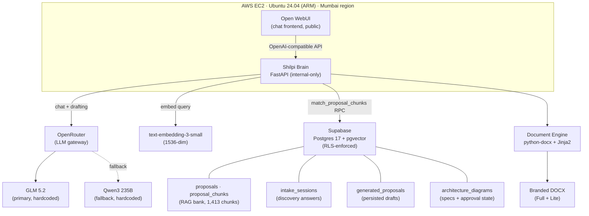
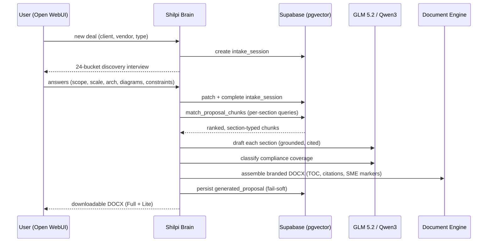
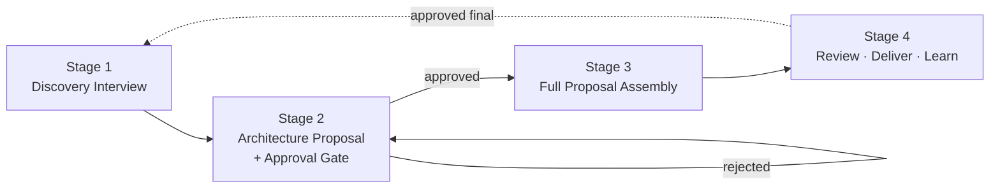
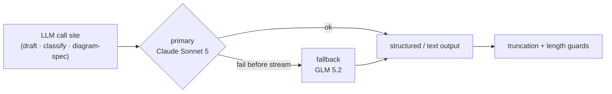
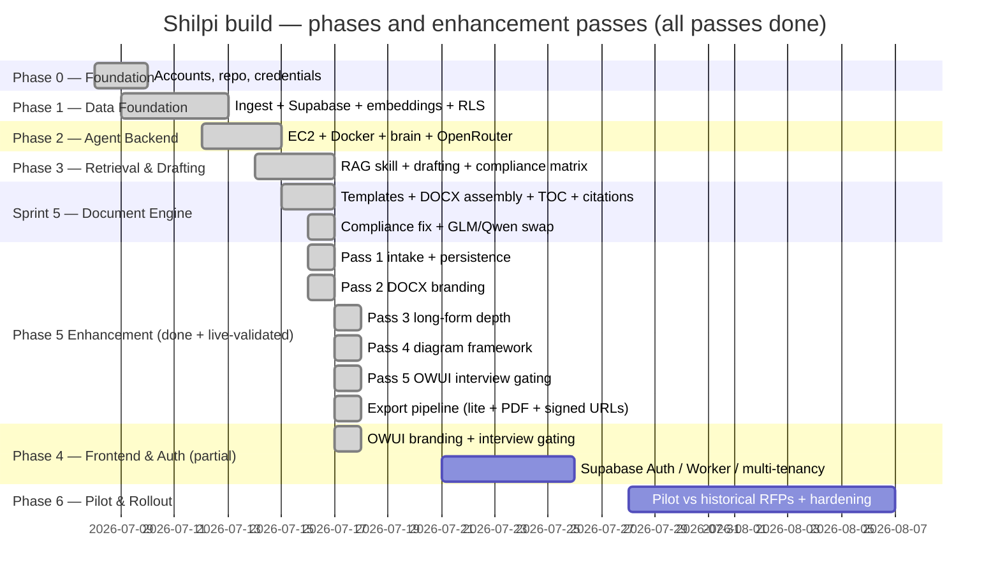

# Shilpi — IV Proposal Architect

**Shilpi** (सर्वम्, Sanskrit for *"all, everything, the whole"*) is Inspirit Vision's in-house Proposal Architect — a conversational, retrieval-grounded AI that turns a new RFP into a structured, client-ready proposal in hours instead of days, by drafting from IV's 100+ historical proposal bank rather than from a blank page.


-231154)


-FF9900)

> **Internal use only.** Proprietary to Inspirit Vision. This repository is public for collaboration; no client content, credentials, or infrastructure secrets are committed. See [Security posture](#security-posture).

---

## Progress Dashboard

> Quick-glance project status. Last updated: 2026-08-14 (IST).

**Overall completion: ~88%**
`██████████████████░░`

### Phase completion

| Phase | Status | Progress |
|---|---|---|
| 0 — Foundation & accounts | Done | `████████████████████` 100% |
| 1 — Data foundation (ingest + Supabase + embeddings) | Done | `████████████████████` 100% |
| 2 — Agent backend (EC2 + Docker + OpenRouter) | Done | `████████████████████` 100% |
| 3 — Retrieval + drafting | Done | `████████████████████` 100% |
| 4 — Conversational frontend + auth | Partial | `███████████████░░░░░` 75% — **full pipeline validated end to end in chat** (router → 22-area discovery → diagram plan → per-diagram approval → drafting → DOCX/PDF); auth/multi-tenancy still missing |
| 5 — Architecture approval gate + compression/export | Done (gate enforced in chat) | `████████████████████` 98% |
| 6 — Validation (recreation benchmark) | In progress | `████████░░░░░░░░░░░░` 40% — four scored runs against the Amlak proposal; fidelity, hygiene and structure addressed, run 5 pending |
| 7 — Pilot + hardening + rollout | Not started | `░░░░░░░░░░░░░░░░░░░░` 0% |

### What's next

Sequenced in **[`docs/PHASES.md`](docs/PHASES.md)**. In short:

| Phase | Focus |
|---|---|
| **6 — Validation** *(current)* | Recreation test against a known-good proposal → corpus expansion → scored pilot on historical RFPs → eval harness → cost telemetry |
| 7 — Hardening | TLS + network exposure, Supabase Auth / multi-tenancy, backups, CI |
| 8 — Quality (evidence-led) | Hybrid search, model A/B, the proposal-length question, diagram visual parity, screenshot/asset reuse |
| 9 — Production | Rollout, monitoring, runbook, key rotation |

The ordering is deliberate: the project is feature-rich and evidence-poor. No
Shilpi output has yet been scored against a human proposal, so every remaining
quality decision — model choice, proposal length, whether diagram polish matters,
how much corpus is enough — is currently argued from intuition. Validation comes
before hardening, and hardening before scale.

Eval fixtures live in `docs/evals/` and are **not committed** — they contain
client-confidential proposal content and this repository is public. See
[`docs/evals/README.md`](docs/evals/README.md).

### Known gaps before pilot

- **Corpus coverage ~11%** — 11 of 100+ bank proposals ingested (1,413 chunks). Grounding quality and draft depth are bounded by this; bulk ingestion from the Drive bank is the highest-leverage open item.
- **Supabase Auth / Worker / multi-tenancy** (Phase 4) — not wired (RLS + disabled sign-ups is the interim gate). `approved_by` on diagrams stays NULL until user identity exists.
- **Diagram variety** — Shilpi produces zone-and-box architecture graphs only. IV's proposals also use swimlane workflows (HRMS joiner flow across HRMS / IdM / Manager / AD lanes) with decision nodes, and hardware-spec callouts drawn beside the boxes. Not built.
- **Durable diagram spec-template store** (per vendor + diagram type) — deferred from Pass 4.
- **Hybrid search** (BM25 + RRF) — retrieval is pure vector similarity for now.
- **Phase 6 pilot** — not started; no *scored* runs against historical RFPs yet. The `RFP/` folder in the Drive bank is the natural test set. First recreation-test fixture prepared (Amlak / SailPoint — a client absent from the corpus, with the vendor present).
- **Corpus type coverage** — the 11 ingested proposals are 10 implementation, 1 MSS and **zero migration**, despite the intake template supporting all three. A migration or MSS proposal currently has almost no grounding; ingestion should deliberately seek those out rather than adding more of the same.
- **Visual assets** — human proposals are roughly half visual (40 images in the Amlak proposal alone; vendor product UI, IV corporate assets, client architecture). Shilpi produces generated diagrams only. Asset reuse is Phase 8.
- **Visual density** — the human Amlak proposal carries 37 images, roughly a third of them corporate and case-study assets rather than architecture. Shilpi produces 6. Asset reuse (the `visual_assets` table plus a mandatory human approval gate) is Phase 8.

### Recently shipped (2026-08-11 → 14)

Four validation runs against the Amlak benchmark drove this work. Each number
below is measured against the human proposal as a control, not asserted.

- **Two classes of silent answer loss fixed.** `parse_bucket_answers` split
  replies on `;`, so a multi-item value ended at its first semicolon — 9 of 10
  out-of-scope items, 5 of 6 pain points and Tranches 1-3 were discarded before
  reaching the drafting engine. Separately, `_norm_label` treated "HA and DR
  requirements" and "HA / DR requirements" as different fields, dropping five
  more answers. Both produced a confident *partial* parse that short-circuited
  the LLM fallback, so nothing was chased and nothing was logged.
- **Template rebuilt to IV's house structure** — 11 sections, 47 unique
  content-specific subsections. Previously 7 generic sections whose subsections
  were the same three headings ("Overview / Detailed Design / Considerations &
  Dependencies") repeated on every section, because they came from a
  module-level list applied uniformly. IV's own proposal has 53 subsections and
  all 53 differ.
- **Markdown tables render as Word tables in drafted sections.** Only the
  compliance-matrix path could do this; a sizing or BOQ table anywhere else
  landed as one paragraph of literal pipe characters.
- **Real Word styles for bullets and subheadings.** The renderer decided per
  *block*: a block opening with a label kept its dash lines as body text. One
  run produced 42 paragraphs with embedded newlines, 52 dash-lines as prose and
  zero uses of `List Bullet`. The decision is now per line.
- **Client logo attached in chat.** Open WebUI sends attachments in the
  multimodal content array; `last_user_text` kept only the text parts, so the
  image reached the brain and was discarded one line before anything could use
  it. Now decoded at discovery area 10 and placed on the cover and in the
  running header.
- **Corpus leakage closed.** The citation appendix and the compliance matrix's
  Evidence column carried other clients' names and verbatim proposal text into a
  client deliverable. The appendix is gone; the matrix now has separate internal
  and client-facing renders.
- **Degeneration detection generalised.** The phrase-repetition check scored a
  single-pass thesaurus walk at zero, because it never repeats. Two structural
  signals added: longest run without sentence-ending punctuation, and
  function-word density. Thresholds set for zero false positives against the
  human proposal rather than for maximum catch.
- **Primary model moved to Claude Sonnet 5** after a controlled comparison.

**Lesson re-learned.** Two of the tests written for this work passed a negative
control with their call sites deliberately unwired, and a third was satisfied by
the IV logo when it meant to detect the client logo. The "built but never wired"
failure was reproduced inside its own regression suite. All three now drive the
real pipeline and assert the generated document.

---

## Executive Summary

Inspirit Vision currently spends multiple person-days drafting each client proposal from scratch — assembling company profile, similar experience, scope understanding, solution architecture, implementation methodology, RACI, timeline, and compliance from memory and old files. With a bank of 100+ historical proposals across SailPoint, Ping Identity, IBM Security Verify, Red Hat Keycloak (RHBK), and ForgeRock engagements, there is enough reusable intellectual property to power a system that drafts, diagrams, and delivers proposals in a fraction of the time.

Shilpi is that system. He is **not a chatbot and not a search engine** — he is a well-read junior consultant who has read every proposal IV has ever sent, remembers all of them, interviews you about the new deal, proposes an architecture you must approve, and then drafts the full document section by section, grounded in what IV has actually delivered before.

### The economics behind it

| Signal | Value | Source |
|---|---|---|
| Time to first full draft, manual process | 2 to 5 person-days | IV internal baseline |
| Proposal content that is static/reusable across deals | ~60% | IV corpus analysis, 10 sample proposals |
| Diagrams that are reused or templated across proposals | ~38% | IV corpus analysis, perceptual hashing of 260 embedded images |
| Source proposals in the working corpus | 11 ingested, 1,413 chunks | Shilpi Supabase, live |
| Target time to first draft | under 2 hours | Project success criterion (V1) |
| Target output size (Lite, email-friendly) | under 5 MB | Project success criterion (V1) |

### Targets

| Metric | Pilot exit | Steady state |
|---|---|---|
| Time to first full draft | under 2 hours | under 90 minutes |
| Structural completeness (expected sections present) | 100% | 100% |
| Fabricated client references / pricing | Zero | Zero |
| Drafts requiring major rework | under 30% | under 15% |

### What Shilpi will not do

- **He will not invent client references or metrics.** If he does not know something, he says so, and inserts an `[SME REVIEW]` marker.
- **He will not fill in pricing.** Commercials are always a human call. He sets up the table; the team fills in the numbers.
- **V1 contract:** he will not start drafting until the architecture is approved. This is a hard gate — no shortcuts — and it is **enforced in the chat flow**: a drafting request before approval is refused.
- **He will not be sycophantic.** No "Great question!", no exclamation marks, no celebration emojis. He talks like a senior consultant.

---

## Known Gaps — Not Pilot-Ready Yet

Honest about what is not done, so no one mistakes the current state for production-ready:

- **Auth and multi-tenancy:** Supabase Auth and the Worker JWT gate are not wired. The brain is protected by network isolation (internal-only) and Open WebUI's disabled sign-ups, not by per-user identity. User identity is not yet propagated end-to-end, so generated drafts are not yet attributed to individual users (`approved_by` on diagrams is NULL). Production auth hardening is a pending milestone, not abandoned.
- **Corpus coverage:** only 11 of the 100+ bank proposals are ingested (1,413 chunks). Every downstream quality metric — grounding density, citation coverage, how much genuinely distinct content exists per section — is bounded by this. Bulk ingestion is the highest-leverage open item.
- **Proposal length:** `full` depth measures 42pp after the NoneType fix + 3500-token cap (both deployed); the opt-in `deep` tier (6 subsection facets) is merged but not yet re-measured. 100+pp remains a target, pending a decision on whether length is the right proxy for "boss-ready".
- **Client-logo sourcing:** approval-gated embedding of a client logo sourced online is deferred from Pass 5; the placeholder box is used instead.
- **Durable diagram spec-template store:** reusable DiagramSpec templates keyed by vendor and diagram type are deferred from Pass 4 (the engine regenerates from scratch for now).
- **External research and fact-checking:** Exa/Firecrawl external research and the secondary-LLM fact-checker are deferred to post-pilot.
- **Hybrid search:** retrieval is pure vector similarity; BM25 + reciprocal rank fusion is deferred.
- **Diagram visual parity:** D2 output is accurate and legible but visibly machine-generated next to IV's hand-composed sample decks (STC, NWC). Auto-layout cannot close that gap. Reaching house-style parity needs either editable export (`.drawio`/`.pptx`) for a human to finish, or a designer-built SVG template library for the ~4 recurring diagram types — a design investment, not an engineering one. Deferred until pilot feedback says whether it matters.
- **Pilot validation:** no end-to-end runs against historical RFPs with the scoring rubric yet.

---

## System Architecture


```mermaid
flowchart TB
    subgraph EC2["AWS EC2 · Ubuntu 24.04 (ARM) · Mumbai region"]
        OWUI["Open WebUI<br/>(chat frontend, public)"]
        BRAIN["Shilpi Brain<br/>FastAPI (internal-only)"]
        OWUI -->|OpenAI-compatible API| BRAIN
    end

    ROUTER["OpenRouter<br/>(LLM gateway)"]
    GLM["GLM 5.2<br/>(primary, hardcoded)"]
    QWEN["Qwen3 235B<br/>(fallback, hardcoded)"]
    EMB["text-embedding-3-small<br/>(1536-dim)"]

    SB["Supabase<br/>Postgres 17 + pgvector<br/>(RLS-enforced)"]
    PROP["proposals · proposal_chunks<br/>(RAG bank, 1,413 chunks)"]
    INTAKE["intake_sessions<br/>(discovery answers)"]
    GEN["generated_proposals<br/>(persisted drafts)"]
    DIAG["architecture_diagrams<br/>(specs + approval state)"]

    DOCS["Document Engine<br/>python-docx + Jinja2"]
    DOCX["Branded DOCX<br/>(Full + Lite)"]

    BRAIN -->|chat + drafting| ROUTER
    ROUTER --> GLM
    ROUTER -.fallback.-> QWEN
    BRAIN -->|embed query| EMB
    BRAIN -->|match_proposal_chunks RPC| SB
    SB --- PROP
    SB --- INTAKE
    SB --- GEN
    SB --- DIAG
    BRAIN --> DOCS
    DOCS --> DOCX
```

**The critical edge in that diagram is the internal-only binding.** The brain is never exposed publicly — every external path runs through the Open WebUI frontend, and the brain holds the only keys to Supabase and OpenRouter.

### End-to-end proposal sequence


```mermaid
sequenceDiagram
    participant U as User (Open WebUI)
    participant B as Shilpi Brain
    participant S as Supabase (pgvector)
    participant L as GLM 5.2 / Qwen3
    participant D as Document Engine

    U->>B: new deal (client, vendor, type)
    B->>S: create intake_session
    B-->>U: 24-bucket discovery interview
    U->>B: answers (scope, scale, arch, diagrams, constraints)
    B->>S: patch + complete intake_session
    B->>S: match_proposal_chunks (per-section queries)
    S-->>B: ranked, section-typed chunks
    B->>L: draft each section (grounded, cited)
    B->>L: classify compliance coverage
    B->>D: assemble branded DOCX (TOC, citations, SME markers)
    B->>S: persist generated_proposal (fail-soft)
    B-->>U: downloadable DOCX (Full + Lite)
```

---

## Component Choices and Why

| Component | Choice | Why this and not the alternative |
|---|---|---|
| Agent runtime | **FastAPI brain** (Python) | Replaced the originally-planned Hermes agent after evaluating framework lock-in. A thin FastAPI service is fully auditable, has no telemetry, and every prompt change is a tracked commit. Skills are plain Python modules, not a proprietary format |
| LLM gateway | **OpenRouter** | Provider-agnostic. One key, one contract, swap models by changing a constant. No per-provider SDK lock-in |
| Primary LLM | **GLM 5.2** (`z-ai/glm-5.2`) | Strong long-context drafting at low cost. Hardcoded so the user-facing model list is a single entry: "Shilpi Architect" |
| Fallback LLM | **Qwen3 235B** (`qwen/qwen3-235b-a22b-2507`) | Auto-triggered at every LLM call site if the primary fails before streaming. DeepSeek was removed entirely (it spiraled on ambiguous compliance requirements) |
| Embeddings | **text-embedding-3-small** (1536-dim) | Cheap, well-understood, good enough for vendor/section-typed retrieval. Negligible one-time cost to embed the whole bank |
| Retrieval | **Supabase pgvector** + `match_proposal_chunks` RPC | Vector similarity with section-type awareness and metadata filters, in the same database as everything else. No separate vector store to operate |
| Document output | **python-docx + Jinja2** | Native DOCX with real headings, tables, a refreshable TOC field, and embedded images. Templates are version-controlled Jinja2, not a binary .dotx |
| Diagram rendering | **DiagramSpec JSON → D2 (SVG → cairosvg PNG), Graphviz fallback** | GLM emits a constrained JSON spec; D2 renders it with real nested zone containers (DMZ / secure zone / data zone) which Graphviz lays out poorly. SVG is native (no headless browser); Graphviz stays installed as an automatic fallback so a missing `d2` binary degrades instead of breaking. No image-generation model (unreliable at precise labels), no external rendering API (would leak client architecture) |
| Chat frontend | **Open WebUI** | Open-source, OpenAI-compatible, supports a persona system prompt and a single locked model. Cheaper and more controllable than building a custom chat UI |
| Hosting | **AWS EC2 (ARM, Mumbai)** | Single-purpose box, static IP, close to the team. Fixed low monthly cost; covered by AWS credits during the MVP window |
| Data store | **Supabase (Postgres + pgvector + RLS)** | Auth, relational data, vector search, and storage in one free-tier service. RLS at the database layer is the security backbone |

---

## The Proposal Bank and RAG

Shilpi grounds every draft in what IV has actually delivered, never in model memory.

- **Bank:** 100+ historical proposals (DOCX/PDF). **Working corpus:** 11 proposals ingested and embedded as 1,413 chunks across 15 section types.
- **Section taxonomy:** `exec_summary`, `scope`, `solution`, `architecture`, `assumptions`, `timeline`, `pricing`, `why_vendor`, `similar_experience`, `cover`, `table`, `diagram`, `ocr`, `page`, `other`. Retrieval is section-type aware — an executive-summary query matches executive-summary chunks, not commercial ones.
- **Metadata per proposal:** `client_name`, `industry`, `country`, `iam_vendor`, `proposal_type` (implementation / MSS), `user_count`, `app_count`, `deal_size_bucket`, `outcome`, `year` — captured during ingestion and reused as the discovery interview schema.
- **Diagram reuse (measured):** of 260 embedded images across 8 sample proposals, ~38% are reused or templated, concentrated **per vendor and per diagram type** (e.g. SailPoint deployment-architecture and HRMS joiner-workflow diagrams recur across SailPoint proposals; Ping reference architectures recur across Ping proposals). This is why reusable DiagramSpec templates are stored in Supabase rather than regenerating every diagram from scratch.

### Grounding contract

- Every drafted claim is tied to a retrieved chunk with a citation number.
- A **weak-evidence threshold** flags low-similarity sections with an `[SME REVIEW: weak evidence]` prefix rather than forcing uncertain content.
- Compliance requirements are classified per-requirement (Met / Partially Met / Not Met) against the retrieved evidence, with paraphrase matching to avoid false negatives.

---

## Conversational Workflow

Shilpi follows a four-stage conversation, with a hard human gate before any drafting begins — **enforced end-to-end in the chat flow** as of 2026-07-27. A new thread opens with an intent router (start a new proposal / search past proposals / discuss); conversation state travels in invisible markers inside assistant replies, so the stateless OpenAI-compatible protocol needs no OWUI plugin.


```mermaid
flowchart LR
    S1["Stage 1<br/>Discovery Interview"] --> S2["Stage 2<br/>Architecture Proposal<br/>+ Approval Gate"]
    S2 -->|approved| S3["Stage 3<br/>Full Proposal Assembly"]
    S2 -->|rejected| S2
    S3 --> S4["Stage 4<br/>Review · Deliver · Learn"]
    S4 -.approved final.-> S1
```

### Stage 1 — Discovery Interview
A 24-bucket structured interview collects everything needed for an accurate draft: client and engagement details, scale and volumetrics, scope, **architecture inputs (deployment model, required diagram types and count, hardware sizing, HA/DR, security architecture)**, migration, integrations (HRMS, AD/Exchange, IdP/SSO, applications), compliance and regulatory specifics, timeline, MSS-specific SLA/commercials (conditional), submission constraints, audience and win-themes, current-state systems, NFRs, delivery model, post-go-live, and reuse controls. Every answer persists to the `intake_sessions` table.

### Stage 2 — Architecture Proposal and Human-in-Loop Gate
Shilpi retrieves the closest-matching past architecture, generates a `DiagramSpec`, renders it for preview, and presents it. The user **approves or rejects with comments**; on rejection he regenerates incorporating the feedback. Approved diagrams are persisted and embedded in the DOCX. **V1 contract (enforced):** drafting is hard-gated on an approved architecture — a "generate the proposal" request before approval is refused in chat. The reusable spec-template library remains deferred.

### Stage 3 — Full Proposal Assembly
Static sections (Company Profile, Why-Vendor, Methodology) are pulled near-verbatim from the RAG bank. Dynamic sections (Executive Summary, Sizing, RACI, Timeline, Solution Architecture) are generated fresh, grounded in retrieved chunks. A compliance matrix is classified per requirement. The document is assembled into a branded DOCX with a refreshable TOC, citation appendix, and SME-review markers.

### Stage 4 — Review, Deliver, Learn
Section-level edit requests preserve approved sections untouched. On final approval, the proposal is saved back into the RAG bank as new reference material, so the next deal starts smarter. Delivery in "Full" (print-ready) and "Lite" (email-friendly, under 5 MB) variants.

---

## Document Production Engine

The engine is what turns a chat thread into a deliverable document.

### Built now

- **Templates:** Jinja2 section templates per proposal type. The `implementation` template mirrors IV's real house structure — **11 top-level sections and 47 content-specific subsections, every heading distinct** ("Proposed Production Hardware Sizing", "Tranche 2 - Lifecycle Management and Initial Applications", "Payment Milestones"). Eleven subsections explicitly require a markdown table, which the assembler renders as native Word tables. Section titles and headings render through Jinja, so vendor and client names substitute ("Proposed Solution - SailPoint", "Why SailPoint"). Subsections defined on a section override the depth tier's count: those headings are the section's structure, not a knob.
- **Section-by-section drafting:** each section runs its own retrieval query and LLM draft, with per-call token caps and frequency penalty to prevent repetition spirals on ambiguous content.
- **Compliance matrix:** per-requirement classification against retrieved evidence, with paraphrase matching and a truncation guard.
- **Citations and traceability:** retrieval traces are persisted with each generated proposal. Inline `[N]` markers and the citation appendix are **stripped from the deliverable** — the appendix listed retrieved chunks by client name and similarity score, so an Amlak document named three other IV clients across 78 paragraphs. Provenance belongs in logs, not in a document that leaves the building.
- **SME-review markers:** inserted where evidence is weak or a gap is detected, so human review is fast and targeted.
- **Branded DOCX:** IV logo on the title page, navy (`#231154`) and orange (`#E85A24`) accents, running header/footer with page numbers and section dividers. A client logo **attached in the chat** at discovery area 10 is decoded and placed both on the title page and in the running header on every page.
- **Deterministic QA gate (`document_qa.py`):** three independent structural signals for degeneration — phrase repetition, longest run without sentence-ending punctuation, and function-word density — measured against the human Amlak proposal as a control (0 false positives across 375 blocks). Also strips em-dashes (IV writes 0.2 per 1,000 words; an early run wrote 13.4) and internal review asides in bracketed, dash-led and bare forms.

### Built now (continued — enhancement passes)

- **Long-form depth:** `brief` / `standard` / `full` tiers control retrieval fan-out and, for sections that do not define their own subsections, the number of generic facets drafted. `full` adds RACI, timeline, sizing, integration inventory, and risk appendices as real DOCX tables.
- **Diagram framework (Pass 4, done + live-validated):** GLM emits a constrained `DiagramSpec` JSON → D2 renders SVG (cairosvg → PNG), Graphviz fallback → user approves **in chat** → only approved diagrams are embedded. Approval state machine (draft → needs_review → approved/rejected), now driven from the conversation.
- **Export pipeline (Round 3, done + live-validated):** lite (<5 MB) DOCX compression via Pillow, PDF export via LibreOffice headless, and delivery to storage signed URLs (`generated-drafts` bucket, 1-hour TTL). Opt-in via `lite` / `include_pdf` / `return_signed_urls` on `/v1/generate-proposal`.

### Deferred

- **Client-logo sourcing:** approval-gated embedding of a client logo sourced online when one is not provided.
- **Durable diagram spec-template store:** reusable specs keyed by vendor and diagram type (the engine regenerates from scratch for now).

---

## Model Routing


```mermaid
flowchart LR
    CALL["LLM call site<br/>(draft · classify · diagram-spec)"] --> P{"primary<br/>Claude Sonnet 5"}
    P -->|ok| OUT["structured / text output"]
    P -->|fail before stream| F["fallback<br/>GLM 5.2"]
    F --> OUT
    OUT --> GUARD["truncation + length guards"]
```

- **Primary:** Claude Sonnet 5. **Fallback:** GLM 5.2. Defaults live in code; `SHILPI_PRIMARY_MODEL` / `SHILPI_FALLBACK_MODEL` override them, and any override is logged at startup and reported by `GET /health` so it is never silent. There is no model chooser in the UI; Open WebUI exposes a single model, "Shilpi Architect".
- **Why Sonnet over GLM:** measured, not assumed. Same 22 inputs, model as the only variable. GLM produced 4 degenerate paragraphs including two single-pass thesaurus walks of 645 and 677 words with no full stop; Sonnet produced 0, with a worst case of 104. Verbosity and em-dash habit barely moved, which is what identified them as template and prompt problems rather than model problems.
- Fallback applies at all five LLM call sites (chat drafting, section drafting, compliance classification, open-router raw drafting, and diagram-spec generation).
- **Why no DeepSeek:** it spiraled on ambiguous compliance requirements, generating hundreds of thousands of characters and multi-minute hangs. Removed in favor of GLM/Qwen with per-call token caps, frequency penalty, and truncation guards.
- **Why no image-generation model for diagrams:** image-gen models mangle precise text labels and break schematic consistency, and editing labels onto a raster diagram is unreliable. D2 (with Graphviz fallback) renders the DiagramSpec deterministically — no model failure point — and the only model involved (GLM spec generation) already has the Qwen fallback.
- **Why D2 over Graphviz:** Graphviz optimises for minimal edge crossings, not legibility, and its clusters lay out poorly — the first live deployment diagram came out as a repeat of the logical flow with no zones. D2 draws `group` as a real nested container, which is what DMZ / secure zone / data zone diagrams need. Both are auto-layout, so neither reproduces IV's hand-composed sample decks; see [Known gaps](#known-gaps--not-pilot-ready-yet).
- Embeddings use `text-embedding-3-small` (unchanged); OpenRouter's image API remains available as an optional path for non-diagram visuals later, but is not used for architecture diagrams.

---

## API Reference

The brain exposes an OpenAI-compatible interface plus proposal-production endpoints.

| Method | Endpoint | Purpose |
|---|---|---|
| GET | `/health` | Liveness + active primary/fallback model |
| GET | `/v1/keepalive` | Touches Postgres (prevents Supabase free-tier idle pause); cron-curled daily on the host |
| GET | `/v1/models` | Lists the single `shilpi-architect` model |
| POST | `/v1/chat/completions` | Conversation state machine: intent router → discovery interview → architecture approval gate → drafting; vault mode = grounded RAG chat (streaming, SSE heartbeats) |
| POST | `/v1/compliance-matrix` | Classify RFP requirements against retrieved evidence |
| GET | `/v1/intake-template` | Return the 24-bucket discovery interview (filters by proposal type) |
| POST | `/v1/intake-sessions` | Create a discovery session |
| PATCH | `/v1/intake-sessions/{id}` | Merge partial answers |
| POST | `/v1/intake-sessions/{id}/complete` | Validate required answers, mark complete |
| POST | `/v1/generate-proposal` | Generate a branded DOCX; accepts `intake_session_id`, `generated_proposal_id` (embeds approved diagrams), `proposal_depth` (`brief`/`standard`/`full`/`deep`), and export flags `lite` / `include_pdf` / `return_signed_urls` |
| POST | `/v1/proposals/{id}/diagrams` | Create a diagram spec (LLM-generated `DiagramSpec`, persisted as draft) |
| GET | `/v1/proposals/{id}/diagrams` | List diagrams for a proposal |
| PATCH | `/v1/diagrams/{id}` | Advance diagram status (draft → needs_review → approved/rejected; approved renders via D2/Graphviz + uploads) |
| GET | `/v1/diagrams/{id}` | Fetch a single diagram (status, spec, rendered path) |

Persistence is fail-soft: if a Supabase write fails, the generated DOCX is still returned — generation never blocks on storage.

---

## Security Posture

| Layer | Control |
|---|---|
| Network | EC2 security group restricts inbound to SSH (from known IPs) and the frontend port. The brain is bound to localhost — never exposed publicly |
| Database | Row-Level Security enforced at the Postgres layer on every table. All writes use a server-side key; client-facing access is policy-gated. RLS is never disabled |
| Secrets | API keys live only in the server's local environment file (restricted permissions). `.gitignore` blocks `.env`, `*.pem`, `*.key`, and key-pattern files repo-wide |
| Client data | Source proposals under NDA live under `data/raw/` (gitignored, never committed). Only anonymised metadata is version-controlled |
| Frontend | Open WebUI open sign-ups disabled; only the Shilpi Architect model is exposed (all other LLM connections removed) |
| LLM data | OpenRouter is the only external LLM path. No client content is sent to image-generation or rendering APIs |
| Availability | A daily keep-alive pings the database to prevent free-tier idle pause, and auto-restores the project if it is ever found paused |
| Key hygiene | API keys rotated quarterly. The WordPress Lightsail instance is out of scope and never touched by this project |

Deeper reasoning: [`docs/PROJECT.md`](docs/PROJECT.md) (contingency matrix, risk register).

---

## Costs

Qualitative model — no per-credit estimates. Exact figures are tracked in private ops notes.

| Item | Tier | Notes |
|---|---|---|
| Compute (EC2) | Free during MVP (credits), low fixed monthly after | Single ARM instance, static IP |
| Database (Supabase) | Free tier | Pauses after 7 days idle (mitigated by the daily keep-alive) |
| LLM (OpenRouter) | Pay-per-use | GLM 5.2 primary is inexpensive for drafting volume; Qwen3 fallback only on primary failure |
| Embeddings | Negligible | One-time embed of the bank costs cents |
| Frontend, GitHub | Free tiers | Open WebUI is self-hosted; GitHub public repo |

Post-MVP graduation (when volume justifies): Supabase Pro removes the DB cap and idle-pause; OpenRouter production budget scales with proposal volume. The whole stack avoids per-seat SaaS licenses.

---

## Roadmap and Status

The original plan in [`docs/PROJECT.md`](docs/PROJECT.md) is a 6-phase, 12-sprint blueprint. Actual delivery compressed and reshuffled that plan; the table below tracks the real state.


```mermaid
gantt
    dateFormat  YYYY-MM-DD
    title Shilpi build — phases and enhancement passes (all passes done)
    section Phase 0 — Foundation
    Accounts, repo, credentials                 :done, p0, 2026-07-08, 2d
    section Phase 1 — Data Foundation
    Ingest + Supabase + embeddings + RLS        :done, p1, 2026-07-09, 4d
    section Phase 2 — Agent Backend
    EC2 + Docker + brain + OpenRouter           :done, p2, 2026-07-12, 3d
    section Phase 3 — Retrieval & Drafting
    RAG skill + drafting + compliance matrix    :done, p3, 2026-07-14, 3d
    section Sprint 5 — Document Engine
    Templates + DOCX assembly + TOC + citations :done, s5a, 2026-07-15, 2d
    Compliance fix + GLM/Qwen swap              :done, s5b, 2026-07-16, 1d
    section Phase 5 Enhancement (done + live-validated)
    Pass 1 intake + persistence                 :done, e1, 2026-07-16, 1d
    Pass 2 DOCX branding                        :done, e2, 2026-07-16, 1d
    Pass 3 long-form depth                      :done, e3, 2026-07-17, 1d
    Pass 4 diagram framework                   :done, e4, 2026-07-17, 1d
    Pass 5 OWUI interview gating                :done, e5, 2026-07-17, 1d
    Export pipeline (lite + PDF + signed URLs)  :done, e6, 2026-07-17, 1d
    section Phase 4 — Frontend & Auth (partial)
    OWUI branding + interview gating            :done, f4a, 2026-07-17, 1d
    Supabase Auth / Worker / multi-tenancy      :f4b, 2026-07-21, 5d
    section Phase 6 — Pilot & Rollout
    Pilot vs historical RFPs + hardening         :p6, 2026-07-28, 10d
```

| Milestone | State |
|---|---|
| Foundation, repo, credentials | Done |
| Supabase schema, RLS, pgvector, embeddings (11 proposals, 1,413 chunks) | Done |
| EC2 + Docker + brain + OpenRouter (GLM 5.2 + Qwen3) | Done |
| Grounded RAG chat + compliance matrix | Done |
| Document-production engine (templates, DOCX, TOC, citations, SME markers) | Done |
| Compliance repetition fix + model swap (DeepSeek removed) | Done |
| Pass 1 — intake sessions + persistence foundation | Done |
| Pass 2 — DOCX branding (IV logo, navy/orange, header/footer, client-logo placeholder) | Done |
| Pass 3 — long-form depth (depth tiers, multi-subsection, RACI/timeline/sizing/risk appendices) | Done |
| Pass 4 — diagram framework (DiagramSpec → D2/Graphviz → approval → embed approved only) | Done + live-validated; approval gate now enforced in chat |
| Pass 5 — Open WebUI interview gating (no session → discovery interview) | Done |
| Export pipeline — lite <5 MB DOCX + PDF (LibreOffice) + signed URLs to storage | Done + live-validated |
| OWUI in-app logo branding (favicon env + /app/build/static override) | Done (merged); open-webui container rebuild pending on host |
| Persistence fix (generated_proposals status draft→drafting) | Done + live-validated |
| NoneType section-drafting bug (null LLM subsection → empty section) | Fixed — merged `6290d23` (PR #2); rebuild brain to deploy |
| Raise `MAX_DRAFT_TOKENS` (1500 → 3500) | Done — merged `6da140c`; rebuild brain to deploy |
| Client-logo sourcing (web/image search + approval-gated embedding) | Deferred |
| Durable diagram spec-template store (per vendor + diagram type) | Deferred |
| Supabase Auth / Worker / multi-tenancy (Sprint 8) | Not wired (~45% of Phase 4) |
| External research + fact-checker | Deferred (post-pilot) |
| Hybrid search (BM25 + vector + reciprocal rank fusion) | Deferred |
| Pilot against 5–10 historical RFPs + hardening + team rollout | Not started |

> **Status line:** Phases 0–3 complete. Phase 4 ~45% (Open WebUI + interview gating + branding done; Auth/Worker/multi-tenancy not wired). Phase 5 ~97% (all 5 passes + export pipeline done + live-validated; NoneType bug FIXED `6290d23`; MAX_DRAFT_TOKENS raised `6da140c` — rebuild brain to deploy; remaining: client-logo sourcing, durable spec-template store). Phase 6 (pilot, hardening, rollout) not started. Overall ~81%.

---

## Original Plan vs. Actual Build

[`docs/PROJECT.md`](docs/PROJECT.md) was written at ground zero and names components the build later replaced. This table reconciles the blueprint with reality so the two documents do not contradict each other.

| Layer | Original plan (PROJECT.md) | Actual build | Why it changed |
|---|---|---|---|
| Agent runtime | Hermes Agent (Docker) | FastAPI brain | Avoided framework lock-in; a thin auditable service with version-controlled Python modules |
| Hosting | Oracle Cloud Free Tier | AWS EC2 (ARM, Mumbai) | AWS credits available; Mumbai region closer to the team |
| Frontend | Open WebUI on Cloudflare Pages + Worker auth proxy | Open WebUI directly on EC2 | Simpler single-box deployment for MVP; Cloudflare Worker deferred until multi-tenancy is wired |
| Diagrams | MermaidJS inline in chat | DiagramSpec JSON → D2 (Graphviz fallback) | Deterministic, editable, approval-friendly; no external rendering dependency. Graphviz first, switched to D2 for nested zone containers |
| LLM tier | DeepSeek primary, GLM 5.2 fallback, Claude escalation | GLM 5.2 primary + Qwen3 235B fallback, hardcoded | DeepSeek removed after compliance-spiral incidents; GLM/Qwen covers drafting and classification reliably |
| Auth | Supabase Auth + Worker JWT gate (Sprint 8) | RLS at DB layer; brain internal-only | Network isolation is the interim gate; full Auth/Worker is a known gap, not abandoned |

The blueprint's intent (conversation-first, retrieval-grounded, human-in-loop, self-improving) is unchanged. Only the components and sequence evolved.

---

## Repository Guide

```
iv-sarvam/
├── README.md                         # this file
├── backend/brain/                    # the Shilpi brain (FastAPI)
│   ├── app.py                        # endpoints, model routing, fallback
│   ├── document_engine.py            # section drafting + DOCX assembly
│   ├── proposal_templates.py         # Jinja2 section templates (implementation / mss)
│   ├── chat_state.py                 # conversation state machine (router/interview/architecture/drafting modes)
│   ├── intake_template.py            # 24-bucket discovery interview schema
│   ├── supabase_client.py            # thin PostgREST helpers (fail-soft)
│   ├── branding.py                   # DOCX branding (logo, theme, header/footer)
│   ├── assets/                       # optimized IV logo PNGs
│   ├── tests/                        # keyless smoke tests (intake + document engine)
│   ├── Dockerfile
│   └── requirements.txt
├── deploy/                           # EC2 deployment
│   ├── docker-compose.yml            # open-webui + sarvam-brain
│   ├── Dockerfile.webui
│   ├── patch-webui.py                # OWUI persona + lockdown patches
│   └── assets/                       # OWUI logo assets
├── supabase/migrations/              # SQL migrations (schema + RLS + RPCs)
│   ├── 001_init.sql
│   └── shilpi_005_intake_and_diagrams.sql
├── scripts/                          # ingestion + embedding pipeline
├── docs/                             # project, persona, sprint docs
├── data/                             # raw (gitignored) + tagging templates
└── assets/                           # shared branding assets
```

---

## Getting Started

The brain and frontend run as Docker services on the EC2 host. Local development of the brain:

```bash
git clone https://github.com/imranshaikh-commits/iv-sarvam.git
cd iv-sarvam

# create the environment file from the private ops template (names only — no secrets here):
#   OPENROUTER_API_KEY=...
#   SUPABASE_URL=...
#   SUPABASE_KEY=...

# run the brain locally
cd backend/brain
pip install -r requirements.txt
uvicorn app:app --host 127.0.0.1 --port 8000

# keyless tests (no API keys needed)
python tests/test_intake_template.py
python tests/test_document_engine.py
```

Deployment to the EC2 host (run on the host):

```bash
cd ~/iv-sarvam && git fetch && git pull origin <branch> && cd deploy && docker compose up -d --build sarvam-brain  # container name intentionally unchanged, see deploy/docker-compose.yml
curl -s http://127.0.0.1:8000/health
```

Open WebUI is the user-facing surface; the brain is never exposed directly.

---

## Persona and Team

**Shilpi's character** (full spec in [`docs/SHILPI_PERSONA.md`](docs/SHILPI_PERSONA.md), one-pager in [`docs/MEET_SHILPI.md`](docs/MEET_SHILPI.md)): consultative not compliant; precise on scope, conservative on claims; vendor-agnostic by conviction; bilingually and culturally aware; structured but never robotic; curious about the deal, not just the RFP; self-aware about his limits. Signature opening: *"Shilpi here — IV's Proposal Architect. New deal, or picking up something from earlier?"*

| Role | Person | Responsibility |
|---|---|---|
| Project Lead | Imran | Direction, prompt engineering, persona tuning, sprint reviews |
| Technical Reviewer | Ashish | Architecture quality gate, IAM technical accuracy, pricing review |

---

## Licence

Proprietary — Inspirit Vision internal use only. Not for redistribution. Client proposal content is under NDA and never committed to this repository.

---

*Maintained by the IV team. Start with [`docs/PROJECT.md`](docs/PROJECT.md) for the full plan, [`docs/MEET_SHILPI.md`](docs/MEET_SHILPI.md) for the persona, or this README for the current build state.*
