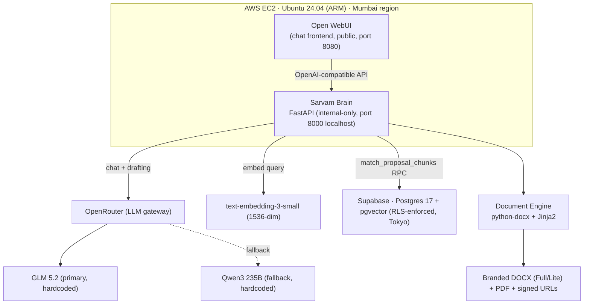

# Sarvam — Project Handover Document

> **Purpose.** This document lets any new operator (human or AI agent) pick up the Sarvam build exactly where it stands today, with zero re-discovery. It was written because the build may move to a different Perplexity account when credits on the originating account run low. Read it in full before starting work; it is self-contained.
>
> **Last updated:** 2026-07-17, end of Round 3 (IST). **Repo:** `imranshaikh-commits/iv-sarvam` (public fork of `creator-imran/sarvam`). **Default branch:** `main` (single-branch workflow; all feature branches deleted after merge). **Current HEAD:** `main` is `863fa26`. The EC2 host working tree is at `0ef3c7b` — all brain code is present and current; the commits between `0ef3c7b` and `863fa26` are docs-only (README/HANDOVER) and do not affect the running brain. **Always verify current HEAD before acting** (`gh api repos/imranshaikh-commits/iv-sarvam/commits/main`).
>
> **Public-safe.** This file is committed to a public repository. It contains **no** secrets, API keys, EC2 IPs, or Supabase project refs. Identifiers are described by name/region so the operator can locate them; secrets live only on the EC2 host's local env file. Sensitive IDs (EC2 public IP, Supabase project ref, key file path) are carried in the private startup prompt, not here.

---

## ⚡ Where things stand right now (read this first)

This is the exact state as of 2026-07-17, ~15:30 IST. If you do nothing else, read this.

- **All 5 enhancement passes + the export pipeline + the persistence fix + OWUI branding are merged to `main` (`863fa26`) and deployed live on the EC2 brain.** The brain was rebuilt this session with LibreOffice + Pillow + `export_engine` (apt + pip layers ran fresh, not cached). Health: `{"status":"ok","primary_model":"z-ai/glm-5.2","fallback_model":"qwen/qwen3-235b-a22b-2507"}`. Inside the container: `import export_engine, PIL` OK; `soffice` present at `/usr/bin/soffice`.
- **Full end-to-end live validation PASSED this session** (13-step E2E script, all green): health/models → interview gating (0-token discovery) → intake session create/PATCH/complete → generate proposal (240 KB DOCX, persists `proposal_id`) → compliance matrix (real RAG grounding) → export pipeline (lite + 167 KB PDF via LibreOffice + signed URLs to `generated-drafts` bucket) → diagram flow (create spec → `needs_review` → `approved` with `dot` render uploaded to `diagram-renders` → re-embed in a 298 KB DOCX).
- **One known bug is mid-investigation — the NoneType section-drafting soft-fail.** When the LLM returns `null` for a subsection draft, the code does `'NoneType' object has no attribute 'strip'` and that subsection comes back **empty** (fail-soft, so generation completes). At `proposal_depth="full"` (3 subsections/section) it fires repeatedly and is the single biggest reason proposals stay short. Confirmed firing this session on: `Considerations & Dependencies` (technical_approach), `Detailed Design` (integration_points), `Overview` + `Detailed Design` (assumptions_open_questions). **This is the #1 fix lever for length + completeness, and it is fully grounded (no hallucination cost).** See [§13](#13-known-gaps--not-pilot-ready-yet) + [§14](#14-immediate-next-steps).
- **A `proposal_depth="full"` generation was launched right before this handover** to measure the real page count (the user needs a boss-ready 100+ page proposal; the "brief" run was 9 pages by design). The result was not captured before credits ran low — **re-run it and count the pages** (command in [§11](#11-deploy-workflow-user-runs-on-ec2) + [§14](#14-immediate-next-steps)).
- **OWUI in-app logo branding is merged (`3501254`) but the `open-webui` container has NOT been rebuilt** — the logo won't render until `docker compose up -d --build open-webui` is run on the EC2 host. Tab title/favicon are OK; sidebar/sign-in logo still default.
- **Credits are low.** The user is credit-conscious (migrated across 3-4 Perplexity accounts already). Minimize tool calls; prefer `gh`/git + the Supabase connector over browser automation; do not spawn subagents for tasks you can do from context.

---

## 0. How to use this document

1. Read this file end-to-end (especially [⚡ Where things stand](#-where-things-stand-right-now-read-this-first)).
2. Read [`README.md`](../README.md) (the public face + progress dashboard) and [`docs/PROJECT.md`](PROJECT.md) (the original 6-phase/12-sprint blueprint).
3. Connect the three external services on the new account (see [§5](#5-live-infrastructure--external-services)).
4. Recreate the keep-alive cron (see [§15](#15-accountsession-specific-items-to-recreate)).
5. Resume the in-flight work in [§14](#14-immediate-next-steps) — do **not** re-do Pass 1–5 or the export pipeline; they are done and live.

---

## 1. What Sarvam is

**Sarvam** (सर्वम्, Sanskrit for *"all, everything, the whole"*) is Inspirit Vision's in-house **Proposal Architect** — a conversational, retrieval-grounded AI that turns a new RFP into a structured, client-ready proposal in hours instead of days, by drafting from IV's 100+ historical proposal bank rather than from a blank page.

He is **not a chatbot and not a search engine**. He is a well-read junior consultant who has read every proposal IV has ever sent, remembers all of them, interviews the user about the new deal, proposes an architecture the user must approve, then drafts the full document section by section, grounded in what IV has actually delivered before.

**Vendors in the corpus:** SailPoint, Ping Identity, IBM Security Verify, Red Hat Keycloak (RHBK), ForgeRock.

**Persona:** consultative not compliant; precise on scope, conservative on claims; vendor-agnostic by conviction; bilingually and culturally aware; structured but never robotic; self-aware about his limits. Signature opening: *"Sarvam here — IV's Proposal Architect. New deal, or picking up something from earlier?"* Full persona in [`docs/SARVAM_PERSONA.md`](SARVAM_PERSONA.md); one-pager in [`docs/MEET_SARVAM.md`](MEET_SARVAM.md).

**People:** Imran (project lead, prompt engineering, persona, sprint reviews; also runs all EC2 host commands — the agent has no SSH access); Ashish (technical reviewer — architecture quality gate, IAM accuracy, pricing).

---

## 2. Current status (TL;DR)

- **Phases 0–3 complete** (foundation, data, agent backend, retrieval + drafting). External research (Exa/Firecrawl) deferred.
- **Phase 4 ~45%:** Open WebUI deployed + interview gating wired + branding code merged; Supabase Auth / Worker / multi-tenancy **not wired**.
- **Phase 5 ~95%:** all 5 enhancement passes done + live-validated; export pipeline (lite + PDF + signed URLs) done + live-validated; persistence fixed + live-validated. Remaining: NoneType section-drafting bug (the active item), client-logo sourcing, durable diagram spec-template store, `approved_by` (blocked on Phase 4 auth).
- **Phase 6** (pilot, hardening, rollout) — not started.
- **Overall completion: ~80%.** The honest remaining gap to 100% is Phase 4 auth + Phase 6 pilot (both large), plus the small Phase 5 polish items.

Everything through the export pipeline + branding + persistence fix is on `main` (`863fa26`). The live brain on EC2 runs `main` brain code (host tree at `0ef3c7b`; commits since are docs-only).

### Round 3 — what landed this session (2026-07-17)

- **OWUI in-app logo branding** — `WEBUI_FAVICON_URL=/static/favicon.png` env + `Dockerfile.webui` COPY of IV logos into `/app/build/static/` (compiled frontend defaults replaced, not just backend static). Merged `3501254` (from `cf25a37`). ⚠️ **`open-webui` container not yet rebuilt — run `docker compose up -d --build open-webui` to render the logo.** Fallback if OWUI DB settings override env: OWUI Admin → Settings → Images (non-destructive).
- **Phase 5 export pipeline** — new `export_engine.py` (Pillow lite DOCX compression <5 MB over `word/media/*`, LibreOffice-headless DOCX→PDF, all fail-soft); `supabase_client` upload + signed-URL delivery to the `generated-drafts` bucket; opt-in params `lite`/`include_pdf`/`return_signed_urls` on `/v1/generate-proposal` (**no flags = legacy DOCX binary, byte-for-byte; any flag = JSON with sizes + signed URLs**). Dockerfile adds `libreoffice-writer` + `fonts-dejavu-core`; requirements adds `pillow`. 59 tests pass. Merged `5301bade` (feat `6f45522` + status fix `c14bdef`).
- **Persistence 400 fixed** — `insert_generated_proposal` sent `status="draft"`, but DB CHECK `generated_proposals_status_check` only allows `drafting`; every insert 400-ed and `generated_proposals` stayed empty (this blocked the diagram-embed flow, which needs a persisted `proposal_id`). One-line fix `draft`→`drafting` + regression test. Merged in `5301bade`.
- **EC2 deploy unblocked** — the host was stuck at `2ca7788` because `git pull` was blocked by an uncommitted local edit to `deploy/docker-compose.yml` (the same `WEBUI_FAVICON_URL` line that branding later added to `main`). Resolution: `git stash` → `git pull origin main` (fast-forward to `0ef3c7b`) → `docker compose up -d --build sarvam-brain` (apt installed libreoffice fresh). The stashed edit was redundant (main had it) and was dropped.
- **Live validation PASSED** — see [⚡ Where things stand](#-where-things-stand-right-now-read-this-first).

### Earlier rounds (already on main, preserved for context)

- **Pass 3 (long-form depth)** — `proposal_depth` tiers `brief`/`standard`/`full`; multi-subsection drafting + retrieval fan-out + appendix pack (RACI/timeline/sizing/integration inventory/risks). Merged `bee4264` (from `04fcd123`).
- **Pass 4 (diagram framework)** — `DiagramSpec` JSON → local Graphviz renderer; approval state machine on `architecture_diagrams.status` (`draft`→`needs_review`→`approved`/`rejected`); only approved diagrams embed. Endpoints `/v1/proposals/{id}/diagrams` + `/v1/diagrams/{id}`. Merged `d1a8805`.
- **Pass 5 (OWUI interview gating)** — `/v1/chat/completions` with no `intake_session_id` starts the Stage 1 discovery interview (no RAG/drafting/network); session present → existing RAG path. Client-logo sourcing deferred. Merged `cb18462` (from `ffc8818`).

---

## 3. Architecture (actual build)



**The brain is internal-only** (bound to localhost). Every external path runs through Open WebUI. The brain holds the only keys to Supabase and OpenRouter.

### Original plan vs. actual build (reconciliation)

| Layer | Original plan (`docs/PROJECT.md`) | Actual build | Why it changed |
|---|---|---|---|
| Agent runtime | Hermes Agent (Docker) | FastAPI brain | Avoided framework lock-in; thin, auditable, version-controlled Python modules |
| Hosting | Oracle Cloud Free Tier | AWS EC2 (ARM, Mumbai) | AWS credits available; Mumbai closer to the team |
| Frontend | Open WebUI on Cloudflare Pages + Worker auth proxy | Open WebUI directly on EC2 | Simpler single-box MVP; Cloudflare Worker deferred until multi-tenancy |
| Diagrams | MermaidJS inline in chat | DiagramSpec JSON → local Graphviz | Deterministic, editable, approval-friendly; no external rendering dependency |
| LLM tier | DeepSeek primary, GLM 5.2 fallback, Claude escalation | GLM 5.2 primary + Qwen3 235B fallback, hardcoded | DeepSeek removed after compliance-spiral incidents |
| Auth | Supabase Auth + Worker JWT gate (Sprint 8) | RLS at DB layer; brain internal-only | Network isolation is the interim gate; full Auth/Worker is a known gap |

The blueprint's intent (conversation-first, retrieval-grounded, human-in-loop, self-improving) is unchanged.

---

## 4. Repository

- **URL:** https://github.com/imranshaikh-commits/iv-sarvam
- **Branch:** `main` (HEAD `863fa26`, single-branch workflow). EC2 pulls `main`.
- All former feature branches (`sprint5-doc-engine`, `docs/readme-redesign`, `pass4-diagrams`, `pass5-interview-gating`, `export-pipeline`, `owui-branding-fix`) were deleted after merge — trees were byte-identical, nothing lost.

### Key files

```
backend/brain/
  app.py                # all endpoints, model constants, _structured_with_fallback (5 LLM call sites), export opt-in params
  document_engine.py    # draft_section, assemble_docx (branded), generate_proposal, draft_with_openrouter, MAX_DRAFT_TOKENS=1500
  proposal_templates.py  # DepthTier (brief/standard/full), get_depth_tier, Jinja2 section templates (implementation + mss)
  intake_template.py     # 24-bucket discovery interview schema (Pass 1)
  supabase_client.py     # thin PostgREST helpers, insert_generated_proposal (status="drafting"), upload_generated_draft, create_signed_url (fail-soft)
  branding.py            # DOCX branding: logo, navy/orange, header/footer, section dividers, client-logo placeholder (Pass 2)
  export_engine.py       # NEW (Round 3): Pillow lite DOCX compression <5MB, LibreOffice-headless DOCX→PDF, fail-soft
  diagram_engine.py      # DiagramSpec + Graphviz render_spec (Pass 4)
  assets/                # iv_logo.png (1600px), iv_logo_header.png (400px)
  tests/                 # test_intake_template.py, test_document_engine.py, test_export_engine.py (59 tests total, keyless)
  Dockerfile             # COPYs all modules + assets; apt installs graphviz + libreoffice-writer + fonts-dejavu-core
deploy/
  docker-compose.yml     # open-webui (public 8080) + sarvam-brain (localhost 8000); WEBUI_FAVICON_URL env
  Dockerfile.webui, patch-webui.py, assets/   # OWUI persona + lockdown + IV logo into /app/build/static
supabase/migrations/
  001_init.sql
  sarvam_005_intake_and_diagrams.sql   # intake_sessions table + diagram columns (applied to live DB)
scripts/                 # ingest_proposals.py, ingest_v2.py, run_ingest.sh; sarvam.env (gitignored, secrets)
docs/                    # PROJECT.md, SARVAM_PERSONA.md, MEET_SARVAM.md, sprint docs, HANDOVER.md (this file)
data/                    # raw (gitignored) + tagging templates
```

### Commit history (most recent first)

| SHA | What |
|---|---|
| `863fa26` | docs: handover — diagram + export live validation PASSED (2026-07-17) |
| `cac8e3e` | docs: Phase 5 live-validated — diagram create→approve→embed + export PDF/signed-URLs (~80%, P5 95%) |
| `0ef3c7b` | docs: handover round-3 — branding + export pipeline + persistence fix, deploy + diagram-validation steps |
| `7fd241b` | docs: dashboard — Phase 5 export pipeline done, branding + persistence fix |
| `5301bad` | Merge export-pipeline: lite DOCX + PDF + signed URLs + persistence status fix (draft→drafting) |
| `c14bdef` | fix(brain): use valid 'drafting' status on generated_proposals insert |
| `6f45522` | feat(brain): Phase 5 opt-in export pipeline (lite DOCX, PDF, signed URLs) |
| `3501254` | Merge owui-branding-fix: OWUI in-app logo branding (favicon env + /app/build/static) |
| `cf25a37` | fix(owui): render IV in-app logo via build/static override + favicon env |
| `2ca7788` | docs(handover): record Pass 4 + Pass 5 completion |
| `cb18462` | Merge Pass 5: OWUI interview gating in /v1/chat/completions |
| `ffc8818` | feat(brain): gate /v1/chat/completions to start Stage 1 discovery interview |
| `d1a8805` | Merge Pass 4: architecture diagram framework (DiagramSpec + Graphviz + approval state machine) |
| `8558913` | docs: redesign README |
| `b4d42b0` | feat(brain): Pass 2 — DOCX branding |
| `7622a4d` | feat(brain): Pass 1 — intake sessions + persistence foundation |

---

## 5. Live infrastructure & external services

The new account must reconnect these three connectors (the originating account's connections do not transfer). Use Perplexity's connector system (`list_external_tools` → `connect`). Locate each by the descriptors below — **never paste secrets into chat or commit them**.

| Service | How to identify it | Connector tooling |
|---|---|---|
| **GitHub** | repo `imranshaikh-commits/iv-sarvam` | `gh` / `git` CLIs (via `api_credentials=["github"]`) and GitHub connector |
| **Supabase** | project named `imranshaikh-iv-sarvam`, Tokyo region (ap-northeast-1), Postgres 17 + pgvector, free tier | Supabase connector: `execute_sql`, `apply_migration`, `restore_project`, `get_project`, `list_tables`, `list_migrations` |
| **AWS** | Sarvam EC2 host in Mumbai (ap-south-1, ARM, Ubuntu 24.04, static Elastic IP) | AWS connector (note: the agent has **no SSH access** — the user runs all host/docker commands) |

**OpenRouter** (LLM gateway): primary `z-ai/glm-5.2`, fallback `qwen/qwen3-235b-a22b-2507`, embedding `openai/text-embedding-3-small`. The API key lives only in the server-local environment file (`scripts/sarvam.env`, restricted permissions, gitignored). The agent never touches it.

**Open WebUI:** self-hosted on the EC2 box; model `sarvam-architect` → the brain's OpenAI-compatible endpoint. All other LLM connections in OWUI are disabled by the user (only sarvam-brain is enabled).

**Secrets location:** a single server-local environment file on the EC2 host (`scripts/sarvam.env`, restricted permissions). Contains the OpenRouter key, Supabase URL/key, and OpenAI key (for embeddings). Rotated quarterly. Never committed.

---

## 6. Database (Supabase Postgres + pgvector)

**Live counts (verified 2026-07-17):** 8 tables · 5 migrations · 11 proposals · 1,413 chunks · 1 organization. After this session's live validation: `intake_sessions` has the test session `cd986560-2dea-4c08-bda6-e3efb5e25654` (complete, client "Acme Financial Services", SailPoint, implementation); `generated_proposals` has the test row `7e09e870-60f8-4df9-8fc2-26f193391b1a` (status `drafting`, lite_docx_path + final_pdf_path set); `architecture_diagrams` has `8a95b403-2146-44d4-8440-b513c96d1fbe` (status `approved`, rendered via `dot`, `rendered_svg_path` set).

### Tables
- `organizations` — 1 row (the IV org)
- `org_members`, `profiles`
- `proposals` — 11 rows; columns: id, org_id, proposal_slug, source_filename, file_type, total_word_count, image_count, client_name, industry, country, iam_vendor, proposal_type, user_count, app_count, deal_size_bucket, outcome, year, notes, created_at
- `proposal_chunks` — 1,413 rows, `VECTOR(1536)`; section_type taxonomy: other(555), table(268), ocr(262), page(198), assumptions(29), diagram(26), architecture(17), solution(13), scope(10), exec_summary(8), similar_experience(8), timeline(7), pricing(5), why_vendor(5), cover(2)
- `generated_proposals` — columns: id (uuid PK), org_id (NOT NULL FK→organizations), created_by (nullable FK→auth.users), client_name, proposal_type (CHECK: implementation|mss), iam_vendor, discovery_answers (jsonb), status (NOT NULL, CHECK: discovery|architecture_review|architecture_approved|drafting|review|final|abandoned, default 'discovery'), architecture_diagram_id, draft_markdown, final_docx_path, final_pdf_path, lite_docx_path, retrieval_trace (jsonb), created_at, updated_at, intake_session_id (FK→intake_sessions).
- `intake_sessions` — Pass 1. Columns include id, org_id, proposal_type, answers jsonb, status, created_at, completed_at.
- `architecture_diagrams` — Pass 4. Columns: id, org_id, generated_proposal_id, mermaid_source (legacy col), rendered_svg_path, approved, approved_by (NULL — blocked on Phase 4 auth), approved_at, rejection_comments, iteration, created_at, diagram_type, title, spec_json jsonb, renderer (default 'graphviz'), status (CHECK draft|needs_review|approved|rejected), intake_session_id.

### Migrations
1. `sarvam_001_schema` — core tables
2. `sarvam_002_retrieval_function` — `match_proposal_chunks` RPC (vector similarity, section-type + metadata filters)
3. `sarvam_003_rls_policies` — RLS on every table
4. `sarvam_004_harden_functions` — function hardening
5. `sarvam_005_intake_and_diagrams` — intake_sessions + diagram columns (Pass 1)

**RLS is enforced at the database layer. Do not disable.** The brain uses a server-side key; anon access is policy-gated.

### Storage buckets
`source-proposals`, `proposal-images` (legacy, pre-existing). **`generated-drafts`** + **`diagram-renders`** created this session (both private/public=false). The export pipeline uploads lite DOCX + PDF to `generated-drafts` and issues signed URLs (1-hour TTL); the diagram renderer uploads rendered PNGs to `diagram-renders`.

### Free-tier caveat
Supabase free tier auto-pauses after 7 days of inactivity. A daily keep-alive cron prevents this — see [§15](#15-accountsession-specific-items-to-recreate).

---

## 7. Model stack

- **Primary LLM:** `z-ai/glm-5.2` — strong long-context drafting, low cost.
- **Fallback LLM:** `qwen/qwen3-235b-a22b-2507` (Qwen3 235B, flagship) — auto-triggered at every LLM call site if the primary fails before streaming, via `_structured_with_fallback`.
- **Hardcoded** as constants — no env override, no model chooser in the UI. Open WebUI exposes a single model: "Sarvam Architect".
- **Embeddings:** `openai/text-embedding-3-small` (1536-dim), unchanged.
- **DeepSeek was removed entirely** — it spiraled on ambiguous compliance requirements (hundreds of thousands of characters, multi-minute hangs). Guarded against recurrence with per-call `max_tokens` caps (`MAX_DRAFT_TOKENS = 1500`), `frequency_penalty=0.2`, `max_retries=1`, and a truncation guard.
- **Token cap rationale (important):** depth grows by making *more* LLM calls (more subsections + retrieval fan-out), **never** a bigger single call. The 1500-token hard cap is an anti-repetition-spiral + cost guard, **not** the primary hallucination control. Hallucination is prevented by RAG grounding + `[N]` citations + `[ASSUMPTION]` markers + weak-evidence downgrade — these stay on regardless of length.
- **5 LLM call sites:** chat drafting, section drafting, compliance classification, open-router raw drafting, diagram-spec generation.

---

## 8. Master plan (6 phases / 12 sprints) — status

From [`docs/PROJECT.md`](PROJECT.md):

| Phase | Sprints | State |
|---|---|---|
| 0 — Foundation & accounts | 0 | Done |
| 1 — Data foundation (ingest + Supabase + embeddings) | 1–2 | Done (11 proposals, 1,413 chunks) |
| 2 — Agent backend (EC2 + Docker + OpenRouter) | 3–4 | Done |
| 3 — Retrieval + drafting | 5–6 | Done (RAG end-to-end, compliance matrix); external research deferred |
| 4 — Conversational frontend + auth | 7–8 | ~45% — Open WebUI deployed + interview gating + branding code merged; Supabase Auth/Worker/multi-tenancy **not wired** |
| 5 — Architecture approval gate + compression/export | 9–10 | ~95% — diagram framework + interview gating + lite/PDF/signed-URL export all done + live-validated; NoneType bug + client-logo sourcing + durable spec store pending; `approved_by` blocked on Phase 4 |
| 6 — Pilot + hardening + rollout | 11–12 | Not started |

**Post-Sprint-5 extras, not started:** Exa+Firecrawl external research, fact-checker LLM, hybrid search (BM25+vector+RRF), retrieval tuning.

---

## 9. The enhancement sprint (Pass 1–5) + export pipeline — detailed

Sequencing (advisor-validated): each pass tightly scoped and verified independently. **All passes + the export pipeline are DONE and live.**

### Pass 1 — Intake + persistence foundation — DONE (`7622a4d`)
- `intake_sessions` migration (`sarvam_005`), applied to live DB.
- `GET /v1/intake-template` — 24-bucket discovery interview, filters by proposal type.
- `POST /v1/intake-sessions`, `PATCH /v1/intake-sessions/{id}`, `POST /v1/intake-sessions/{id}/complete` (validates required answers).
- `/v1/generate-proposal` accepts `intake_session_id` to backfill + persist to `generated_proposals` (fail-soft).
- 24-bucket interview covers: client, engagement, scale/volumetrics, scope, architecture (deployment model, diagram types + count, hardware sizing, HA/DR, security architecture, cluster topology), migration, integration, compliance/regulatory, timeline, MSS-specific (conditional), submission constraints, audience/tone, client pain + win themes, current-state systems, target architecture constraints, NFRs, delivery model, commercials, post-go-live, reuse controls, branding (client logo), depth.

### Pass 2 — DOCX branding — DONE (`b4d42b0`)
- `branding.py` (leaf module, imported by `document_engine`, no circular import, keyless/offline).
- IV identity: navy `#231154` primary, orange `#E85A24` accent, Calibri sans-serif, WCAG-AA contrast.
- Branded title page (logo, navy/orange divider, title, client, vendor, date+version, `DRAFT · CONFIDENTIAL`), running header (logo + `Technical Proposal — {client}` + navy rule), running footer (`Inspirit Vision — Confidential` + `Page N` + navy rule), section dividers (orange tick + navy left bar, kept out of TOC), client-logo placeholder box (`client_logo_path` param embeds a supplied logo; no online sourcing yet).
- Assets: `iv_logo.png` (1600px, ~172KB), `iv_logo_header.png` (400px, ~27KB).

### Pass 3 — Long-form depth — DONE (`bee4264`, from `04fcd123`)
**Goal:** take drafts from ~12 pages toward 100+ page source-proposal parity.
- `proposal_depth` tiers: `brief` (1 subsection, 1 query, no appendices, 900 tok/call) / `standard` (1/1/none, 1500) / `full` (3 subsections — Overview + Detailed Design + Considerations & Dependencies — 3 queries, appendices on, 1500). Unknown/absent → `standard`.
- Multi-subsection drafting per section (each facet its own LLM call, same per-call cap).
- Appendices (full depth only): RACI, timeline, sizing, integration inventory, risks — as real DOCX tables, assumption-marked where data is absent (never fabricated).
- **Known issue (the active bug):** when a subsection LLM call returns `null`, `draft_section` raises `'NoneType' object has no attribute 'strip'` and that subsection is silently dropped. Fail-soft (generation completes) but empties content. Most visible at `full` depth. See [§13](#13-known-gaps--not-pilot-ready-yet).

### Pass 4 — Architecture diagram framework — DONE (`d1a8805`)
- GLM 5.2 emits structured `DiagramSpec` JSON (`nodes` + `edges` + `title` + `diagram_type`).
- Local Graphviz renderer (`dot`) → PNG (deterministic, apt-installable in the Dockerfile, no external data leak). Not Mermaid CLI (heavy Chromium), not Kroki (leaks client data), not image-gen (unreliable at schematic labels).
- Approval state machine on `architecture_diagrams.status`: `draft` → `needs_review` → `approved`/`rejected` (with `rejection_comments`, `iteration`).
- Only `approved` diagrams with a rendered image embed in the DOCX; draft/rejected/needs_review silently skipped.
- Endpoints: `POST /v1/proposals/{proposal_id}/diagrams` (body: `title`, `diagram_type`, `context_text`, `intake_session_id`, `iam_vendor`, `client_name`), `GET /v1/proposals/{proposal_id}/diagrams`, `PATCH /v1/diagrams/{id}` (`{status}`).
- **Diagram opt-in for embedding:** pass `generated_proposal_id` in the `/v1/generate-proposal` body — the engine lists diagrams for that proposal, renders approved ones via `diagram_engine.render_spec`, and embeds them.
- **Deferred:** reusable DiagramSpec templates in Supabase keyed by `vendor` + `diagram_type` (approved diagrams would promote to templates; engine clones-and-edits instead of recreating). Diagram-reuse analysis already done: 260 images across 8 DOCX, ~38% reused/templated.

### Pass 5 — OWUI interview gating — DONE (`cb18462`, from `ffc8818`)
- `/v1/chat/completions` with no `intake_session_id` starts the Stage 1 discovery interview (no RAG/drafting/network — 0 tokens).
- Session present → existing RAG path. Streaming + non-streaming both handled.
- Client-logo sourcing deferred.

### Export pipeline (Round 3) — DONE (`5301bade`, from `6f45522` + `c14bdef`)
- `export_engine.py`: Pillow lite DOCX compression (downscales images in `word/media/*` to hit <5 MB; no-op if already under target), LibreOffice-headless DOCX→PDF, all fail-soft.
- `supabase_client`: `upload_generated_draft` (to `generated-drafts` bucket) + `create_signed_url` (1-hour TTL). RLS untouched.
- `/v1/generate-proposal` opt-in params: `lite` (bool), `include_pdf` (bool), `return_signed_urls` (bool). **No flags → legacy DOCX binary, byte-for-byte. Any flag → JSON** with `filename`, `docx` (sizes), `pdf` (size), `signed_urls` (docx + pdf), `generated_proposal_id`.
- Dockerfile: `libreoffice-writer` + `fonts-dejavu-core`; requirements: `pillow`. 59 tests pass.

---

## 10. Hard rules & constraints (do not violate)

- **Do NOT touch the WordPress Lightsail instance.** Out of scope entirely.
- **Never commit `.env` files or anything under `data/raw/`.** (`.gitignore` blocks `.env`, `*.pem`, `*.key`, `scripts/sarvam.env`, key patterns.)
- **RLS is enforced at the database layer — do not disable.**
- **The brain (`sarvam-brain`, port 8000) is bound to localhost only.** Never expose it publicly.
- **Rotate API keys quarterly.**
- **No EC2 SSH access for the agent** (no `.pem` key). The user runs all host/docker commands; the agent gives exact commands. (The user holds their own SSH key on their Mac — the agent still never SSHes; it gives commands for the user to run.)
- **The agent cannot read the server-local env file** (`scripts/sarvam.env`, secrets). Don't try.
- **Public repo:** never put the EC2 public IP, Supabase project ref, or any key in committed docs. Sensitive IDs go in the private startup prompt only.

---

## 11. Deploy workflow (user runs on EC2)

The EC2 host runs single-branch `main`. Standard update:
```bash
cd ~/iv-sarvam && git fetch && git pull origin main
cd deploy
docker compose up -d --build sarvam-brain     # brain (export pipeline + persistence fix)
docker compose up -d --build open-webui      # OWUI branding (STILL PENDING this session — run to render the logo)
sleep 5; H=127.0.0.1; P=8000; curl -s http://$H:$P/health; echo
```
Expected health: `{"status":"ok","model":"sarvam-architect","primary_model":"z-ai/glm-5.2","fallback_model":"qwen/qwen3-235b-a22b-2507"}`

Post-rebuild sanity (confirms the new deps landed):
```bash
docker compose exec sarvam-brain python3 -c "import export_engine, PIL; print('export_engine + Pillow OK')"
docker compose exec sarvam-brain sh -c 'command -v soffice && echo soffice OK || echo soffice MISSING'
```

**Gotcha (hit this session):** if `git pull` aborts with "Your local changes to deploy/docker-compose.yml would be overwritten", the host has an uncommitted local edit. `git diff deploy/docker-compose.yml` to inspect, then `git stash` → `git pull origin main`. If the stashed edit is just the `WEBUI_FAVICON_URL` line (now in main), `git stash drop` it.

**URL-mangling gotcha:** chat clients auto-linkify URLs in code blocks. Build `curl` URLs from shell variables (`H=127.0.0.1; P=8000; http://$H:$P/...`) so they survive copy-paste. Also: the `pp(){ python3 -m json.tool 2>/dev/null || cat; }` helper silently swallows non-JSON (binary DOCX) — use `-o file -w "HTTP %{http_code}..."` + `head -c` for debugging instead.

### Brain endpoints
`GET /health` · `GET /v1/models` (only sarvam-architect) · `POST /v1/chat/completions` (grounded RAG + streaming; no session → discovery interview) · `POST /v1/compliance-matrix` · `POST /v1/generate-proposal` (accepts `intake_session_id`, `generated_proposal_id`, `proposal_depth`, `lite`, `include_pdf`, `return_signed_urls`, `include_compliance_matrix`; persists) · `GET /v1/intake-template` · `POST /v1/intake-sessions` · `PATCH /v1/intake-sessions/{id}` · `POST /v1/intake-sessions/{id}/complete` · `POST /v1/proposals/{id}/diagrams` · `GET /v1/proposals/{id}/diagrams` · `PATCH /v1/diagrams/{id}` · `GET /v1/diagrams/{id}`

### E2E validation script (the 13-step one that passed this session)
Reuse the existing test intake session `cd986560-2dea-4c08-bda6-e3efb5e25654` (client "Acme Financial Services", SailPoint, implementation). The full script + the full-depth page-count probe are in the originating session's transcript; the key shapes:
```bash
# generate (brief) → persists
curl -s -o /tmp/sarvam.docx -w "HTTP %{http_code} size=%{size_download}B time=%{time_total}s\n" \
  $B/v1/generate-proposal -H "Content-Type: application/json" \
  -d '{"intake_session_id":"<SID>","proposal_depth":"brief","include_compliance_matrix":true,"rfp_text":"..."}'

# export pipeline → JSON with PDF + signed URLs
curl -s $B/v1/generate-proposal -H "Content-Type: application/json" \
  -d '{"intake_session_id":"<SID>","proposal_depth":"brief","lite":true,"include_pdf":true,"return_signed_urls":true}' | python3 -m json.tool

# full-depth page-count probe (THE IN-FLIGHT ONE — re-run + count pages)
curl -s $B/v1/generate-proposal -H "Content-Type: application/json" \
  -d '{"generated_proposal_id":"<PID>","intake_session_id":"<SID>","proposal_depth":"full","include_compliance_matrix":true,"rfp_text":"...","lite":true,"include_pdf":true,"return_signed_urls":true}' | python3 -m json.tool
# then fetch the returned PDF signed URL and count /Type /Page (the 8-page "full-depth sample" in the workspace suggests full may still be short — fix the NoneType bug first)
```

---

## 12. Key decisions & rationale

- **Model swap:** GLM 5.2 primary + Qwen3 235B fallback, hardcoded. DeepSeek removed (compliance spiral). Fallback at all 5 call sites via `_structured_with_fallback`.
- **Diagrams = DiagramSpec + Graphviz** (not Mermaid/Kroki/image-gen) — see Pass 4.
- **Diagram reuse at spec-template level** (not pixel) — per vendor + diagram type. Deferred.
- **Depth via more calls, not bigger calls** — the 1500-token hard cap is anti-spiral + cost, not anti-hallucination. Hallucination is controlled by RAG + citations + assumption markers.
- **Fail-soft persistence:** if a Supabase write fails, the generated DOCX is still returned — generation never blocks on storage.
- **OWUI lockdown:** only sarvam-brain connection enabled; OpenAI/OpenRouter/Ollama connections disabled by the user. Multi-model dropdown removed.

---

## 13. Known gaps / not pilot-ready yet

**Active bug (fix first):**
- **NoneType section-drafting soft-fail.** When a subsection LLM call returns `null`, `draft_section` does `'NoneType' object has no attribute 'strip'` and drops that subsection (empty). Non-fatal (fail-soft) but is the #1 reason proposals stay short + have missing sections, especially at `proposal_depth="full"`. Confirmed firing on `Considerations & Dependencies`/technical_approach, `Detailed Design`/integration_points, `Overview`+`Detailed Design`/assumptions_open_questions. Fix: treat a `null`/empty draft as a retry (once) then a grounded `[ASSUMPTION]`-marked placeholder instead of crashing to empty. ~30 min, fully grounded.

**Phase 5 polish (small):**
- Client-logo sourcing (web/image search + approval-gated embedding) — deferred from Pass 5.
- Durable diagram spec-template store (Supabase, keyed by vendor + diagram_type) — deferred from Pass 4.
- `approved_by` on architecture_diagrams is NULL — blocked on Phase 4 auth (no user identity yet).
- OWUI in-app logo: code merged but `open-webui` container not yet rebuilt (see [§11](#11-deploy-workflow-user-runs-on-ec2)).

**Phase 4 (the real remaining gap):**
- Supabase Auth / Worker / multi-tenancy not wired. Currently gated by RLS + disabled sign-ups + brain-localhost isolation. Unblocks `approved_by` + real per-org data isolation.

**Phase 6 (not started):**
- Pilot (5-10 historical RFPs, scoring rubric), hardening, rollout.

**Deferred post-pilot:** Exa+Firecrawl external research, fact-checker LLM, hybrid search (BM25+vector+RRF), retrieval tuning, AWS Systems Manager Session Manager (permanent SSH fix vs dynamic client IP rules).

---

## 14. Immediate next steps

1. **Measure the full-depth page count** (in-flight). Re-run the full-depth probe in [§11](#11-deploy-workflow-user-runs-on-ec2), fetch the returned PDF signed URL, count `/Type /Page`. The honest expectation: even at `full`, output is bounded by the 1500-token/call cap + section fill rate; the 8-page prior sample suggests it may still be short. Report the real number, not a guess.
2. **Fix the NoneType section-drafting bug** ([§13](#13-known-gaps--not-pilot-ready-yet)). Biggest lever for length + completeness; fully grounded. Delegate to a coding subagent (managed clone from the repo, single-branch `main`) per the coding skill — do not hand-edit.
3. **Rebuild `open-webui`** on the EC2 host to render the merged branding logo (`docker compose up -d --build open-webui`).
4. **Then decide direction with the user:** close Phase 5 polish to ~100% (client-logo + durable spec store), or jump to Phase 4 auth (the bigger lever toward a real pilot) / Phase 6 pilot.

**Before each step:** verify live state (branch HEAD via `gh api`, DB counts via the Supabase connector); do not trust stale memory. If a coding subagent returns empty after hitting its turn limit, ask the user whether to continue — do not re-spawn or continue the work yourself.

---

## 15. Account/session-specific items to recreate

These live on the originating account/session and **will not transfer** to a new account:

1. **Daily Supabase keep-alive cron** (originating id `081d3850`, fires `54 0 * * *` UTC — i.e. ~06:24 IST daily, background). On the new account, recreate via `schedule_cron`:
   - `cron`: `54 0 * * *` (UTC).
   - `background`: true.
   - Task: call the Supabase connector `execute_sql` on the project with `SELECT count(*) AS c FROM organizations;`. If it succeeds, end silently (no notification). If it fails/paused, call `restore_project`, then `send_notification` (in-app only) to the user: title "Sarvam Supabase was paused — auto-restored", short body. Never notify on success.
2. **Connectors:** GitHub, Supabase, AWS — reconnect on the new account (see [§5](#5-live-infrastructure--external-services)). The user will reconnect when prompted — do not ask for keys or paste secrets.
3. **Workspace files:** the 10 source proposals and 5 handover docs were uploaded attachments on the originating session — they are **already ingested into Supabase** (11 proposals, 1,413 chunks), so re-upload is only needed if re-analysis of raw files is required. The diagram-reuse analysis is captured in [§9 Pass 4](#pass-4--architecture-diagram-framework--done-d1a8805).
4. **IV logo assets** are committed in `backend/brain/assets/` — the committed ones are enough; originals are on the EC2 host if needed.
5. **Test data (reusable):** intake session `cd986560-2dea-4c08-bda6-e3efb5e25654`, generated proposal `7e09e870-60f8-4df9-8fc2-26f193391b1a`, approved diagram `8a95b403-2146-44d4-8440-b513c96d1fbe`. Safe to reuse for validation; do not delete.

---

## 16. Source materials (where they live)

- **5 handover docs** (orig. uploaded): architecture/system design, infra/deployment, dev status/sprint progress, data/RAG pipeline, remaining work/roadmap. Summarized in `docs/PROJECT.md` and this file.
- **10 source proposals** (orig. uploaded, 8 DOCX + 2 PDF) across SailPoint, Ping, IBM Security Verify, Red Hat Keycloak, and MSS engagements. All ingested into Supabase; client names/filenames withheld (NDA).
- **SAMPLE README** the redesigned README was modeled on: `https://github.com/imranbayone/bayone-answer-engine` (mirror + exceed).

---

*End of handover. When in doubt, read [`README.md`](../README.md), [`docs/PROJECT.md`](PROJECT.md), and the code on `main`. Verify live state before acting; do not trust memory alone.*
