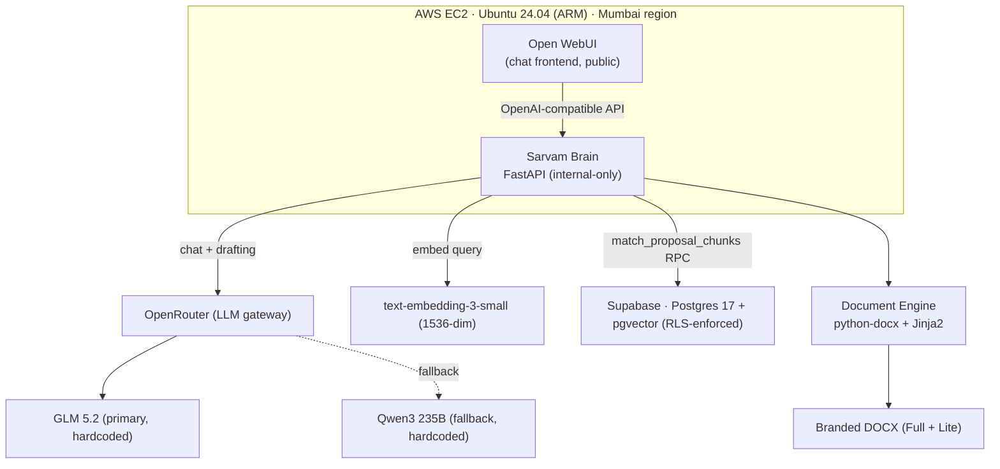

# Sarvam — Project Handover Document

> **Purpose.** This document lets any new operator (human or AI agent) pick up the Sarvam build exactly where it stands today, with zero re-discovery. It was written because the build may move to a different Perplexity account when credits on the originating account run low. Read it in full before starting work; it is self-contained.
>
> **Last updated:** 2026-07-17 (IST). **Repo:** `imranshaikh-commits/iv-sarvam` (public fork of `creator-imran/sarvam`). **Default branch:** `main`. **Working branch:** `main` (single-branch workflow as of 2026-07-17; `sprint5-doc-engine` and `docs/readme-redesign` were deleted after full merges). Current HEAD: `main` is `cb18462`. **Always verify current HEAD before acting.**
>
> **Public-safe.** This file is committed to a public repository. It contains **no** secrets, API keys, EC2 IPs, or Supabase project refs. Identifiers are described by name/region so the operator can locate them; secrets live only on the EC2 host's local env file.

---

## 0. How to use this document

1. Read this file end-to-end.
2. Read [`README.md`](../README.md) (the public face) and [`docs/PROJECT.md`](PROJECT.md) (the original 6-phase/12-sprint blueprint).
3. Connect the three external services on the new account (see [§5](#5-live-infrastructure--external-services)).
4. Recreate the keep-alive cron (see [§15](#15-accountsession-specific-items-to-recreate)).
5. Start on [Pass 3](#14-immediate-next-steps) — do not re-do Pass 1 or Pass 2; they are done and live.

---

## 1. What Sarvam is

**Sarvam** (सर्वम्, Sanskrit for *"all, everything, the whole"*) is Inspirit Vision's in-house **Proposal Architect** — a conversational, retrieval-grounded AI that turns a new RFP into a structured, client-ready proposal in hours instead of days, by drafting from IV's 100+ historical proposal bank rather than from a blank page.

He is **not a chatbot and not a search engine**. He is a well-read junior consultant who has read every proposal IV has ever sent, remembers all of them, interviews the user about the new deal, proposes an architecture the user must approve, then drafts the full document section by section, grounded in what IV has actually delivered before.

**Vendors in the corpus:** SailPoint, Ping Identity, IBM Security Verify, Red Hat Keycloak (RHBK), ForgeRock.

**Persona:** consultative not compliant; precise on scope, conservative on claims; vendor-agnostic by conviction; bilingually and culturally aware; structured but never robotic; self-aware about his limits. Signature opening: *"Sarvam here — IV's Proposal Architect. New deal, or picking up something from earlier?"* Full persona in [`docs/SARVAM_PERSONA.md`](SARVAM_PERSONA.md); one-pager in [`docs/MEET_SARVAM.md`](MEET_SARVAM.md).

**People:** Imran (project lead, prompt engineering, persona, sprint reviews); Ashish (technical reviewer — architecture quality gate, IAM accuracy, pricing).

---

## 2. Current status (TL;DR)

- **Phases 0–3 are substantially complete** (foundation, data, agent backend, retrieval + drafting). External research (Exa/Firecrawl) deferred.
- **Phase 4 is partial:** Open WebUI is deployed; Supabase Auth / Worker / multi-tenancy is **not wired**.
- **Phase 5 is ~90% complete** through a 5-pass enhancement sprint + export pipeline:
  - Pass 1 (intake + persistence) — **DONE** (`7622a4d`, migration `005` applied to live DB)
  - Pass 2 (DOCX branding) — **DONE** (`b4d42b0`)
  - Pass 3 (long-form depth) — **DONE** (`04fcd123`; merged to `main` as `bee4264`; verified live on EC2)
  - Pass 4 (diagram framework) — **DONE** (`d1a8805`; Graphviz render + approval state machine)
  - Pass 5 (Open WebUI interview gating, core) — **DONE** (`cb18462`; client-logo sourcing deferred)
  - Export pipeline (lite <5 MB DOCX + PDF export + signed URLs) — **DONE** (`5301bade`); OWUI branding fix `3501254`; persistence status fix (draft→drafting) included
- **Phase 6** (pilot, hardening, rollout) — not started.

Everything through the export pipeline + branding fix + persistence fix is on `main` (`7fd241b`, includes all docs). The live brain on EC2 runs `main` (single-branch workflow as of 2026-07-17; all feature branches deleted after merge).

---

## Status update — 2026-07-17 (IST)

### Completed this session

- **Pass 3 (long-form depth)** implemented, tested (18/18 keyless tests pass),
  sample DOCX visually inspected (title page, TOC, body subsections, all 5
  appendix tables clean). Commit `04fcd123` on `sprint5-doc-engine`; merged to
  `main` as merge commit `bee4264` (no force, no rewrite).
- **Pass 3 deployed live** to the EC2 brain (sprint5-doc-engine pull +
  sarvam-brain rebuild). Verified live: `/health` OK; `/v1/models` OK (only
  sarvam-architect); `/v1/intake-template` OK (24 buckets); intake session
  create/PATCH/complete + validation OK; `/v1/compliance-matrix` OK;
  `/v1/generate-proposal` returns a valid branded DOCX (HTTP 200, ~50s for
  brief, ~240 KB, content-type
  `application/vnd.openxmlformats-officedocument.wordprocessingml.document`).
- **Daily Supabase keep-alive** scheduled task recreated on this account
  (cron ~09:00 UTC, background; pings `SELECT count(*) FROM organizations;`,
  auto-restores the project and notifies the user only on failure).
- **Connectors** (GitHub, Supabase, AWS) reconnected on this account.
- **Live state verified** against the handover — exact match: 8 tables
  (RLS enabled on all), 11 proposals, 1,413 chunks, 5 migrations
  (sarvam_001..sarvam_005), 1 organization. No data/schema/context lost across
  the 3-4 account migrations.

### Branch HEADs (verified 2026-07-17)

- `main`: `cb18462` (single branch; Pass 3 + all docs merged)
- (single-branch workflow as of 2026-07-17; `sprint5-doc-engine` deleted after full merge — trees were byte-identical, nothing lost)

### Pass 4 + Pass 5 — completed 2026-07-17 (IST)

- **Pass 4 (architecture diagram framework)** — `DiagramSpec` JSON from GLM 5.2 -> local Graphviz renderer (deterministic, no external data leak); approval state machine on `architecture_diagrams` (draft -> needs_review -> approved/rejected); only approved diagrams embed in the DOCX; fail-soft when graphviz or the `diagram-renders` bucket is absent. New endpoints `/v1/proposals/{id}/diagrams` + `/v1/diagrams/{id}`. 37 tests pass. Merged to `main` as `d1a8805`. **EC2 dep:** `sudo apt-get install -y graphviz`.
- **Pass 5 (OWUI interview gating, core)** — `/v1/chat/completions` with no `intake_session_id` now starts the Stage 1 discovery interview (no RAG/drafting/network); session present -> existing RAG path; streaming + non-streaming both handled. Client-logo sourcing deferred. 42 tests pass total. Merged to `main` as `cb18462`.
- **Branch cleanup:** temporary `pass4-diagrams` + `pass5-interview-gating` branches deleted after merge; repo remains single-branch `main`.

### New known gaps

- **OWUI logo branding not rendering in-app** — tab title + tab favicon are OK;
  sidebar + sign-in logo still default. Critical post-pilot / pre-deployment
  sprint — see `docs/SPRINT_OWUI_BRANDING.md`.
- **Interview gating not wired** in `/v1/chat/completions` — "Hi" returns a RAG
  reply, not the discovery interview. This is Pass 5 work (not started).
- **Recurring SSH access breaks** are caused by a dynamic client public IP
  (rules pinned to /32 stop matching when the IP rotates), NOT by AWS
  auto-changing rules. Permanent fix: AWS Systems Manager Session Manager
  (no inbound port 22, no IP rules).

### Round 3 — OWUI branding + export pipeline + persistence fix — 2026-07-17 (IST)

- **OWUI in-app logo branding** — fixed via `WEBUI_FAVICON_URL=/static/favicon.png` env + `Dockerfile.webui` COPY of IV logos into `/app/build/static/` (compiled frontend defaults now replaced, not just the backend static path). Merged `3501254`. Fallback if OWUI DB settings override env: OWUI Admin → Settings → Images (non-destructive).
- **Phase 5 export pipeline** — new `export_engine.py` (Pillow lite DOCX compression <5 MB over `word/media/*`, LibreOffice-headless DOCX→PDF, all fail-soft); `supabase_client` upload + signed-URL delivery to the `generated-drafts` bucket; opt-in params `lite`/`include_pdf`/`return_signed_urls` on `/v1/generate-proposal` (no flags = legacy DOCX binary byte-for-byte; any flag = JSON with sizes + signed URLs). Dockerfile adds `libreoffice-writer` + `fonts-dejavu-core`; requirements adds `pillow`. 59 tests pass (42 + 16 new + 1 regression). Merged `5301bade`.
- **Persistence 400 fixed** — `insert_generated_proposal` sent `status="draft"`, but DB CHECK `generated_proposals_status_check` only allows `drafting`; every insert 400-ed and `generated_proposals` stayed empty (this blocked the diagram-embed flow, which needs a persisted `proposal_id`). One-line fix `draft`→`drafting` + regression test. Merged `5301bade`.
- **EC2 deploy (rebuild required — new APT/pip deps):**

  ```
  cd ~/iv-sarvam && git pull origin main
  cd deploy
  docker compose up -d --build open-webui    # branding fix
  docker compose up -d --build sarvam-brain  # export pipeline + persistence fix
  curl -s http://127.0.0.1:8000/health
  ```

- **Diagram + export live validation — PASSED (2026-07-17)** — full flow confirmed live: `POST /v1/proposals/{id}/diagrams` (LLM produced a 6-node IAM architecture spec) → `PATCH needs_review` → `PATCH approved` (rendered via `dot`, uploaded to `diagram-renders`, `rendered_svg_path` set) → regenerate with `generated_proposal_id` produced a 298 KB DOCX (~57 KB larger than the 240 KB base = diagram embedded). Export pipeline also live-validated: lite compression (already <5 MB), PDF 167 KB via LibreOffice, signed URLs to the `generated-drafts` bucket (created). Persistence fix confirmed (`generated_proposal_id` returned + row persists).
- **Still open:** client-logo sourcing (Pass 5 deferred); `generated-drafts` Supabase Storage bucket must be created manually for signed-URL delivery; Supabase Auth/Worker/multi-tenancy (Phase 4) not wired; Phase 6 not started.

---

## 3. Architecture (actual build)



**The brain is internal-only** (bound to localhost). Every external path runs through Open WebUI. The brain holds the only keys to Supabase and OpenRouter.

### Original plan vs. actual build (reconciliation)

| Layer | Original plan (`docs/PROJECT.md`) | Actual build | Why it changed |
|---|---|---|---|
| Agent runtime | Hermes Agent (Docker) | FastAPI brain | Avoided framework lock-in; thin, auditable, version-controlled Python modules |
| Hosting | Oracle Cloud Free Tier | AWS EC2 (ARM, Mumbai) | AWS credits available; Mumbai closer to the team |
| Frontend | Open WebUI on Cloudflare Pages + Worker auth proxy | Open WebUI directly on EC2 | Simpler single-box MVP; Cloudflare Worker deferred until multi-tenancy |
| Diagrams | MermaidJS inline in chat | DiagramSpec JSON → local Graphviz | Deterministic, editable, approval-friendly; no external rendering dependency |
| LLM tier | DeepSeek primary, GLM 5.2 fallback, Claude escalation | GLM 5.2 primary + Qwen3 235B fallback, hardcoded | DeepSeek removed after compliance-spiral incidents |
| Auth | Supabase Auth + Worker JWT gate (Sprint 8) | RLS at DB layer; brain internal-only | Network isolation is the interim gate; full Auth/Worker is a known gap |

The blueprint's intent (conversation-first, retrieval-grounded, human-in-loop, self-improving) is unchanged.

---

## 4. Repository

- **URL:** https://github.com/imranshaikh-commits/iv-sarvam
- **Branch:** `main` (HEAD `cb18462`, single-branch workflow as of 2026-07-17) — has everything through Pass 3 + redesigned README + all docs. EC2 pulls `main`.
- (Former working branches `sprint5-doc-engine` and `docs/readme-redesign` were deleted on 2026-07-17 after full merges — trees were byte-identical, nothing lost.)

### Key files

```
backend/brain/
  app.py                # all endpoints, model constants, _structured_with_fallback (5 LLM call sites)
  document_engine.py    # draft_section, assemble_docx (branded), generate_proposal, draft_with_openrouter
  proposal_templates.py  # Jinja2 section templates (implementation + mss, 8 sections each)
  intake_template.py     # 24-bucket discovery interview schema (Pass 1)
  supabase_client.py     # thin PostgREST helpers, fail-soft (Pass 1)
  branding.py            # DOCX branding: logo, navy/orange, header/footer, section dividers, client-logo placeholder (Pass 2)
  assets/                # iv_logo.png (1600px), iv_logo_header.png (400px)
  tests/                 # test_intake_template.py (7 keyless tests), test_document_engine.py
  Dockerfile             # COPYs all modules + assets
deploy/
  docker-compose.yml     # open-webui (public) + sarvam-brain (internal-only)
  Dockerfile.webui, patch-webui.py, assets/   # OWUI persona + lockdown
supabase/migrations/
  001_init.sql
  sarvam_005_intake_and_diagrams.sql   # intake_sessions table + diagram columns (applied to live DB)
scripts/                 # ingest_proposals.py, ingest_v2.py, run_ingest.sh
docs/                    # PROJECT.md, SARVAM_PERSONA.md, MEET_SARVAM.md, sprint docs
data/                    # raw (gitignored) + tagging templates
```

### Commit history (most recent first)

| SHA | What |
|---|---|
| `7fd241b` | docs: update progress dashboard (~78%, Phase 5 ~90%) |
| `5301bad` | Merge export-pipeline: Phase 5 lite DOCX + PDF + signed URLs + persistence status fix |
| `c14bdef` | fix(brain): use valid 'drafting' status on generated_proposals insert |
| `6f45522` | feat(brain): Phase 5 opt-in export pipeline (lite DOCX, PDF, signed URLs) |
| `3501254` | Merge owui-branding-fix: OWUI in-app logo branding (favicon env + /app/build/static) |
| `8558913` | docs: redesign README (merge into sprint5-doc-engine) |
| `ae019ed` | docs: redesign README — actual build, master-plan status, known gaps |
| `b4d42b0` | feat(brain): Pass 2 — DOCX branding |
| `7622a4d` | feat(brain): Pass 1 — intake sessions + persistence foundation |
| `56d777b` | feat(brain): switch LLM to GLM 5.2 primary + Qwen3 fallback (DeepSeek removed) |
| `1793f6e` | fix(brain): cap compliance-classifier max_tokens + length caps (repetition spiral) |
| `41437c7` | fix: real refreshable TOC field, clean SME marker, input validation |
| `55266ff` | feat: Sprint 5 document-production engine (/v1/generate-proposal) |
| `1549fab` | fix: require verbatim quotes + consistent downgrade output |

---

## 5. Live infrastructure & external services

The new account must reconnect these three connectors (the originating account's connections do not transfer). Use Perplexity's connector system (`list_external_tools` → connect). Locate each by the descriptors below — **never paste secrets into chat or commit them**.

| Service | How to identify it | Connector tooling |
|---|---|---|
| **GitHub** | repo `imranshaikh-commits/iv-sarvam` | `gh` / `git` CLIs (via `api_credentials=["github"]`) and GitHub connector |
| **Supabase** | project named `imranshaikh-iv-sarvam`, Tokyo region, Postgres 17 + pgvector, free tier | Supabase connector: `execute_sql`, `apply_migration`, `restore_project`, `get_project`, `list_tables`, `list_migrations` |
| **AWS** | Sarvam EC2 host in Mumbai (ARM, Ubuntu 24.04, static Elastic IP) | AWS connector (note: the agent has **no SSH access** — the user/operator runs all host commands) |

**OpenRouter** (LLM gateway): primary `z-ai/glm-5.2`, fallback `qwen/qwen3-235b-a22b-2507`, embedding `openai/text-embedding-3-small`. The API key lives only in the server-local environment file (restricted permissions). The agent never touches it.

**Open WebUI:** self-hosted on the EC2 box; model `sarvam-architect` → the brain's OpenAI-compatible endpoint. All other LLM connections in OWUI are disabled by the user (only sarvam-brain is enabled).

**Secrets location:** a single server-local environment file on the EC2 host (restricted permissions). Contains the OpenRouter key, Supabase URL/key, and OpenAI key (for embeddings). Rotated quarterly. Never committed.

---

## 6. Database (Supabase Postgres + pgvector)

**Live counts (verified 2026-07-16):** 8 tables · 5 migrations · 11 proposals · 1,413 chunks · 1 intake_session (test) · 0 generated_proposals · 0 architecture_diagrams.

### Tables
- `organizations` — 1 row (the IV org; UUID intentionally omitted from public docs)
- `org_members`, `profiles`
- `proposals` — 11 rows; columns: id, org_id, proposal_slug, source_filename, file_type, total_word_count, image_count, client_name, industry, country, iam_vendor, proposal_type, user_count, app_count, deal_size_bucket, outcome, year, notes, created_at
- `proposal_chunks` — 1,413 rows, `VECTOR(1536)`; section_type taxonomy: other(555), table(268), ocr(262), page(198), assumptions(29), diagram(26), architecture(17), solution(13), scope(10), exec_summary(8), similar_experience(8), timeline(7), pricing(5), why_vendor(5), cover(2)
- `generated_proposals` — 0 rows; `/v1/generate-proposal` persists here (fail-soft). User attribution pending until Auth/Worker identity is wired.
- `intake_sessions` — 0 production rows (1 test); Pass 1. Columns include id, org_id, proposal_type, answers jsonb, status, created_at, completed_at.
- `architecture_diagrams` — 0 rows; Pass 4 target. Columns: id, org_id, generated_proposal_id, mermaid_source (legacy col), rendered_svg_path, approved, approved_by, approved_at, rejection_comments, iteration, created_at, diagram_type, title, spec_json jsonb, renderer (default 'graphviz'), status (CHECK draft|needs_review|approved|rejected), intake_session_id.

### Migrations
1. `sarvam_001_schema` — core tables
2. `sarvam_002_retrieval_function` — `match_proposal_chunks` RPC (vector similarity, section-type + metadata filters)
3. `sarvam_003_rls_policies` — RLS on every table
4. `sarvam_004_harden_functions` — function hardening
5. `sarvam_005_intake_and_diagrams` — intake_sessions + diagram columns (Pass 1)

**RLS is enforced at the database layer. Do not disable.** The brain uses a server-side key; anon access is policy-gated.

**Storage buckets** (pending manual creation): `source-proposals`, `proposal-images`, `generated-drafts`, `diagram-renders`.

### Free-tier caveat
Supabase free tier auto-pauses after 7 days of inactivity. A daily keep-alive cron prevents this — see [§15](#15-accountsession-specific-items-to-recreate).

---

## 7. Model stack

- **Primary LLM:** `z-ai/glm-5.2` — strong long-context drafting, low cost.
- **Fallback LLM:** `qwen/qwen3-235b-a22b-2507` (Qwen3 235B, flagship) — auto-triggered at every LLM call site if the primary fails before streaming, via `_structured_with_fallback`.
- **Hardcoded** as constants — no env override, no model chooser in the UI. Open WebUI exposes a single model: "Sarvam Architect".
- **Embeddings:** `openai/text-embedding-3-small` (1536-dim), unchanged.
- **DeepSeek was removed entirely** — it spiraled on ambiguous compliance requirements (hundreds of thousands of characters, multi-minute hangs). Guarded against recurrence with per-call `max_tokens` caps, `frequency_penalty=0.2`, `max_retries=1`, and a truncation guard.
- **5 LLM call sites:** chat drafting, section drafting, compliance classification, open-router raw drafting, diagram-spec generation.

---

## 8. Master plan (6 phases / 12 sprints) — status

From [`docs/PROJECT.md`](PROJECT.md):

| Phase | Sprints | State |
|---|---|---|
| 0 — Foundation & accounts | 0 | Done |
| 1 — Data foundation (ingest + Supabase + embeddings) | 1–2 | Done (11 proposals, 1,413 chunks) |
| 2 — Agent backend (EC2 + Docker + OpenRouter) | 3–4 | Done |
| 3 — Retrieval + drafting | 5–6 | Done (RAG end-to-end, compliance matrix); external research deferred |
| 4 — Conversational frontend + auth | 7–8 | Open WebUI deployed; Supabase Auth/Worker/multi-tenancy **not wired** |
| 5 — Architecture approval gate + compression/export | 9–10 | ~90% — diagram framework + interview gating + lite/PDF/signed-URL export done; client-logo sourcing + live diagram validation pending |
| 6 — Pilot + hardening + rollout | 11–12 | Not started |

**Post-Sprint-5 extras (handover doc 05 §4-5), not started:** Exa+Firecrawl external research, fact-checker LLM, hybrid search (BM25+vector+RRF), retrieval tuning.

---

## 9. The enhancement sprint (Pass 1–5) — detailed

This is the current active work — Phase 5 catch-up + enhancement, triggered by the user's big enhancement bundle. **Sequencing (advisor-validated): each pass is tightly scoped and verified independently.**

### Pass 1 — Intake + persistence foundation — DONE (`7622a4d`)
- `intake_sessions` migration (`sarvam_005`), applied to live DB.
- `GET /v1/intake-template` — 24-bucket discovery interview, filters by proposal type.
- `POST /v1/intake-sessions`, `PATCH /v1/intake-sessions/{id}`, `POST /v1/intake-sessions/{id}/complete` (validates required answers).
- `/v1/generate-proposal` accepts `intake_session_id` to backfill + persist to `generated_proposals` (fail-soft).
- `intake_template.py` (24 buckets), `supabase_client.py` (httpx PostgREST), `tests/test_intake_template.py` (7 keyless tests, all pass).
- 24-bucket interview covers: client, engagement, scale/volumetrics, scope, architecture (deployment model, required diagram types + count, hardware sizing, HA/DR, security architecture, cluster topology), migration, integration, compliance/regulatory, timeline, MSS-specific (conditional), submission constraints, audience/tone, client pain + win themes, current-state systems, target architecture constraints, NFRs, delivery model, commercials, post-go-live, reuse controls, branding (client logo), depth.

### Pass 2 — DOCX branding — DONE (`b4d42b0`)
- `branding.py` (leaf module, imported by `document_engine`, no circular import, keyless/offline).
- IV identity: navy `#231154` primary, orange `#E85A24` accent, Calibri sans-serif, WCAG-AA contrast.
- Branded title page (logo, navy/orange divider, title, client, vendor, date+version, `DRAFT · CONFIDENTIAL`), running header (logo + `Technical Proposal — {client}` + navy rule, content pages only), running footer (`Inspirit Vision — Confidential` + `Page N` + navy rule, numbering starts at 1 after title), section dividers (orange tick + navy left bar, kept out of TOC), client-logo placeholder box (`client_logo_path` param embeds a supplied logo instead; no online sourcing yet).
- Assets: `iv_logo.png` (1600px, ~172KB), `iv_logo_header.png` (400px, ~27KB). Source 4000px JPEG not committed.
- `document_engine.assemble_docx` rebuilt to use branding; `generate_proposal` signature/return, depth/max_tokens logic, endpoints, diagrams, Pass 1 files untouched.
- Dockerfile COPYs `branding.py` + `assets/`.
- Verified: py_compile OK, keyless smoke test pass, sample rendered to PDF→PNG, visually confirmed no overflow/wrapping/contrast.

### Pass 3 — Long-form depth — DONE (`04fcd123`, merged to `main` `bee4264`, verified live)
**Goal:** take drafts from ~12 pages toward 100+ page source-proposal parity.
- `proposal_depth` tiers: `brief` / `standard` / `full` (control via number of subsections drafted + retrieval fan-out, not by inflating a single giant call).
- Multi-subsection drafting per section.
- More retrieval queries per section.
- Tables/appendices: RACI, timeline, sizing, integration inventory, risks.
- Keep per-call token caps + frequency penalty to avoid repetition spirals.

**Acceptance criteria:**
- `proposal_depth` supports `brief`, `standard`, `full`.
- Existing `/v1/generate-proposal` calls still work with a safe default.
- `full` adds multi-subsection drafting + appendices (RACI, timeline, sizing, integration inventory, risks).
- Per-call token caps + frequency penalty preserved.
- Keyless tests pass; sample DOCX generated and visually checked.
- Commit to `sprint5-doc-engine`; provide EC2 deploy command.

**Subagent setup (for the next agent):**
```
Repository setup: managed clone from https://github.com/imranshaikh-commits/iv-sarvam. Work on `main` (single-branch workflow). Do not manually clone it.
```

### Pass 4 — Architecture diagram framework — queued
**Goal:** dynamic, approval-gated diagrams embedded in the DOCX.
- GLM 5.2 emits structured `DiagramSpec` JSON.
- Local Graphviz renderer → PNG/SVG (deterministic, apt-installable, no external data leak). **Not** Mermaid CLI (heavy Chromium dep), **not** Kroki (leaks client data), **not** image-gen model (unreliable at precise schematic labels).
- Approval state machine on `architecture_diagrams.status`: `draft` → `needs_review` → `approved`/`rejected` (with `rejection_comments`, `iteration`).
- Only `approved` diagrams are embedded in the DOCX.
- **Reuse at spec-template level (not pixel):** store reusable DiagramSpec templates in Supabase keyed by `vendor` + `diagram_type`; approved diagrams promote to templates. Engine clones-and-edits a template rather than recreating from scratch.
- Diagram reuse analysis (already done): 260 images across 8 DOCX, 199 distinct; ~38% reused/templated (45 exact-reused, 30 near-duplicate, 124 one-off). Reuse is per-vendor + per-diagram-type (two SailPoint implementation proposals share deployment/HRMS/SSO diagrams; two Ping proposals share reference architectures).
- Image-gen models available on OpenRouter (Unified Image API: Google Nano Banana, OpenAI GPT Image, Flux, Seedream) but **not needed** for architecture diagrams. If polished non-diagram visuals wanted later: primary Google Nano Banana 2, fallback OpenAI GPT Image or ByteDance Seedream 4.5.

### Pass 5 — Open WebUI integration — queued
- Investigate the OWUI chat payload; enforce brain-side: no `intake_session_id` → respond with the interview (Stage 1 discovery) instead of drafting.
- Download-button via OWUI extension/action so generated DOCX is downloadable from chat.
- Persist generated proposals to `generated_proposals` once auth/user IDs are wired.

### Cross-cutting (also queued)
- **Client-logo sourcing:** web/image search + approval-gated embedding (ties Pass 1 interview + Pass 2 branding). If the correct logo is uncertain, confirm with the user.
- **Tune weak-evidence threshold** against real similarity scores after reviewing several outputs.

---

## 10. Hard rules & constraints (do not violate)

- **Do NOT touch the WordPress Lightsail instance.** Out of scope entirely.
- **Never commit `.env` files or anything under `data/raw/`.** (`.gitignore` blocks `.env`, `*.pem`, `*.key`, key patterns.)
- **RLS is enforced at the database layer — do not disable.**
- **The brain (`sarvam-brain`, port 8000) is bound to localhost only.** Never expose it publicly.
- **Rotate API keys quarterly.**
- **No EC2 SSH access for the agent** (no `.pem` key). The user runs all host/docker commands; the agent gives exact commands.
- **The agent cannot read the server-local env file** (secrets). Don't try.
- **Public repo:** never put the EC2 public IP, Supabase project ref, or any key in committed docs.

---

## 11. Deploy workflow (user runs on EC2)

```bash
cd ~/iv-sarvam && git fetch && git pull origin main && cd deploy && docker compose up -d --build sarvam-brain && sleep 5 && H=127.0.0.1; P=8000; curl -s http://$H:$P/health; echo
```
Expected health: `{"status":"ok","model":"sarvam-architect","primary_model":"z-ai/glm-5.2","fallback_model":"qwen/qwen3-235b-a22b-2507"}`

URL-mangling note: chat clients auto-linkify URLs in code blocks. When giving the user a `curl` command, build the URL from shell variables (`H=127.0.0.1; P=8000; http://$H:$P/...`) so it survives copy-paste.

### Brain endpoints
`GET /health` · `GET /v1/models` (only sarvam-architect) · `POST /v1/chat/completions` (grounded RAG + streaming) · `POST /v1/compliance-matrix` · `POST /v1/generate-proposal` (accepts `intake_session_id`, persists) · `GET /v1/intake-template` · `POST /v1/intake-sessions` · `PATCH /v1/intake-sessions/{id}` · `POST /v1/intake-sessions/{id}/complete`

---

## 12. Key decisions & rationale

- **Model swap:** GLM 5.2 primary + Qwen3 235B fallback, hardcoded. DeepSeek removed (compliance spiral). Fallback at all 5 call sites via `_structured_with_fallback`. Embedding unchanged.
- **Diagrams = DiagramSpec + Graphviz** (not Mermaid/Kroki/image-gen) — see Pass 4.
- **Diagram reuse at spec-template level** (not pixel) — per vendor + diagram type.
- **5-pass sequencing:** Pass 1 → 2 → 3 → 4 → 5, each verified independently. Passes 1–2 done.
- **Fail-soft persistence:** if a Supabase write fails, the generated DOCX is still returned — generation never blocks on storage.
- **OWUI lockdown:** only sarvam-brain connection enabled; OpenAI/OpenRouter/Ollama connections disabled by the user. Multi-model dropdown removed.

---

## 13. Known gaps / not pilot-ready yet

- Auth/multi-tenancy not wired (network isolation + disabled sign-ups is the interim gate).
- Architecture approval gate pending Pass 4.
- Long-form depth pending Pass 3.
- Lite (under 5 MB) compression, PDF export, delivery to storage signed URLs — not done.
- External research (Exa/Firecrawl) + fact-checker LLM — deferred post-pilot.
- Hybrid search (BM25+vector+RRF) — deferred.
- Pilot validation against historical RFPs — not started.
- Supabase storage buckets pending manual creation.

---

## 14. Immediate next steps

1. Pass 4 (architecture diagram framework) — or prioritize interview-gating
   (Pass 5) for the biggest user-visible win.
2. OWUI branding fix (`docs/SPRINT_OWUI_BRANDING.md`) — post-pilot, pre-deploy.
3. Phase 6 pilot (5-10 historical RFPs, scoring rubric, hardening, rollout).

**Before each pass:** verify live state (branch HEAD, DB counts) with `gh api` and the Supabase connector; do not trust stale memory.

---

## 15. Account/session-specific items to recreate

These live on the originating account/session and **will not transfer** to a new account:

1. **Daily Supabase keep-alive cron** (originating id `88b8e51a`, fires ~05:39 IST daily). On the new account, recreate it via `schedule_cron`:
   - `cron`: `9 0 * * *` (UTC) — i.e. ~05:39 IST.
   - `background`: true.
   - Task: call the Supabase connector `execute_sql` on the project with `SELECT count(*) AS c FROM organizations;`. If it succeeds, end silently (no notification). If it fails/paused, call `restore_project`, then `send_notification` (in-app) to the user: title "Sarvam Supabase was paused — auto-restored".
2. **Connectors:** GitHub, Supabase, AWS — reconnect on the new account (see [§5](#5-live-infrastructure--external-services)).
3. **Workspace files:** the 10 source proposals and 5 handover docs were uploaded attachments on the originating session — they are **already ingested into Supabase** (11 proposals, 1,413 chunks), so re-upload is only needed if re-analysis of raw files is required (e.g. deeper diagram study). The diagram-reuse analysis is already captured in [§9 Pass 4](#pass-4--architecture-diagram-framework--queued).
4. **IV logo assets** are committed in `backend/brain/assets/` and `uploaded_attachments/.../InspiritVision_Logo_*` — the committed ones are enough; originals are on the EC2 host if needed.

---

## 16. Source materials (where they live)

- **5 handover docs** (orig. uploaded): architecture/system design, infra/deployment, dev status/sprint progress, data/RAG pipeline, remaining work/roadmap. Summarized in `docs/PROJECT.md` and this file.
- **10 source proposals** (orig. uploaded, 8 DOCX + 2 PDF) across SailPoint, Ping, IBM Security Verify, Red Hat Keycloak, and MSS engagements. All ingested into Supabase; client names/filenames withheld (NDA).
- **SAMPLE README** the redesigned README was modeled on: `https://github.com/imranbayone/bayone-answer-engine` (mirror + exceed).

---

*End of handover. When in doubt, read [`README.md`](../README.md), [`docs/PROJECT.md`](PROJECT.md), and the code on `main`. Verify live state before acting; do not trust memory alone.*
